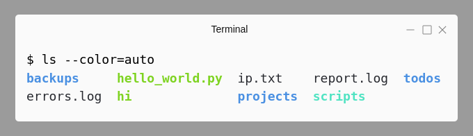

# <a name="files-and-directories"></a>Files and Directories

**Table of Contents**

* [pwd](#pwd)
* [cd](#cd)
* [clear](#clear)
* [ls](#ls)
* [mkdir](#mkdir)
* [touch](#touch)
* [rm](#rm)
* [cp](#cp)
* [mv](#mv)
* [rename](#rename)
* [ln](#ln)
* [tar and gzip](#tar-and-gzip)

<br>

Let's look at commonly used commands to navigate directories, create and modify files and folders. For certain commands, a list of commonly used options are also given

Make it a habit to use `man` command to read about a new command - for example `man ls`

Short descriptions for commands are shown as quoted text (taken from `whatis` or `help -d`)

<br>

## <a name="pwd"></a>pwd

>print name of current/working directory

* apart from knowing your current working directory, often used to copy the absolute path to be pasted elsewhere, like in a script
* some Terminal emulators display the current directory path as window/tab title by default

```bash
$ pwd
/home/learnbyexample
```

<br>

## <a name="cd"></a>cd

>Change the shell working directory

* Like `pwd`, the `cd` command is a shell builtin
* Let's see an example of changing working directory to some other directory and coming back
* Specifying `/` at end of path argument is optional

```bash
$ pwd
/home/learnbyexample

$ # providing an absolute path as argument
$ cd /etc
$ pwd
/etc

$ # to go back to previous working directory
$ # if there's a directory named '-', use './-' to go that directory
$ cd -
/home/learnbyexample
$ pwd
/home/learnbyexample
```

* Relative paths are well, relative to current working directory
* `.` refers to current directory
* `..` refers to directory one hierarchy above
* `../..` refers to directory two hierarchies above and so on

```bash
$ pwd
/home/learnbyexample

$ # go to directory one hierarchy above
$ cd ..
$ pwd
/home

$ # go to directory 'learnbyexample' present in current directory
$ # './' is optional in this case
$ cd ./learnbyexample
$ pwd
/home/learnbyexample

$ # go to directory two hierarchies above
$ cd ../..
$ pwd
/
```

* `cd ~/` or `cd ~` or `cd` will go to directory specified by `HOME` shell variable (which is usually set to user's home directory)

```bash
$ pwd
/
$ echo "$HOME"
/home/learnbyexample

$ cd
$ pwd
/home/learnbyexample
```

**Further Reading**

* Use `help cd` for documentation
* [cd Q&A on unix stackexchange](https://unix.stackexchange.com/questions/tagged/cd-command?sort=votes&pageSize=15)
* [cd Q&A on stackoverflow](https://stackoverflow.com/questions/tagged/cd?sort=votes&pageSize=15)
* [bash manual: Tilde Expansion](https://www.gnu.org/software/bash/manual/html_node/Tilde-Expansion.html)

<br>

## <a name="clear"></a>clear

>clear the terminal screen

You can also use `Ctrl+l` short-cut to clear the terminal screen (in addition, this retains any typed text)

<br>

## <a name="ls"></a>ls

>list directory contents

* by default, `ls` output is sorted alphabetically

```bash
$ # if no argument is given, current directory contents are displayed
$ ls
backups  hello_world.py  palindrome.py  projects    todo
ch.sh    ip.txt          power.log      report.log  workshop_brochures

$ # absolute/relative paths can be given as arguments
$ ls /var/
backups  crash  local  log   metrics  run   spool
cache    lib    lock   mail  opt      snap  tmp
$ # for multiple arguments, listing is organized by directory
$ ls workshop_brochures/ backups/
backups:
chrome_bookmarks_02_07_2018.html  dot_files

workshop_brochures:
Python_workshop_2017.pdf  Scripting_course_2016.pdf

$ # single column listing
$ ls -1 backups/
chrome_bookmarks_02_07_2018.html
dot_files
```

* `-F` appends a character to each file name indicating the file type (other than regular files)
    * `/` for directories
    * `*` for executable files
    * `@` for symbolic links
    * `|` for FIFOs
    * `=` for sockets
    * `>` for doors
    * the indicator details are described in `info ls`, not in `man ls`

```bash
$ ls -F
backups/  hello_world.py*  palindrome.py*  projects@   todo
ch.sh*    ip.txt           power.log       report.log  workshop_brochures/

$ # if you just need to distinguish file and directory, use -p
$ ls -p
backups/  hello_world.py  palindrome.py  projects    todo
ch.sh     ip.txt          power.log      report.log  workshop_brochures/
```

* or use the color option



* long listing format
* shows details like file permissions, ownership, size, timestamp, etc
    * See [chmod](./Working_with_Files_and_Directories.md#chmod) section for details on permissions, groups, etc
* file types are distinguished as `d` for directories, `-` for regular files, `l` for symbolic links, etc

```bash
$ ls -l
total 84
drwxrwxr-x 3 learnbyexample eg  4096 Jul  4 18:23 backups
-rwxr-xr-x 1 learnbyexample eg  2746 Mar 30 11:38 ch.sh
-rwxrwxr-x 1 learnbyexample eg    41 Aug 21  2017 hello_world.py
-rw-rw-r-- 1 learnbyexample eg    34 Jul  4 09:01 ip.txt
-rwxrwxr-x 1 learnbyexample eg  1236 Aug 21  2017 palindrome.py
-rw-r--r-- 1 learnbyexample eg 10449 Mar  8  2017 power.log
lrwxrwxrwx 1 learnbyexample eg    12 Jun 21 12:08 projects -> ../projects/
-rw-rw-r-- 1 learnbyexample eg 39120 Feb 25  2017 report.log
-rw-rw-r-- 1 learnbyexample eg  5987 Apr 11 11:06 todo
drwxrwxr-x 2 learnbyexample eg  4096 Jul  5 12:05 workshop_brochures

$ # to show size in human readable format instead of byte count
$ ls -lh power.log
-rw-r--r-- 1 learnbyexample eg 11K Mar  8  2017 power.log

$ # use -s option instead of -l if only size info is needed
$ ls -1sh power.log report.log
12K power.log
40K report.log
```

* changing sorting criteria
* use `-t` to sort by timestamp, often combined with `-r` to reverse the order so that most recently modified file shows as last item
* `-S` option sorts by file size (not suitable for directories)
* `-v` option does version sorting (suitable for filenames with numbers in them)
* `-X` option allows to sort by file extension (i.e characters after the last `.` in filename)

```bash
$ ls -lhtr
total 84K
-rw-rw-r-- 1 learnbyexample eg  39K Feb 25  2017 report.log
-rw-r--r-- 1 learnbyexample eg  11K Mar  8  2017 power.log
-rwxrwxr-x 1 learnbyexample eg 1.3K Aug 21  2017 palindrome.py
-rwxrwxr-x 1 learnbyexample eg   41 Aug 21  2017 hello_world.py
-rwxr-xr-x 1 learnbyexample eg 2.7K Mar 30 11:38 ch.sh
-rw-rw-r-- 1 learnbyexample eg 5.9K Apr 11 11:06 todo
lrwxrwxrwx 1 learnbyexample eg   12 Jun 21 12:08 projects -> ../projects/
-rw-rw-r-- 1 learnbyexample eg   34 Jul  4 09:01 ip.txt
drwxrwxr-x 3 learnbyexample eg 4.0K Jul  4 18:23 backups
drwxrwxr-x 2 learnbyexample eg 4.0K Jul  5 12:05 workshop_brochures

$ ls -X
backups   todo                power.log   hello_world.py  ch.sh
projects  workshop_brochures  report.log  palindrome.py   ip.txt
```

* filenames starting with `.` are considered as hidden files

```bash
$ # -a option will show hidden files too
$ ls -a backups/dot_files/
.  ..  .bashrc  .inputrc  .vimrc

$ # . and .. are special directories pointing to current and parent directory
$ # if you recall, we have used them in specifying relative paths
$ # so, 'ls', 'ls .' and 'ls backups/..' will give same result
$ ls -aF backups/dot_files/
./  ../  .bashrc  .inputrc  .vimrc

$ # use -A option to show hidden files excluding . and .. special directories
$ ls -A backups/dot_files/
.bashrc  .inputrc  .vimrc
```

* use `-R` option to recursively list sub-directories too

```bash
$ ls -ARF
.:
backups/  hello_world.py*  palindrome.py*  projects@   todo
ch.sh*    ip.txt           power.log       report.log  workshop_brochures/

./backups:
chrome_bookmarks_02_07_2018.html  dot_files/

./backups/dot_files:
.bashrc  .inputrc  .vimrc

./workshop_brochures:
Python_workshop_2017.pdf  Scripting_course_2016.pdf
```

* often, we want to prune which files/folders are to be listed
* commands like `find` provide extensive features in this regard
* the shell itself provides a matching technique called glob/wildcards
    * see [Shell wildcards](./Shell.md#wildcards) section for more examples and details
* beginners incorrectly associate globbing with `ls` command, as a demonstration globbing results are shown using `echo` command first

```bash
$ # all unquoted arguments are subjected to shell globbing interpretation
$ echo *.py *.log
hello_world.py palindrome.py power.log report.log
$ echo '*.py' *.log
*.py power.log report.log

$ # long list only files ending with .py
$ ls -l *.py
-rwxrwxr-x 1 learnbyexample eg   41 Aug 21  2017 hello_world.py
-rwxrwxr-x 1 learnbyexample eg 1236 Aug 21  2017 palindrome.py

$ # match all filenames starting with alphabets c/d/e/f/g/h/i
$ echo [c-i]*
ch.sh hello_world.py ip.txt
$ ls -sh [c-i]*
4.0K ch.sh  4.0K hello_world.py  4.0K ip.txt
```

* use `-d` option to not show directory contents

```bash
$ echo b*
backups
$ # since backups is a directory, ls will list its contents
$ ls b*
chrome_bookmarks_02_07_2018.html  dot_files
$ # -d option will show the directory entry instead of its contents
$ ls -d b*
backups

$ # a simple way to get only the directory entries
$ # assuming simple filenames without spaces/newlines/etc
$ echo */
backups/ projects/ workshop_brochures/
$ ls -d */
backups/  projects/  workshop_brochures/
```

**Further Reading**

* `man ls` and `info ls` for more options and complete documentation
* [ls Q&A on unix stackexchange](https://unix.stackexchange.com/questions/tagged/ls?sort=votes&pageSize=15)
* [ls Q&A on stackoverflow](https://stackoverflow.com/questions/tagged/ls?sort=votes&pageSize=15)
* [mywiki.wooledge: avoid parsing output of ls](https://mywiki.wooledge.org/ParsingLs)
* [unix.stackexchange: why not parse ls?](https://unix.stackexchange.com/questions/128985/why-not-parse-ls)
* [unix.stackexchange: What are ./ and ../ directories?](https://unix.stackexchange.com/questions/63081/what-are-and-directories)

<br>

## <a name="mkdir"></a>mkdir

>make directories

* Linux filenames can use any character other than `/` and the ASCII NUL character
* quote the arguments if name contains characters like space, `*`, etc to prevent shell interpretation
    * shell considers space as argument separator, `*` is a globbing character, etc
* unless otherwise needed, try to use only alphabets, numbers and underscores for filenames

```bash
$ # one or more absolute/relative paths can be given to create directories
$ mkdir reports 'low power adders'

$ # listing can be confusing when filename contains characters like space
$ ls
low power adders  reports
$ ls -1
low power adders
reports
```

* use `-p` option to create multiple directory hierarchies in one go
* it is also useful in scripts to create a directory without having to check if it already exists
* special variable `$?` gives exit status of last executed command
    * `0` indicates success and other values indicate some kind of failure
    * see documentation of respective commands for details

```bash
$ mkdir reports
mkdir: cannot create directory ‘reports’: File exists
$ echo $?
1
$ # when -p is used, mkdir won't give an error if directory already exists
$ mkdir -p reports
$ echo $?
0

$ # error because 'a/b' doesn't exist
$ mkdir a/b/c
mkdir: cannot create directory ‘a/b/c’: No such file or directory
$ # with -p, any non-existing directory will be created as well
$ mkdir -p a/b/c
$ ls -1R a
a:
b

a/b:
c

a/b/c:
```

**Further Reading**

* [mkdir Q&A on unix stackexchange](https://unix.stackexchange.com/questions/tagged/mkdir?sort=votes&pageSize=15)
* [mkdir Q&A on stackoverflow](https://stackoverflow.com/questions/tagged/mkdir?sort=votes&pageSize=15)
* [unix.stackexchange: Characters best avoided in filenames](https://unix.stackexchange.com/questions/269093/characters-best-avoided-in-filenames-when-used-in-bash-e-g)

<br>

## <a name="touch"></a>touch

* Usually files are created using a text editor or by redirecting output of a command to a file
* But sometimes, for example to test file renaming, creating empty files comes in handy
* the `touch` command is primarily used to change timestamp of a file (see [touch](./Working_with_Files_and_Directories.md#touch) section of next chapter)
* if a filename given to `touch` doesn't exist, an empty file gets created with current timestamp

```bash
$ touch ip.txt
$ ls -1F
a/
ip.txt
low power adders/
reports/
```

<br>

## <a name="rm"></a>rm

>remove files and directories

**Options**

* `-r` remove recursively, used for removing directories
* `-f` force remove without prompt for non-existing files and write protected files (provided user has appropriate permissions)
* `-i` prompt before every removal
* `-d` remove empty directories

**Examples**

* `rm project_adder/power.log` remove file power.log from project_adder directory
* `rm -r project_adder` remove folder project_adder from current directory even if non-empty
* `rm -d project_tmp` remove project_tmp folder provided it is empty
    * `rmdir project_tmp` can also be used
* If available, use `gvfs-trash` command to send items to trash instead of permanent deletion
    * or, [unix.stackexchange: creating a simple trash command](https://unix.stackexchange.com/questions/452496/create-a-recycle-bin-feature-without-using-functions)
* Files removed using `rm` can still be recovered with time/skill. Use `shred` command to overwrite files
    * [recover deleted files](https://unix.stackexchange.com/questions/80270/unix-linux-undelete-recover-deleted-files)
    * [recovering accidentally deleted files](https://unix.stackexchange.com/questions/2677/recovering-accidentally-deleted-files)
    * [Securely wipe disk](https://wiki.archlinux.org/index.php/Securely_wipe_disk)
* [rm Q&A on unix stackexchange](https://unix.stackexchange.com/questions/tagged/rm?sort=votes&pageSize=15)
* [rm Q&A on stackoverflow](https://stackoverflow.com/questions/tagged/rm?sort=votes&pageSize=15)

<br>

## <a name="cp"></a>cp

>copy files and directories

The destination path is always specified as the last argument. More than one source file/folder can be specified if destination is a directory

**Options**

* `-r` copy recursively, used for copying directories
* `-i` prompt before overwriting
* `-u` copy files only if newer than existing file in destination location or if file doesn't exist in destination

**Examples**

* `cp /home/raja/Raja_resume.doc Ravi_resume.doc` create a copy of file Raja_resume.doc as Ravi_resume.doc in your current directory
* `cp /home/raja/Raja_resume.doc .` create a copy of file Raja_resume.doc in your current directory - name not changed in this case
    * `.` represents current directory and `..` represents one hierarchy above
* `cp -r /home/guest1/proj_matlab ~/proj_matlab_bug_test` copy proj_matlab to your home directory as proj_matlab_bug_test
* `cp report/output.log report/timing.log .` copy files output.log and timing.log to current directory
* [cp Q&A on unix stackexchange](https://unix.stackexchange.com/questions/tagged/cp?sort=votes&pageSize=15)
* [cp Q&A on stackoverflow](https://stackoverflow.com/questions/tagged/cp?sort=votes&pageSize=15)

Also check out

* `rsync` a fast, versatile, remote (and local) file-copying tool
* [rsync examples](https://www.digitalocean.com/community/tutorials/how-to-use-rsync-to-sync-local-and-remote-directories-on-a-vps)
* [rsync Q&A on unix stackexchange](https://unix.stackexchange.com/questions/tagged/rsync?sort=votes&pageSize=15)
* [rsync Q&A on stackoverflow](https://stackoverflow.com/questions/tagged/rsync?sort=votes&pageSize=15)

<br>

## <a name="mv"></a>mv

>move (rename) files

The destination path is always specified as the last argument. More than one source file/folder can be specified if destination is a directory

**Options**

* `-f` don't prompt for overwriting and moving write protected files (provided user has appropriate permissions)
* `-i` prompt before overwriting

**Examples**

* `mv project_adder project_lowpower_adder` rename file or folder
* `mv power.log timing.log area.log project_multiplier/result/` move the specified files to result directory
* [mv Q&A on unix stackexchange](https://unix.stackexchange.com/questions/tagged/mv?sort=votes&pageSize=15)
* [mv Q&A on stackoverflow](https://stackoverflow.com/questions/tagged/mv?sort=votes&pageSize=15)

<br>

## <a name="rename"></a>rename

>renames multiple files

Note: The `perl` based `rename` is presented here and different from [util-linux-ng version](https://linux.die.net/man/1/rename). Check `man rename` for details

**Options**

* `-f` overwrite existing files
* `-n` dry run without actually renaming files

**Examples**

* `rename 's/\.JPG$/.jpg/' *JPG` change the file extension from '.JPG' to '.jpg'
* `rename 's/ /_/g' *` replace all 'space' characters in filenames with '_'
* [rename Q&A on unix stackexchange](https://unix.stackexchange.com/questions/tagged/rename?sort=votes&pageSize=15)
* See [Perl one liners](https://github.com/learnbyexample/Command-line-text-processing/blob/master/perl_the_swiss_knife.md) for examples and details on Perl based substitution command

<br>

## <a name="ln"></a>ln

>make links between files

Create hard or soft link of file or folder. Soft link is similar to short-cuts created in Windows. Hard link is like same file with different name, same timestamp and permissions of original file. Hard links can be moved to another directory after creation, will still have content even when original file is deleted. On the other hand, soft links have their own timestamps and permissions, it cannot be moved to another folder unless the link creation was done using full path and of course becomes a dead link when original file is deleted. More differences [here](https://askubuntu.com/questions/108771/what-is-the-difference-between-a-hard-link-and-a-symbolic-link)

**Examples**

* `ln -s results/report.log .` create a symbolic link of report.log from results folder to current directory
* `ln results/report.log report.log` create a hard link of report.log from results folder to current directory, will not lose content even if results/report.log file is deleted
* `unlink report.log` delete link
    * `rm report.log` can also be used
* [ln Q&A on unix stackexchange](https://unix.stackexchange.com/questions/tagged/ln?sort=votes&pageSize=15)
* [ln Q&A on stackoverflow](https://stackoverflow.com/questions/tagged/ln?sort=votes&pageSize=15)

<br>

## <a name="tar-and-gzip"></a>tar and gzip

`tar` is archiving utility. The archived file is same size as combined sizes of archived files  
Usually so often combined with compression utility like `gzip` that there is a way to do it just using the `tar` command.

**Examples**

Archive and Compression

* `tar -cvf backup_mar15.tar project results` create backup_mar15.tar of files/folders project and results
    * `-v` option stands for verbose, i.e displays all the files and directories being archived
* `gzip backup_mar15.tar` overwrites backup_mar15.tar with backup_mar15.tar.gz, a compressed version
* `tar -cvzf backup_mar15.tar.gz project results` create backup_mar15.tar and overwrite with backup_mar15.tar.gz

Extract archive and Decompression

* `gunzip backup_mar15.tar.gz` decompress and overwrite as backup_mar15.tar
* `tar -xvf backup_mar15.tar` extract archived files to current directory
* `tar -xzvf backup_mar15.tar.gz` decompress and extract archived files to current directory

z commands

* `zcat story.txt.gz` display file contents of compressed file on standard output
* `zless story.txt.gz` display file contents of compressed file one screenful at a time
* There are other commands as well like `zgrep`, `zdiff`, `zcmp` etc to work on compressed files

**Further Reading**

* [tar Q&A on unix stackexchange](https://unix.stackexchange.com/questions/tagged/tar?sort=votes&pageSize=15)
* [tar Q&A on stackoverflow](https://stackoverflow.com/questions/tagged/tar?sort=votes&pageSize=15)
