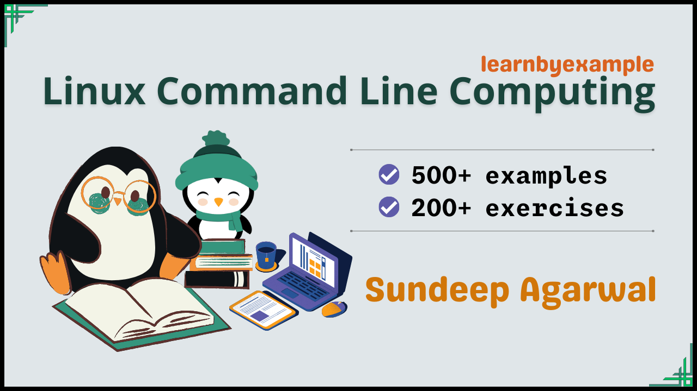

# Release offers

To celebrate my latest ebook release, you can download [Computing from the Command Line](https://learnbyexample.gumroad.com/l/cli_computing) for FREE till 08-Nov-2022.

Some of my ebooks and bundles are on sale as well till 08-Nov-2022:

* [Command line text processing with GNU Coreutils](https://learnbyexample.gumroad.com/l/cli_coreutils/cli_computing_release) is FREE
* [Magical one-liners](https://learnbyexample.gumroad.com/l/oneliners/cli_computing_release) bundle is $5 (normal price $15) — grep, sed, awk, perl and ruby one-liners
* [All books bundle](https://learnbyexample.gumroad.com/l/all-books/cli_computing_release) is $10 (normal price $28) — all my 13 programming ebooks

# Computing from the Command Line

This book aims to teach Linux command line tools and Shell Scripting for beginner to intermediate level users. The focus is towards managing your files and performing text processing tasks. Topics like system administration and networking won't be discussed, but some details might get covered in future versions of this book.

    

The book also includes exercises to test your understanding, which is presented together as a single file in this repo — [exercises.md](./exercises/exercises.md)

For solutions to the exercises, see [exercise-solutions.md](./exercises/exercise-solutions.md).

See [Version_changes.md](./Version_changes.md) to keep track of changes made to the book.

[Click this link](https://github.com/learnbyexample/cli-computing/tree/09091253463a313ddce5a95f467857ea85c25ce6) for an earlier version of the book in this repo.

 See my curated list on [Linux CLI and Shell scripting](https://learnbyexample.github.io/curated_resources/linux_cli_scripting.html) for more learning resources.

 

# E-book

* You can purchase the book using these links:
   * https://learnbyexample.gumroad.com/l/cli_computing
   * https://leanpub.com/cli_computing
* You can also get the book as part of these bundles:
   * **All books bundle** from https://learnbyexample.gumroad.com/l/all-books
        * Includes all my programming books
* See https://learnbyexample.github.io/books/ for list of other books

For a preview of the book, see [sample chapters](https://github.com/learnbyexample/cli-computing/blob/master/sample_chapters/cli_computing_sample.pdf)

The book can also be [viewed as a single markdown file in this repo](./cli_computing.md). See my blogpost on [generating pdf from markdown using pandoc](https://learnbyexample.github.io/customizing-pandoc/) if you are interested in the ebook creation process.

For web version of the book, visit https://learnbyexample.github.io/cli-computing/

 

## Feedback and Contributing

⚠️ ⚠️ Please DO NOT submit pull requests. Main reason being any modification requires changes in multiple places.

I would highly appreciate if you'd let me know how you felt about this book. It could be anything from a simple thank you, pointing out a typo, mistakes in code snippets, which aspects of the book worked for you (or didn't!) and so on. Reader feedback is essential and especially so for self-published authors.

You can reach me via:

* Issue Manager: [https://github.com/learnbyexample/cli-computing/issues](https://github.com/learnbyexample/cli-computing/issues)
* E-mail: `echo 'bGVhcm5ieWV4YW1wbGUubmV0QGdtYWlsLmNvbQo=' | base64 --decode`
* Twitter: [https://twitter.com/learn_byexample](https://twitter.com/learn_byexample)

 

# Table of Contents

1. Preface
2. Introduction and Setup
3. Command Line Overview
4. Managing Files and Directories
5. Shell Features
6. Viewing Part or Whole File Contents
7. Searching Files and Filenames
8. File Properties
9. Managing Processes
10. Multipurpose Text Processing Tools
11. Sorting Stuff
12. Comparing Files
13. Assorted Text Processing Tools
14. Shell Scripting
15. Shell Customization

 

# Acknowledgements

* [GNU Manuals](https://www.gnu.org/manual/manual.html) — documentation for command line tools and the `bash` shell
* [stackoverflow](https://stackoverflow.com/) and [unix.stackexchange](https://unix.stackexchange.com/) — for getting answers on pertinent questions related to CLI tools
* [tex.stackexchange](https://tex.stackexchange.com/) — for help on [pandoc](https://github.com/jgm/pandoc/) and `tex` related questions
* [/r/commandline/](https://old.reddit.com/r/commandline), [/r/linux4noobs/](https://old.reddit.com/r/linux4noobs/), [/r/linuxquestions/](https://old.reddit.com/r/linuxquestions/) and [/r/linux/](https://old.reddit.com/r/linux/) — helpful forums
* [canva](https://www.canva.com/) — cover image
* [Warning](https://commons.wikimedia.org/wiki/File:Warning_icon.svg) and [Info](https://commons.wikimedia.org/wiki/File:Info_icon_002.svg) icons by [Amada44](https://commons.wikimedia.org/wiki/User:Amada44) under public domain
* [carbon](https://carbon.now.sh/) — creating terminal screenshots with highlighted text
* [oxipng](https://github.com/shssoichiro/oxipng), [pngquant](https://pngquant.org/) and [svgcleaner](https://github.com/RazrFalcon/svgcleaner) — optimizing images
* [Inkscape](https://inkscape.org/) — favicon
* [mdBook](https://github.com/rust-lang/mdBook) — for web version of the book
    * [mdBook-pagetoc](https://github.com/JorelAli/mdBook-pagetoc) — for adding table of contents for each page
    * [minify-html](https://github.com/wilsonzlin/minify-html) — for minifying html files

 

# License

The book is licensed under a [Creative Commons Attribution-NonCommercial-ShareAlike 4.0 International License](https://creativecommons.org/licenses/by-nc-sa/4.0/)

The code snippets are licensed under MIT, see [LICENSE](./LICENSE) file

