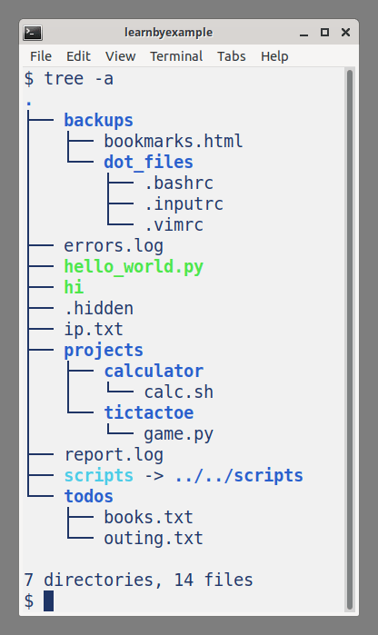

# Preface

This book aims to teach Linux command line tools and Shell Scripting for beginner to intermediate level users. The focus is towards managing your files and performing text processing tasks. Topics like system administration and networking won't be discussed, but some details might get covered in future versions of this book.

## Prerequisites

You should be familiar with basic computer usage, know fundamental terms like files and directories, how to install programs and so on. You should also be already comfortable with programming basics like variables, loops and functions.

In terms of software, you should have access to the `GNU bash` shell and commonly used Linux command line tools. This could be as part of a Linux distribution or via other means such as a Virtual Machine, WSL (Windows Subsystem for Linux) and so on. More details about the working environment will be discussed in the introductory chapters.

You are also expected to get comfortable with reading manuals, searching online, visiting external links provided for further reading, tinkering with illustrated examples, asking for help when you are stuck and so on. In other words, be proactive and curious instead of just consuming the content passively.

See my curated list on [Linux CLI and Shell Scripting](https://learnbyexample.github.io/curated_resources/linux_cli_scripting.html) for more learning resources.

## Conventions

* Code snippets shown are copy pasted from the `bash` shell (version **5.0.17**) and modified for presentation purposes. Some commands are preceded by comments to provide context and explanations, blank lines have been added to improve readability and so on.
* External links are provided throughout the book for you to explore certain topics in more depth.
* The [cli-computing repo](https://github.com/learnbyexample/cli-computing) has all the [example files and scripts](https://github.com/learnbyexample/cli-computing/tree/master/example_files) used in the book. The repo also includes all the [exercises](https://github.com/learnbyexample/cli-computing/blob/master/exercises/exercises.md) as a single file, along with a separate [solutions](https://github.com/learnbyexample/cli-computing/blob/master/exercises/exercise-solutions.md) file. If you are not familiar with `git` command, click the **Code** button on the webpage to get the files.
* See the [Setup](#setup) section for instructions to create a working environment for following along the contents presented in this book.

## Acknowledgements

* [GNU Manuals](https://www.gnu.org/manual/manual.html) — documentation for command line tools and the `bash` shell
* [stackoverflow](https://stackoverflow.com/) and [unix.stackexchange](https://unix.stackexchange.com/) — for getting answers on pertinent questions related to CLI tools
* [tex.stackexchange](https://tex.stackexchange.com/) — for help on [pandoc](https://github.com/jgm/pandoc/) and `tex` related questions
* [/r/commandline/](https://old.reddit.com/r/commandline), [/r/linux4noobs/](https://old.reddit.com/r/linux4noobs/), [/r/linuxquestions/](https://old.reddit.com/r/linuxquestions/) and [/r/linux/](https://old.reddit.com/r/linux/) — helpful forums
* [canva](https://www.canva.com/) — cover image
* [Warning](https://commons.wikimedia.org/wiki/File:Warning_icon.svg) and [Info](https://commons.wikimedia.org/wiki/File:Info_icon_002.svg) icons by [Amada44](https://commons.wikimedia.org/wiki/User:Amada44) under public domain
* [carbon](https://carbon.now.sh/) — creating terminal screenshots with highlighted text
* [oxipng](https://github.com/shssoichiro/oxipng), [pngquant](https://pngquant.org/) and [svgcleaner](https://github.com/RazrFalcon/svgcleaner) — optimizing images

## Feedback and Errata

I would highly appreciate if you'd let me know how you felt about this book. It could be anything from a simple thank you, pointing out a typo, mistakes in code snippets, which aspects of the book worked for you (or didn't!) and so on. Reader feedback is essential and especially so for self-published authors.

You can reach me via:

* Issue Manager: [https://github.com/learnbyexample/cli-computing/issues](https://github.com/learnbyexample/cli-computing/issues)
* E-mail: learnbyexample.net@gmail.com
* Twitter: [https://twitter.com/learn_byexample](https://twitter.com/learn_byexample)

## Author info

Sundeep Agarwal is a lazy being who prefers to work just enough to support his modest lifestyle. He accumulated vast wealth working as a Design Engineer at Analog Devices and retired from the corporate world at the ripe age of twenty-eight. Unfortunately, he squandered his savings within a few years and had to scramble trying to earn a living. Against all odds, selling programming ebooks saved his lazy self from having to look for a job again. He can now afford all the fantasy ebooks he wants to read and spends unhealthy amount of time browsing the internet.

When the creative muse strikes, he can be found working on yet another programming ebook (which invariably ends up having at least one example with regular expressions). Researching materials for his ebooks and everyday social media usage drowned his bookmarks, so he maintains curated resource lists for sanity sake. He is thankful for free learning resources and open source tools. His own contributions can be found at [https://github.com/learnbyexample](https://github.com/learnbyexample).

**List of books:** [https://learnbyexample.github.io/books/](https://learnbyexample.github.io/books/)

## License

This work is licensed under a [Creative Commons Attribution-NonCommercial-ShareAlike 4.0 International License](https://creativecommons.org/licenses/by-nc-sa/4.0/)

Code snippets are available under [MIT License](https://github.com/learnbyexample/cli-computing/blob/master/LICENSE)

Resources mentioned in the Acknowledgements section above are available under original licenses.

## Book version

1.0

See [Version_changes.md](https://github.com/learnbyexample/cli-computing/blob/master/Version_changes.md) to track changes across book versions.

# Introduction and Setup

Back in 2007, I had a rough beginning as a design engineer at a semiconductor company in terms of utilizing software tools. Linux command line, Vim and Perl were all new to me. In addition to learning about command line tools from colleagues and supervisors, I remember going through and making notes in a photocopied book (unable to recall the title now).

The biggest pain points were not knowing about handy options (for example, `grep --color` to highlight matching portions, `find -exec` to apply commands on filtered files, etc) and tools (for example, `xargs` to workaround limitations of too many command line arguments). And then there were tools like `sed` and `awk` with intimidating syntax. I'm at a loss to reason out why I didn't utilize shell scripts much. I stuck to Perl and Vim instead of learning such handy tools. I also did not know about forums like [stackoverflow](https://stackoverflow.com/) and [unix.stackexchange](https://unix.stackexchange.com/) until after I left my job in 2014.

I started collating what I knew about Linux command line tools when I got chances to conduct scripting course workshops for college students. From 2016 to 2018, I started maintaining my tutorials on Linux command line, Vim and scripting languages as GitHub repos. As you might guess, I then started polishing these materials and [published them as ebooks](https://learnbyexample.github.io/books/). This is an ongoing process, with **Computing from the Command Line** being the thirteenth ebook.

This book aims to teach Linux command line tools and Shell Scripting for beginner to intermediate level users. Plenty of examples are provided to make it easier to understand a particular tool and its various features. External links are provided for further reading. Important notes and warnings are formatted to stand out from normal text.

Writing a book always has a few pleasant surprises for me. This time I learned handy options like `mkdir -m` and `chmod =`, got better understanding of many shell features and so on. I'm also planning to learn and present more command line tools for the next version of this book.

This chapter will give a brief introduction to Linux. You'll also see suggestions and instructions for setting up a command line environment to follow along the contents presented in this book.

## Linux overview

Quoting selective parts from [wikipedia](https://en.wikipedia.org/wiki/Linux):

>Linux is a family of open-source Unix-like operating systems based on the Linux kernel, an operating system kernel first released on September 17, 1991, by Linus Torvalds. Linux is typically packaged in a Linux distribution.
>
>Linux was originally developed for personal computers based on the Intel x86 architecture, but has since been ported to more platforms than any other operating system. Because of the dominance of the Linux-based Android on smartphones, Linux also has the largest installed base of all general-purpose operating systems. 
>
>Linux is one of the most prominent examples of free and open-source software collaboration. The source code may be used, modified and distributed commercially or non-commercially by anyone under the terms of its respective licenses, such as the GNU General Public License.

Apart from Linux exposure during my previous job, I've been using Linux as my desktop system since 2014 and it is very well suited for my needs. Compared to my Windows experience, Linux is light weight, secure, stable, fast and more importantly doesn't force you to upgrade hardware. Read the wikipedia article linked above for a more comprehensive coverage about Linux, where it is used and so on.

## Linux Distros

Quoting again from [wikipedia](https://en.wikipedia.org/wiki/Linux_distribution):

>A Linux distribution (often abbreviated as distro) is an operating system made from a software collection that is based upon the Linux kernel and, often, a package management system. Linux users usually obtain their operating system by downloading one of the Linux distributions, which are available for a wide variety of systems ranging from embedded devices (for example, OpenWrt) and personal computers (for example, Linux Mint) to powerful supercomputers (for example, Rocks Cluster Distribution).

I use Ubuntu, which is beginner friendly. Here are some resources to help you choose a distro:

* [/r/linux4noobs wiki](https://old.reddit.com/r/linux4noobs/wiki/distro_selection) — selection guide for noobs
* [List of Linux distributions](https://en.wikipedia.org/wiki/List_of_Linux_distributions) — general information about notable Linux distributions in the form of a categorized list
* [DistroWatch](https://distrowatch.com/) — website dedicated to talking about, reviewing and keeping up to date with open source operating systems. This site particularly focuses on Linux distributions and flavours of BSD, though other open source operating systems are sometimes discussed
* [Light Weight Linux Distros](https://en.wikipedia.org/wiki/Light-weight_Linux_distribution) — uses lower memory and/or has less processor-speed requirements than a more "feature-rich" Linux distribution

## Access to Linux environment

You'll usually find installation instructions from the respective distro website you wish to install. Alternatively, you can install Linux on a [virtual machine](https://en.wikipedia.org/wiki/Virtual_machine) or try it online. Here are some resources to get you started:

* [Install Ubuntu desktop](https://ubuntu.com/tutorials/install-ubuntu-desktop)
* [How to run Ubuntu Desktop on a virtual machine using VirtualBox](https://ubuntu.com/tutorials/how-to-run-ubuntu-desktop-on-a-virtual-machine-using-virtualbox)
* [DistroTest](https://distrotest.net/index.php) — test a distro directly online without installation

If you are already on Windows or macOS, the following options can be used to get access to Linux tools:

* [Git for Windows](https://git-scm.com/downloads) — provides a Bash emulation used to run Git from the command line
* [Windows Subsystem for Linux](https://en.wikipedia.org/wiki/Windows_Subsystem_for_Linux) — compatibility layer for running Linux binary executables natively on Windows
* [brew](https://brew.sh/) — Package Manager for macOS (or Linux)

>   If you are completely new to command line usage, I'd recommend setting up a virtual machine. Or perhaps, a secondary computer that you are free to experiment with. Mistakes in command line can be more destructive compared to the graphical interface. For example, a single space typo can result in data loss, leave your machine unusable, etc.

## Setup

To follow along the contents presented in this book, you'll need files from my [cli-computing repo](https://github.com/learnbyexample/cli-computing). Once you have access to a Linux environment, follow the instructions shown below. If all the commands used below seem alien to you, wait until you reach the [ls](#ls) section (you'll get a link back to these instructions at that point).

To get the files, you can clone the cli-computing repo using the `git` command or download a `zip` version. You may have to install the `git` command if you don't already have it, for example `sudo apt install git` on Debian-like systems. See [https://git-scm.com/downloads](https://git-scm.com/downloads) for other installation choices.

```bash
# option 1: use git
$ git clone --depth 1 https://github.com/learnbyexample/cli-computing.git

# option 2: download zip file
# you can also use 'curl -OL' instead of 'wget'
$ wget https://github.com/learnbyexample/cli-computing/archive/refs/heads/master.zip
$ unzip master.zip
$ mv cli-computing-master cli-computing
```

Once you have the files, you'll be able to follow along the commands presented in this book. For example, you'll need to execute the `ls.sh` script for the [ls](#ls) section.

```bash
$ cd cli-computing/example_files/scripts/
$ ls
cp.sh  file.sh  globs.sh  ls.sh  rm.sh    tar.sh
du.sh  find.sh  grep.sh   mv.sh  stat.sh  touch.sh

$ source ls.sh
$ ls -F
backups/    hello_world.py*  ip.txt     report.log  todos/
errors.log  hi*              projects/  scripts@
```

For sections like the [cat](#cat) command, you'll need to use the sample input files provided in the `text_files` directory.

```bash
$ cd cli-computing/example_files/text_files/
$ cat greeting.txt 
Hi there
Have a nice day
```

## Command Line Interface

Command Line Interface (CLI) allows you to interact with the computer using text commands. For example, the `cd` command helps you navigate to a particular directory. The `ls` command shows the contents of a directory. In a graphical environment, you'd use an explorer (file manager) for navigation and directory contents are shown by default. Some tasks can be accomplished in both CLI and GUI environments, while some are suitable and effective only in one of them.

Here are some advantages of using CLI tools over GUI programs:

* automation
* faster execution
* command invocations are repeatable
* easy to save solutions and share with others
* single environment compared to different UI/UX with graphical solutions
* common text interface allows tools to easily communicate with each other

And here are some disadvantages:

* steep learning curve
* syntax can get very complicated
* need to get comfortable with plenty of tools
* typos have a tendency to be more destructive

You can make use of features like command history, shortcuts and autocompletion to help with plethora of commands and syntax issues. Consistent practice will help to get familiar with quirks of the command line environment. Commands with destructive potential will usually include options to allow manual confirmation and interactive usage, thus reducing or entirely avoiding the impact of typos.

## Chapters

Here's the list of remaining chapters:

* [Command Line Overview](#command-line-overview)
* [Managing Files and Directories](#managing-files-and-directories)
* [Shell Features](#shell-features)
* [Viewing Part or Whole File Contents](#viewing-part-or-whole-file-contents)
* [Searching Files and Filenames](#searching-files-and-filenames)
* [File Properties](#file-properties)
* [Managing Processes](#managing-processes)
* [Multipurpose Text Processing Tools](#multipurpose-text-processing-tools)
* [Sorting Stuff](#sorting-stuff)
* [Comparing Files](#comparing-files)
* [Assorted Text Processing Tools](#assorted-text-processing-tools)
* [Shell Scripting](#shell-scripting)
* [Shell Customization](#shell-customization)

## Resource lists

This book covers but a tiny portion of Linux command line usage. Topics like system administration and networking aren't discussed at all. Check out the following lists to learn about such topics and discover cool tools:

* [Linux curated resources](https://learnbyexample.github.io/curated_resources/linux_cli_scripting.html) — my collection of resources for Linux command line, shell scripting and other related topics
* [Awesome Linux](https://github.com/inputsh/awesome-linux) — list of awesome projects and resources that make Linux even more awesome
* [Arch wiki: list of applications](https://wiki.archlinux.org/title/List_of_applications) — sorted by category, helps as a reference for those looking for packages

# Command Line Overview

This chapter will help you take the first steps in the command line world. Apart from command examples that you can try out, you'll also learn a few essential things about working in a text environment.

For newbies, the sudden paradigm shift to interacting with the computer using just text commands can be overwhelming, especially for those accustomed to the graphical user interface (GUI). After regular usage, things will start to look systematic and you might realize that GUI is ill suited for repetitive tasks. With continuous use, recalling various commands will become easier. Features like command line history, aliases, tab-completion and shortcuts will help too.

If you've used a scientific calculator, you'd know that it is handy with too many functionalities cramped into a tiny screen and a plethora of multipurpose buttons. Command line environment is something like that, but not limited just to mathematics. From managing files to munging data, from image manipulations to working with video, you'll likely find a tool for almost any computing task you can imagine. Always remember that command line tools appeared long before graphical ones did. The rich history shows its weight in the form of robust tools and the availability of wide variety of applications.

## Hello Command Line

Open a [Terminal Emulator](https://en.wikipedia.org/wiki/Terminal_emulator) and type the command as shown below. The `$` followed by a space character at the start is the simple command prompt that I use. It might be different for you. The actual command to type is `echo` followed by a space, then the argument `'Hello Command Line'` and finally press the `Enter` key to execute it. You should get the argument echoed back to you as the command output.

```bash
$ echo 'Hello Command Line'
Hello Command Line
```

Here's another simple illustration. This time, the command `pwd` is entered by itself (i.e. no arguments). You should get *your* current location as the output. The `/` character separates different parts of the location (more details in the upcoming sections).

```bash
$ pwd
/home/learnbyexample
```

Next, enter the `exit` command to quit the Terminal session.

```bash
$ exit
```

If you are completely new to the command line world, try out the above steps a few more times until you feel comfortable with opening a Terminal Emulator, executing commands and quitting the session. More details about the command structure, customizing command prompt, etc will be discussed later.

## File System

In Linux, directory structure starts with the `/` symbol, which is referred to as the **root** directory. The `man hier` command gives description of the file system hierarchy. Here are some selected examples:

* `/` This is the root directory. This is where the whole tree starts.
* `/bin` This directory contains executable programs which are needed in single user mode and to bring the system up or repair it.
* `/home` On machines with home directories for users, these are usually beneath this directory, directly or not. The structure of this directory depends on local administration decisions (optional).
* `/tmp` This directory contains temporary files which may be deleted with no notice, such as by a regular job or at system boot up.
* `/usr` This directory is usually mounted from a separate partition. It should hold only shareable, read-only data, so that it can be mounted by various machines running Linux.
* `/usr/bin` This is the primary directory for executable programs. Most programs executed by normal users which are not needed for booting or for repairing the system and which are not installed locally should be placed in this directory.
* `/usr/share` This directory contains subdirectories with specific application data, that can be shared among different architectures of the same OS.

## Absolute and Relative paths

Quoting [wikipedia](https://en.wikipedia.org/wiki/Path_%28computing%29#Absolute_and_relative_paths):

>An **absolute** or **full** path points to the same location in a file system regardless of the current working directory. To do that, it must contain the root directory.

>By contrast, a **relative** path starts from some given working directory, avoiding the need to provide the full absolute path. A filename can be considered as a relative path based at the current working directory. If the working directory is not the file's parent directory, a file not found error will result if the file is addressed by its name.

For example, `/home/learnbyexample` is an absolute path and `../design` is a relative path. You'll learn how paths are used for performing tasks in the coming chapters.

## Shells and Terminal Emulators

These terms are often used to interchangeably mean the same thing — a prompt to allow the user to execute commands. However, they are quite different:

* **Shell** is a command line interpreter. Sets the syntax rules for invoking commands, provides operators to connect commands and redirect data, has scripting features like loops, functions and so on
* **Terminal** is a text input/output environment. Responsible for visual details like font size, color, etc

Some of the popular shells are `bash`, `zsh` and `fish`. This book will discuss only the [Bash](https://en.wikipedia.org/wiki/Bash_(Unix_shell)) shell. Some of the popular terminal emulators are [GNOME Terminal](https://en.wikipedia.org/wiki/GNOME_Terminal), [konsole](https://en.wikipedia.org/wiki/Konsole), [xterm](https://en.wikipedia.org/wiki/Xterm) and [alacritty](https://github.com/alacritty/alacritty).

Quoting from [wikipedia: Unix shell](https://en.wikipedia.org/wiki/Unix_shell):

>A Unix shell is a command-line interpreter or shell that provides a command line user interface for Unix-like operating systems. The shell is both an interactive command language and a scripting language, and is used by the operating system to control the execution of the system using shell scripts.
>
>Users typically interact with a Unix shell using a terminal emulator; however, direct operation via serial hardware connections or Secure Shell are common for server systems. All Unix shells provide filename wildcarding, piping, here documents, command substitution, variables and control structures for condition-testing and iteration.

Shell features will be discussed in later sections and chapters. For now, open a terminal and try out the following commands:

```bash
$ cat /etc/shells
# /etc/shells: valid login shells
/bin/sh
/bin/dash
/bin/bash
/bin/rbash

$ echo "$SHELL"
/bin/bash
```

In the above example, the `cat` command is used to display the contents of a file and the `echo` command is used to display the contents of a variable. `SHELL` is an environment variable containing full path to the shell.

> The output of the above commands might be different for you. And as mentioned earlier, your command prompt might be different than `$ `. For now, you can ignore it. Or, you could type `PS1='$ '` and press the `Enter` key to set the prompt for the current session.

**Further Reading**

* [unix.stackexchange: What is the exact difference between a 'terminal', a 'shell', a 'tty' and a 'console'?](https://unix.stackexchange.com/q/4126/109046)
* [wikipedia: Comparison of command shells](https://en.wikipedia.org/wiki/Comparison_of_command_shells)
* [unix.stackexchange: Difference between login shell and non-login shell](https://unix.stackexchange.com/q/38175/109046)
* [Features and differences between various shells](http://www.faqs.org/faqs/unix-faq/shell/shell-differences/)
* [Syntax comparison on different shells with examples](https://hyperpolyglot.org/unix-shells)
* [Shell, choosing shell and changing default shells](https://wiki.ubuntu.com/ChangingShells)

## Unix Philosophy

Quoting from [wikipedia: Unix Philosophy](https://en.wikipedia.org/wiki/Unix_philosophy):

> * Write programs that do one thing and do it well.
>
> * Write programs to work together.
>
> * Write programs to handle text streams, because that is a universal interface.

These principles do not strictly apply to all the command line tools, but it is good to be aware of them. As you get familiar with working from the command line, you'll be able to appreciate these guidelines better.

## Command Structure

It is not necessary to fully understand the commands used in this chapter, just the broad strokes. The examples are intended to help you get a feel for the basics of using command options and arguments.

**Command invocation without any options or arguments**:

* `clear` clear the terminal screen
* `date` show the current date and time

**Command with options (flags)**:

* `ls -l` list directory contents in a long listing format
* `ls -la` list directory contents including hidden files in long listing format
    * two short options `-l` and `-a` are combined together here as `-la`
* `df -h` report file system disk space usage sizes in human readable format
* `df --human-readable` same as `df -h` but using long option instead of short option

**Command with arguments**:

* `mkdir project` create a directory named `project` in the current working directory
* `man sort` manual page for the `sort` command
* `diff file1.txt file2.txt` display differences between the two input files
* `wget https://s.ntnu.no/bashguide.pdf` download a file from the internet
    * the link passed to `wget` in the above example is real, visit [BashGuide](https://mywiki.wooledge.org/BashGuide) for details

**Command with both options and arguments**:

* `rm -r project` remove (delete) the `project` directory recursively
* `paste -sd, ip.txt` serialize all lines from the input file to a single line using `,` as the delimiter

**Single quotes vs Double quotes**:

* **Single quotes** preserves the literal value of each character within the quotes
* **Double quotes** preserves the literal value of all characters within the quotes, with the exception of `$`, `` ` ``, `\`, and, when history expansion is enabled, `!`

```bash
# no character is special within single quotes
$ echo '$SHELL'
$SHELL

# $ is special within double quotes, used to interpolate variable here
$ echo "Full path to the shell: $SHELL"
Full path to the shell: /bin/bash
```

More details and other types of quoting will be discussed in the [Shell Features](#shell-features) chapter.

## Command Network

One of the *Unix Philosophy* seen earlier mentioned commands working together. The shell provides several ways to do so. A commonly used feature is redirecting the output of a command — as input of another command, to be saved in a file and so on.

* to another command
    * `du -sh * | sort -h` calculate size of files and folders in human-readable format using `du` and then sort them using a tool specialized for that task
* to a file
    * `grep 'pass' *.log > pass_list.txt` write the results to a file instead of displaying on the terminal (if the file already exists, it gets overwritten)
    * `grep 'error' *.log >> errors.txt` append the results to the given file (creates a new file if necessary)
* to a variable
    * `d=$(date)` save command output in a variable named `d`

Many more of such shell features will be discussed in later chapters.

## Scripting

Not all operations can be completed using a one-liner from the terminal. In such cases, you can save the instructions in a text file and then execute them. Open your favorite text editor and write the three lines shown below:

```bash
$ cat cmds.sh
echo 'hello world'
echo 'how are you?'
seq 3
```

As an alternate to using a text editor, you can use either of the commands shown below to create this file.

```bash
# assuming 'echo' supports '-e' option in your environment
$ echo -e "echo 'hello world'\necho 'how are you?'\nseq 3" > cmds.sh

# a more portable solution using the builtin 'printf' command
$ printf "echo 'hello world'\necho 'how are you?'\nseq 3\n" > cmds.sh
```

The script file is named `cmds.sh` and has three commands in three separate lines. One way to execute the contents of this file is by using the `source` command:

```bash
$ source cmds.sh
hello world
how are you?
1
2
3
```

> Your Linux distro is likely to have an easy to use graphical text editor such as `gedit` and `mousepad`. See [wiki.archlinux: text editors](https://wiki.archlinux.org/title/List_of_applications#Text_editors) for a huge list of editors to choose from.

> The [Shell Scripting](#shell-scripting) chapter will discuss scripting in more detail.

## Command Help

Most distros for personal use come with documentation for commands already installed. Learning how to use manuals from the terminal is handy and there are ways to get specific information as well.

### man

The `man` command is an interface to view manuals from within the terminal itself. This uses a `pager` (which is usually the `less` command) to display the contents. You could call these commands as terminal user interface (TUI) applications. As an example, type `man cat` and you should see something like the screenshot shown below:


Since the documentation has several lines that doesn't completely fit within the terminal window, you will get only the starting part of the manual. You have several options to navigate:

* `↑` and `↓` arrow keys to move up and down by a line
    * you can also use `k` and `j` keys (same keys as those used in the Vim text editor)
* `f` and `b` keys to move forward and backward by a screenful of content
    * `Space` key also moves forward by a screen
* mouse scroll moves up and down by a few lines
* `g` or `Home` go to the start of the manual
* `G` or `End` go to the end of the manual
* `/pattern` followed by `Enter` search for the given pattern in the forward direction
* `?pattern` followed by `Enter` search for the given pattern in the backward direction
* `n` go to the next match
* `N` go to the previous match
* `q` quit

As you might have noticed in the screenshot above, you can use `h` for help about the `less` command itself. Here are some useful tips related to documentation:

* `man man` gives information about the `man` command itself
* `man bash` will give you the manual page for the `bash` shell
    * since this is very long, I'd recommend using the [online GNU Bash manual](https://www.gnu.org/software/bash/manual/)
* `man find | gvim -` open the manual page in your favorite text editor
* `man -k printf` search the short descriptions in all the manual pages for the string `printf`
    * you can also use the `apropos` command instead of `man -k`
* `wc --help` many commands support the `--help` option to give succinct details like options and syntax
    * also, these details will be displayed on the terminal itself, no need to deal with `pager` interface

> See also [unix.stackexchange: How do I use man pages to learn how to use commands?](https://unix.stackexchange.com/q/193815/109046) and [unix.stackexchange: colors in man pages](https://unix.stackexchange.com/q/119/109046).

>   The Linux manual pages are usually shortened version of the full documentation. You can use the `info` command to view the complete documentation for GNU tools. `info` is also a TUI application, but with different key configuration compared to the `man` command. See [GNU Manuals Online](https://www.gnu.org/manual/manual.html) if you'd prefer to read them from a web browser. You can also download them in formats like PDF for offline usage.

### type

For certain operations, the shell provides its own set of commands, known as builtin commands. The `type` command displays information about a command like its path, whether it is a builtin, alias, function and so on.

```bash
$ type cd
cd is a shell builtin
$ type sed
sed is /bin/sed
$ type type
type is a shell builtin

# multiple commands can be given as arguments
$ type pwd awk
pwd is a shell builtin
awk is /usr/bin/awk
```

As will be discussed in the [Shell Customization](#shell-customization) chapter, you can create aliases to customize command invocations. You can use the `type` command to reveal the nature of such aliases. Here are some examples based on aliases I use:

```bash
$ type p
p is aliased to 'pwd'

$ type ls
ls is aliased to 'ls --color=auto'
```

The `type` command formats the command output with a backtick at the start and a single quotes at the end. That doesn't play well with syntax highlighting, so I've changed the backtick to single quotes in the above illustration.

> See also [unix.stackexchange: What is the difference between a builtin command and one that is not?](https://unix.stackexchange.com/q/11454/109046)

### help

The `help` command provides documentation for builtin commands. Unlike the `man` command, the entire text is displayed as the command output. A help page in the default format is shown below. You can add `-m` option if you want the help content in a pseudo-manpage format.

```bash
$ help pwd
pwd: pwd [-LP]
    Print the name of the current working directory.
    
    Options:
      -L        print the value of $PWD if it names the current working directory
      -P        print the physical directory, without any symbolic links
    
    By default, 'pwd' behaves as if '-L' were specified.
    
    Exit Status:
    Returns 0 unless an invalid option is given or the current directory
    cannot be read.
```

You can use the `-d` option to get a short description of the command:

```bash
$ help -d compgen
compgen - Display possible completions depending on the options.
```

> Use `help help` for documentation on the `help` command. If you use `help` without any argument, it will display all the internally defined shell commands.

### whatis and whereis

Here are some more ways to get specific information about commands:

* `whatis` displays one-line manual page descriptions
* `whereis` locates the binary, source, and manual page files for a command

```bash
$ whatis grep
grep (1)             - print lines that match patterns

$ whereis awk
awk: /usr/bin/awk /usr/lib/x86_64-linux-gnu/awk /usr/share/awk
/usr/share/man/man1/awk.1.gz
```

### ch

[explainshell](https://explainshell.com/) is a web app that shows the help text that matches each argument of the command you type in the app. For example, a screenshot for [tar -xzvf archive.tar.gz](https://explainshell.com/explain?cmd=tar+-xzvf+archive.tar.gz) is shown below:


Inspired by this app, I wrote a [Bash script ch](https://github.com/learnbyexample/command_help) to extract information from `man` and `help` pages. Here are some examples:

```bash
$ ch ls -vX
       ls - list directory contents

       -v     natural sort of (version) numbers within text

       -X     sort alphabetically by entry extension

$ ch type -a
    type - Display information about command type.

      -a        display all locations containing an executable named NAME;
                includes aliases, builtins, and functions, if and only if
                the '-p' option is not also used
```

### Further Reading

* [Linux man pages](https://www.mankier.com/) — one of several websites that host man pages online
* [ArchWiki](https://wiki.archlinux.org/title/Table_of_contents) — comprehensive documentation for Arch Linux and other distributions
* [Debian Reference](https://www.debian.org/doc/manuals/debian-reference/) — broad overview of the Debian system, covers many aspects of system administration through shell-command examples

## Shortcuts and Autocompletion

There are several shortcuts you can use to be productive at the command line. These will be discussed in the [Shell Customization](#shell-customization) chapter. Here are some examples to give an idea:

* `Ctrl+u` delete everything to the left of the cursor
* `Ctrl+k` delete from the current character to the end of the line
* `Ctrl+c` abort the currently typed command
* `Ctrl+l` clear the terminal screen and move the prompt to the top, any characters typed as part of the current command will be retained
* `↑` and `↓` arrow keys to navigate previously used commands from the history
    * `Ctrl+p` and `Ctrl+n` can also be used instead of arrow keys
    * you can modify the command before executing such lines from the history

The tab key helps you autocomplete commands, aliases, filenames and so on, depending on the context. If there is only one possible completion, it will be done on single tab press. Otherwise, you can press the tab key twice to get a list of possible matches (if there are any). Here's an example of completing a file path with multiple tab key presses at various stages. Not only does it saves time, it also helps to avoid typos since you are simultaneously verifying the path.

```bash
# pressing tab after typing '/e' will autocomplete to '/etc/'
$ ls /etc/

# pressing tab after 'di' will autocomplete to 'dict'
$ ls /etc/dict
# pressing tab twice will show all possible completions
$ ls /etc/dict
dictd/               dictionaries-common/ 

# type 'i' and press tab to get 'dictionaries-common'
$ ls /etc/dictionaries-common/

# type 'w' and press tab to get 'words'
$ ls /etc/dictionaries-common/words 
```

The character at which the tab key is pressed in the above example has been cherry picked for illustration purposes. The number of steps would increase if you try pressing tab after each character. With experience, using the tab key for autocompletion will become a natural part of your command line usage.

> You can set an option to combine the features of single and double tab presses into a single tab press. This will be discussed in the [Shell Customization](#shell-customization) chapter.

## Real world use cases

If the command line environment only had file managing features, I'd still use it. Given the wide variety of applications available, I can't imagine going back to using a different GUI application for each use case. My primary work is writing ebooks, blog posts and recording videos. Here are the major CLI tools I use:

* text processing using `head`, `tail`, `sort`, `grep`, `sed`, `awk` and so on (you'll learn about these commands in later chapters)
* [git](https://git-scm.com/) — version control
* [pandoc](https://github.com/jgm/pandoc/) — generating PDF/EPUB book versions from markdown files
* [mdBook](https://github.com/rust-lang/mdBook) — web version of the books from markdown files
* [zola](https://github.com/getzola/zola) — static site generator
* [ImageMagick](https://imagemagick.org/index.php) — image processing like resizing, adding borders, etc
* [oxipng](https://github.com/shssoichiro/oxipng), [pngquant](https://pngquant.org/) and [svgcleaner](https://github.com/RazrFalcon/svgcleaner) — optimizing images
* [auto-editor](https://github.com/WyattBlue/auto-editor) — removing silent portions from video recordings
* [FFmpeg](https://github.com/FFmpeg/FFmpeg) — video processing, padding for example (`FFmpeg` is also a major part of the `auto-editor` solution)

Some of these workflows require additional management, for which I write shell functions or scripts. I do need GUI tools as well, for example, web browser, image viewer, PDF/EPUB viewers, [SimpleScreenRecorder](https://github.com/MaartenBaert/ssr) and so on. Some of these can be handled from within the terminal too, but I prefer GUI for such cases. I do launch some of them from the terminal, primarily for providing the file or url to be opened.

You might wonder what advantage does the command line provide for processing images and videos? Apart from being faster, the custom parameters (like border color, border size, quality percentage, etc) are automatically saved as part of the scripts I create. After that, I can just use a single call to the script instead of waiting for a GUI application to open, navigating to required files, applying custom parameters, saving them after all the required processing is done, closing the application, etc. Also, that single script can use as many tools as needed, whereas with GUI you'll have to repeat such steps with different applications.

## Exercises

>  All the exercises are also collated together in one place at [exercises.md](https://github.com/learnbyexample/cli-computing/blob/master/exercises/exercises.md). For solutions, see [exercise-solutions.md](https://github.com/learnbyexample/cli-computing/blob/master/exercises/exercise-solutions.md).

**1)** By default, is `echo` a shell builtin or external command on your system? What command could you use to get an answer for this question?

**2)** What output do you get for the command shown below? Does the documentation help understand the result?

```bash
$ echo apple     42 'banana     100'
```

**3)** Go through [bash manual: Tilde Expansion](https://www.gnu.org/software/bash/manual/html_node/Tilde-Expansion.html). Is `~/projects` a relative or an absolute path? See [this unix.stackexchange thread](https://unix.stackexchange.com/q/221970/109046) for answers.

**4)** Which key would you use to get help while the `less` command is active?

**5)** How would you bring the 50th line to the top of the screen while viewing a `man` page (assume `less` command is the `pager`)?

**6)** What does the `Ctrl+k` shortcut do?

**7)** Briefly explain the role of the following shell operators:

*a)* `|`  
*b)* `>`  
*c)* `>>`

**8)** The `whatis` command displays one-line descriptions about commands. But it doesn't seem to work for `whatis type`. What should you use instead?

```bash
$ whatis cat
cat (1)              - concatenate files and print on the standard output

$ whatis type
type: nothing appropriate.

# ???
type - Display information about command type.
```

**9)** What is the role of the `/tmp` directory?

**10)** Give an example each for absolute and relative paths.

**11)** When would you use the `man -k` command?

**12)** Are there any differences between `man` and `info` pages?

# Managing Files and Directories

This chapter presents commands to do things that are typically handled by a file manager in GUI (also known as file explorer). For example, viewing contents of a directory, navigating to other directories, cut/copy/paste files, renaming and so on. Some of the commands used for these purposes are provided by the shell itself.

As a good practice, make it a habit to go through the documentation of the commands you encounter. Getting used to looking up documentation from the command line will come in handy whenever you are stuck. You can also learn and experiment with options you haven't used yet.

> The [example_files](https://github.com/learnbyexample/cli-computing/tree/master/example_files) directory has the scripts used in this chapter. See [Setup](#setup) section for instructions to create the working environment.

## Builtin and External commands

From [bash manual: What is a shell?](https://www.gnu.org/software/bash/manual/bash.html#What-is-a-shell_003f)

>Shells also provide a small set of built-in commands (builtins) implementing functionality impossible or inconvenient to obtain via separate utilities. For example, `cd`, `break`, `continue`, and `exec` cannot be implemented outside of the shell because they directly manipulate the shell itself. The `history`, `getopts`, `kill`, or `pwd` builtins, among others, could be implemented in separate utilities, but they are more convenient to use as builtin commands.

Many of the commands needed for everyday use are external commands, i.e. not part of the shell. Some builtins, `pwd` for example, might also be available as external command on your system (and these might have differences in features too). In such cases the builtin version will be executed by default, which you can override by using the path of the external version.

You can use the `type` command to distinguish between builtin and external commands. The `type` command is a shell builtin, and provides other features too (which will be discussed later). You can use the `-a` option to get all details about the given command.

```bash
$ type -a cd
cd is a shell builtin

$ type -a ls
ls is /bin/ls

$ type -a pwd
pwd is a shell builtin
pwd is /bin/pwd
```

> To look up documentation, use the `help` command for builtins and `man` for external commands (or `info` for complete documentation, where applicable). Use `help help` and `man man` for their own documentation.

> Typing just `help` will give the list of builtins, along with the command's syntax.

## pwd

`pwd` is a shell builtin command to get the current working directory. This helps to orient yourself with respect to the filesystem. The absolute path printed is often handy to copy-paste elsewhere, in a script for example. Some users prefer their terminal emulators and/or shell prompt to always display the current working directory.

```bash
$ pwd
/home/learnbyexample
```

## cd

`cd` is another shell builtin. This helps to change the current working directory. Here's an example of changing the current working directory using an absolute path:

```bash
$ pwd
/home/learnbyexample

# specifying / at end of the path is optional
$ cd /etc
$ pwd
/etc
```

You can use `-` as an argument to go back to the previous working directory. Continuing from the previous example:

```bash
$ cd -
/home/learnbyexample
```

> Most commands will treat strings starting with `-` as a command option. You can use `--` to tell commands that all the following arguments should *not* be treated as options even if they start with `-`. For example, if you have a folder named `-oops` in the current working directory, you can use `cd -- -oops` to switch to that directory.

Relative paths are well, relative to the current working directory:

* `.` refers to the current directory
* `..` refers to the directory one hierarchy above (i.e. parent directory)
* `../..` refers to the directory two hierarchies above and so on
* `cd ./-` will help you to switch to a directory named `-` in the current location
    * you cannot use `cd -` since that'll take you to the previous working directory

```bash
$ pwd
/home/learnbyexample

# go one hierarchy above
$ cd ..
$ pwd
/home

# change to 'learnbyexample' present in the current directory
# './' is optional in this case
$ cd ./learnbyexample
$ pwd
/home/learnbyexample

# go two hierarchies above
$ cd ../..
$ pwd
/
```

You can switch to the home directory using `cd` or `cd ~` or `cd ~/` from anywhere in the filesystem. This is determined by the value stored in the `HOME` shell variable. See also [bash manual: Tilde Expansion](https://www.gnu.org/software/bash/manual/html_node/Tilde-Expansion.html).

```bash
$ pwd
/
$ echo "$HOME"
/home/learnbyexample

$ cd
$ pwd
/home/learnbyexample
```

## clear

You can use this command to clear the terminal screen. By default, the `clear` command will move the prompt to the top of the terminal as well as try to remove the contents of the scrollback buffer. You can use the `-x` option if you want to retain the scrollback buffer contents.

> The `Ctrl+l` shortcut will also move the prompt line to the top of the terminal. It will retain any text you've typed on the prompt line and scrollback buffer contents won't be cleared. 

## ls

When you use a file explorer GUI application, you'll automatically see the directory contents. And such GUI apps typically have features to show file size, differentiate between files and folders and so on. `ls` is the equivalent command line tool with a plethora of options and functionality related to viewing the contents of directories.

> As mentioned earlier, the [example_files](https://github.com/learnbyexample/cli-computing/tree/master/example_files) directory has the scripts used in this chapter. You can source the `ls.sh` script to follow along the examples shown in this section. See [Setup](#setup) section if you haven't yet created the working environment.
> 
> ```bash
> # first, cd into the 'scripts' directory
> $ cd cli-computing/example_files/scripts
> 
> $ ls
> cp.sh  file.sh  globs.sh  ls.sh  rm.sh    tar.sh
> du.sh  find.sh  grep.sh   mv.sh  stat.sh  touch.sh
> 
> # 'ls.sh' script will create a directory named 'ls_examples'
> # and automatically change to that directory as well
> $ source ls.sh
> $ pwd
> /home/learnbyexample/cli-computing/example_files/scripts/ls_examples
> ```

By default, the current directory contents are displayed. You can pass one or more paths as arguments. Here are some examples:

```bash
$ ls
backups     hello_world.py  ip.txt    report.log  todos
errors.log  hi              projects  scripts

# example with a single path argument
$ ls /sys
block  class  devices   fs          kernel  power
bus    dev    firmware  hypervisor  module

# multiple paths example
# directory listings will be preceded by their names
$ ls projects backups ip.txt
ip.txt

backups:
bookmarks.html  dot_files

projects:
calculator  tictactoe
```

You can use the `-1` option (`1` as in numeric one, not the alphabet `l` which does something else) to list the contents in a single column:

```bash
$ ls -1 backups
bookmarks.html
dot_files
```

The `-F` option appends a character to each filename indicating the file type (if it is other than a regular file):

* `/` directory
* `*` executable file
* `@` symbolic link
* `|` FIFO
* `=` socket
* `>` door

```bash
$ ls -F
backups/    hello_world.py*  ip.txt     report.log  todos/
errors.log  hi*              projects/  scripts@
```

If you just need to distinguish between files and directories, you can use the `-p` option:

```bash
$ ls -p
backups/    hello_world.py  ip.txt     report.log  todos/
errors.log  hi              projects/  scripts
```

You can also use the `--color` option to visually distinguish file types:


The `-l` option displays the contents using a long listing format. You'll get details like file permissions, ownership, size, timestamp and so on. The first character of the first column distinguishes file types as `d` for directories, `-` for regular files, `l` for symbolic links, etc. Under each directory listing, the first line will display the total size of the entries (in terms of KB).

```bash
$ ls -l hi
-rwxrwxr-x 1 learnbyexample learnbyexample 21 Dec  5  2019 hi

# you can add -G option to avoid the group column
$ ls -lG
total 7516
drwxrwxr-x 3 learnbyexample    4096 Feb  4 09:23 backups
-rw-rw-r-- 1 learnbyexample   12345 Jan  1 03:30 errors.log
-rwxrwxr-x 1 learnbyexample      42 Feb 29  2020 hello_world.py
-rwxrwxr-x 1 learnbyexample      21 Dec  5  2019 hi
-rw-rw-r-- 1 learnbyexample      10 Jul 21  2017 ip.txt
drwxrwxr-x 4 learnbyexample    4096 Mar  5 11:21 projects
-rw-rw-r-- 1 learnbyexample 7654321 Jan  1 01:01 report.log
lrwxrwxrwx 1 learnbyexample      13 May  7 15:17 scripts -> ../../scripts
drwxrwxr-x 2 learnbyexample    4096 Apr  6 13:19 todos
```

>  Note that the timestamps showing hours and minutes instead of year depends on the relative difference with respect to the current time. So, for example, you might get `Feb  4  2022` instead of `Feb  4 09:23`.

Use the `-h` option to show file sizes in human readable format (default is byte count).

```bash
$ ls -lG report.log
-rw-rw-r-- 1 learnbyexample 7654321 Jan  1 01:01 report.log

$ ls -lhG report.log
-rw-rw-r-- 1 learnbyexample 7.3M Jan  1 01:01 report.log
```

You can use the `-s` option instead of long listing if you only need allocated file sizes and names:

```bash
$ ls -1sh errors.log report.log
 16K errors.log
7.4M report.log
```

There are several options for changing the order of listing:

* `-t` sorts by timestamp
* `-S` sorts by file size (not suitable for directories)
* `-v` version sorting (suitable for filenames with numbers in them)
* `-X` sorts by file extension (i.e. characters after the last `.` in the filename)
* `-r` reverse the listing order

```bash
$ ls -lGhtr
total 7.4M
-rw-rw-r-- 1 learnbyexample   10 Jul 21  2017 ip.txt
-rwxrwxr-x 1 learnbyexample   21 Dec  5  2019 hi
-rwxrwxr-x 1 learnbyexample   42 Feb 29  2020 hello_world.py
-rw-rw-r-- 1 learnbyexample 7.3M Jan  1 01:01 report.log
-rw-rw-r-- 1 learnbyexample  13K Jan  1 03:30 errors.log
drwxrwxr-x 3 learnbyexample 4.0K Feb  4 09:23 backups
drwxrwxr-x 4 learnbyexample 4.0K Mar  5 11:21 projects
drwxrwxr-x 2 learnbyexample 4.0K Apr  6 13:19 todos
lrwxrwxrwx 1 learnbyexample   13 May  7 15:17 scripts -> ../../scripts
```

Filenames starting with `.` are considered as hidden files and these are NOT shown by default. You can use the `-a` option to view them. The `-A` option is similar, but doesn't show the special `.` and `..` entries.

```bash
# . and .. point to the current and parent directories
$ ls -aF backups/dot_files/
./  ../  .bashrc  .inputrc  .vimrc

# -A will exclude . and ..
$ ls -A backups/dot_files/
.bashrc  .inputrc  .vimrc
```

The `-R` option recursively lists sub-directories as well:

```bash
$ ls -ARF
.:
backups/    hello_world.py*  .hidden  projects/   scripts@
errors.log  hi*              ip.txt   report.log  todos/

./backups:
bookmarks.html  dot_files/

./backups/dot_files:
.bashrc  .inputrc  .vimrc

./projects:
calculator/  tictactoe/

./projects/calculator:
calc.sh

./projects/tictactoe:
game.py

./todos:
books.txt  outing.txt
```

Often you'd want to list only specific files or directories based on some criteria, file extension for example. The shell provides a matching technique called **globs** or **wildcards**. Some simple examples are shown below (see [wildcards](#wildcards) section for more details).

`*` is a placeholder for zero or more characters:

```bash
# *.py *.log will give filenames ending with '.py' or '.log'
$ echo *.py *.log
hello_world.py errors.log report.log

# glob expansion can be prevented by using quotes
$ echo '*.py' *.log
*.py errors.log report.log

# long list only files ending with '.log'
$ ls -lG *.log
-rw-rw-r-- 1 learnbyexample   12345 Jan  1 03:30 errors.log
-rw-rw-r-- 1 learnbyexample 7654321 Jan  1 01:01 report.log
```

`[]` helps you specify a set of characters to be matched once. For example, `[ad]` matches `a` or `d` once. `[c-i]` matches a range of characters from `c` to `i`.

```bash
# entries starting with 'c' to 'i'
$ echo [c-i]*
errors.log hello_world.py hi ip.txt

$ ls -1sh [c-i]*
 16K errors.log
4.0K hello_world.py
4.0K hi
4.0K ip.txt
```

>  As shown in the above examples, globs are expanded by the shell. Beginners often associate globs as something specific to the `ls` command, which is why I've deliberately used `echo` as well in the above examples.

You can use the `-d` option to *not* show directory contents:

```bash
$ echo b*
backups
# since backups is a directory, ls will show its contents
$ ls b*
bookmarks.html  dot_files
# -d will show the directory entry instead of its contents
$ ls -d b*
backups

# a handy way to get only the directory entries
$ echo */
backups/ projects/ scripts/ todos/
$ ls -1d */
backups/
projects/
scripts/
todos/
```

> I hope you have been judiciously taking notes, since there are just too many commands and features. For example, note down all the options discussed in this section. And then explore the output from the `ls --help` command.

**Further Reading**

* [mywiki.wooledge: avoid parsing output of ls](https://mywiki.wooledge.org/ParsingLs)
* [unix.stackexchange: why not parse ls?](https://unix.stackexchange.com/q/128985/109046)
* [unix.stackexchange: What are ./ and ../ directories?](https://unix.stackexchange.com/q/63081/109046)

## tree

The `tree` command displays the contents of a directory recursively, in a hierarchical manner. Here's a screenshot of using `tree -a` from the `ls_examples` sample directory seen in the previous section. The `-a` option is used to show the hidden files as well.



> You might have to install this command. `sudo apt install tree` can be used to get this command on Debian-like distributions.

## mkdir

The `mkdir` command helps you to create new directories. You can pass one or more paths along with the name of the directories you want to create. Quote the names if it can contain shell special characters like space, `*` and so on.

> Create a practice directory for this section:
>
> ```bash
> $ mkdir practice_mkdir
> $ cd practice_mkdir
> ```

Here's an example of creating multiple directories:

```bash
$ mkdir reports 'low power adders'

$ ls -1
'low power adders'
reports
```

The `-p` option will help you to create multiple directory hierarchies in one shot:

```bash
# error because 'a' and 'a/b' paths do not exist yet
$ mkdir a/b/c
mkdir: cannot create directory ‘a/b/c’: No such file or directory

# -p is handy in such cases
$ mkdir -p a/b/c

$ tree
.
├── a
│   └── b
│       └── c
├── low power adders
└── reports

5 directories, 0 files
```

The `-p` option has another functionality too. It will not complain if the directory you are trying to create already exists. This is especially helpful in shell scripts.

```bash
# 'reports' directory was already created in an earlier example
$ mkdir reports
mkdir: cannot create directory ‘reports’: File exists
# exit status will reflect that something went wrong
$ echo $?
1

# the -p option will override such errors
$ mkdir -p reports
$ echo $?
0
```

As seen in the examples above, you can check the exit status of the last executed command using the `$?` special variable. `0` means everything went well and higher numbers indicate some sort of failure has occurred (the details of which you can look up in the command's manual).

>  Linux filenames can use any character other than `/` and the ASCII NUL character. Quote the arguments if it contains characters like space, `*`, etc to prevent shell expansion. Shell considers space as the argument separator, `*` is a wildcard character and so on. As a good practice, use only alphabets, numbers and underscores for filenames, unless you have some specific requirements. See also [unix.stackexchange: Characters best avoided in filenames](https://unix.stackexchange.com/q/269093/109046).

> You can delete the practice directory if you wish:
>
> ```bash
> $ cd ..
> $ rm -r practice_mkdir
> ```

## touch

You'll usually create files using a text editor or by redirecting the output of a command to a file. For some cases, empty files are needed for testing purposes or to satisfy a particular build process. A real world use case is the empty `.nojekyll` file for [GitHub Pages](https://docs.github.com/en/pages/getting-started-with-github-pages/about-github-pages#static-site-generators).

The `touch` command's main functionality is altering timestamps (which will be discussed in the [File Properties](#file-properties) chapter). If a file doesn't exist, `touch` will create an empty file using the current timestamp. You can also pass more than one file argument if needed.

```bash
$ mkdir practice_touch
$ cd practice_touch

$ ls ip.txt
ls: cannot access 'ip.txt': No such file or directory

$ touch ip.txt

$ ls -s ip.txt
0 ip.txt
```

> You can create an empty file using `> ip.txt` as well, but the redirection operator will overwrite the file if it already exists.

## rm

The `rm` command will help you to delete files and directories. You can pass one or more paths as arguments.

```bash
# change to the 'scripts' directory and source the 'rm.sh' script
$ source rm.sh
$ ls -F
empty_dir/  hello.py  loops.py  projects/  read_only.txt  reports/

# delete files ending with .py
$ rm *.py
$ ls -F
empty_dir/  projects/  read_only.txt  reports/
```

You'll need to add the `-r` option to recursively delete directory contents. You can use `rm -d` or the `rmdir` command to delete only empty directories.

```bash
# -r is needed to delete directory contents recursively
$ rm reports
rm: cannot remove 'reports': Is a directory
$ rm -r reports
$ ls -F
empty_dir/  projects/  read_only.txt

# delete empty directories, same as using the 'rmdir' command
$ rm -d empty_dir
# you'll get an error if the directory is not empty
$ rm -d projects
rm: cannot remove 'projects': Directory not empty
```

Typos like misplaced space, wrong glob, etc could wipe out files not intended for deletion. Apart from having backups and snapshots, you could also take some mitigating steps:

* using `-i` option to interactively delete each file
    * you can also use `-I` option for lesser number of prompts
* using `echo` as a dry run to see how the glob expands
* using a trash command (see links below) instead of `rm`

Use `y` for confirmation and `n` to cancel deletion with `-i` or `-I` options. Here's an example of cancelling deletion:

```bash
$ rm -ri projects
rm: descend into directory 'projects'? n

$ ls -F
projects/  read_only.txt
```

And here's an example of providing confirmation at each step of the deletion process:

```bash
$ tree projects
projects
├── calculator
│   └── calc.sh
└── tictactoe
    └── game.py

2 directories, 2 files

$ rm -ri projects
rm: descend into directory 'projects'? y
rm: descend into directory 'projects/tictactoe'? y
rm: remove regular empty file 'projects/tictactoe/game.py'? y
rm: remove directory 'projects/tictactoe'? y
rm: descend into directory 'projects/calculator'? y
rm: remove regular empty file 'projects/calculator/calc.sh'? y
rm: remove directory 'projects/calculator'? y
rm: remove directory 'projects'? y

$ ls -F
read_only.txt
```

The `-f` option can be used to ignore complaints about non-existing files (somewhat similar to the `mkdir -p` feature). It also helps to remove write protected files (provided you have appropriate permissions to delete those files). This option is especially useful for recursive deletion of directories that have write protected files, `.git/objects` for example.

```bash
$ rm xyz.txt
rm: cannot remove 'xyz.txt': No such file or directory
$ echo $?
1
$ rm -f xyz.txt
$ echo $?
0

# example for removing write protected files
# you'll be asked for confirmation even without the -i/-I options
$ rm read_only.txt
rm: remove write-protected regular empty file 'read_only.txt'? n
# with -f, files will be deleted without asking for confirmation
$ rm -f read_only.txt
```

**Further Reading**

* Use a trash command (for example, `trash-cli` on Ubuntu) so that deleted files can be recovered later if needed
    * see also [unix.stackexchange: creating a simple trash command](https://unix.stackexchange.com/q/452496/109046)
* Files removed using `rm` can still be recovered with time and skill
    * [unix.stackexchange: recover deleted files](https://unix.stackexchange.com/q/80270/109046)
    * [unix.stackexchange: recovering accidentally deleted files](https://unix.stackexchange.com/q/2677/109046)
* Use commands like `shred` if you want to make it harder to recover deleted files
    * [wiki.archlinux: Securely wipe disk](https://wiki.archlinux.org/title/Securely_wipe_disk)
* [My curated list](https://learnbyexample.github.io/curated_resources/git_and_github.html) for `git` and related resources

## cp

You can use the `cp` command to make copies of files and directories. With default syntax, you have to specify the source first followed by the destination. To copy multiple items, the last argument as destination can only be a directory. You'll also need to use the `-r` option to copy directories (similar to `rm -r` seen earlier).

```bash
# change to the 'scripts' directory and source the 'cp.sh' script
$ source cp.sh
$ ls -F
backups/  reference/

# recall that . is a relative path referring to the current directory
$ cp /usr/share/dict/words .
$ ls -F
backups/  reference/  words

# error because -r is needed to copy directories
# other file arguments (if present) will still be copied
$ cp /usr/share/dict .
cp: -r not specified; omitting directory '/usr/share/dict'
$ cp -r /usr/share/dict .
$ ls -F
backups/  dict/  reference/  words
```

>  By default, `cp` will overwrite an existing file of the same name in the destination directory. You can use the `-i` option to interactively confirm or deny overwriting existing files. The `-n` option will prevent overwriting existing files without asking for confirmation.

```bash
$ echo 'hello' > ip.txt
$ ls -F
backups/  dict/  ip.txt  reference/  words
$ ls backups
ip.txt  reports
$ cat backups/ip.txt
apple banana cherry
# file will be overwritten without asking for confirmation!
$ cp ip.txt backups/
$ cat backups/ip.txt
hello

# use -i to interactively confirm or deny overwriting
$ echo 'good morning' > ip.txt
$ cp -i ip.txt backups/
cp: overwrite 'backups/ip.txt'? n
$ cat backups/ip.txt
hello

# use -n to prevent overwriting without needing confirmation
$ cp -n ip.txt backups/
$ cat backups/ip.txt
hello
```

If there's a folder in the destination path with the same name as a folder being copied, the contents will be merged. If there are files of identical names in such directories, the same rules discussed above will apply.

```bash
$ tree backups
backups
├── ip.txt
└── reports
    └── jan.log

1 directory, 2 files

$ mkdir reports
$ touch reports/dec.log
$ cp -r reports backups/
$ tree backups
backups
├── ip.txt
└── reports
    ├── dec.log
    └── jan.log

1 directory, 3 files
```

Often, you'd want to copy a file (or a directory) under a different name. In such cases, you can simply use a new name while specifying the destination.

```bash
# copy 'words' file from source as 'words_ref.txt' at destination
$ cp /usr/share/dict/words words_ref.txt

# copy 'words' file as 'words.txt' under the 'reference' directory
$ cp /usr/share/dict/words reference/words.txt

# copy 'dict' directory as 'word_lists'
$ cp -r /usr/share/dict word_lists
```

As mentioned earlier, to copy multiple files and directories, you'll have to specify the destination directory as the last argument.

```bash
$ cp -r ~/.bashrc /usr/share/dict backups/

$ ls -AF backups
.bashrc  dict/  ip.txt  reports/
```

You can use the `-t` option if you want to specify the destination before the source paths (helpful with `find` command for example, will be discussed later). Here are some more notable options:

* `-u` copy files from source only if they are newer or don't exist in the destination
* `-b` and `--backup` options will allow you to create backup copies of files already existing in the destination
* `--preserve` option will help you to copy files along with source file attributes like ownership, timestamp, etc

**Further Reading**

* `rsync` a fast, versatile, remote (and local) file-copying tool
    * [rsync tutorial and examples](https://www.digitalocean.com/community/tutorials/how-to-use-rsync-to-sync-local-and-remote-directories-on-a-vps)
* [syncthing](https://github.com/syncthing/syncthing) — continuous file synchronization program

## mv

You can use the `mv` command to move one or more files and directories from one location to another. Unlike `rm` and `cp`, you do not need the `-r` option for directories.

Syntax for specifying the source and destination is same as seen earlier with `cp`. Here's an example of moving a directory into another directory:

```bash
# change to the 'scripts' directory and source the 'mv.sh' script
$ source mv.sh
$ ls -F
backups/  dot_files/  hello.py  ip.txt  loops.py  manuals/
$ ls -F backups
projects/

$ mv dot_files backups

$ ls -F
backups/  hello.py  ip.txt  loops.py  manuals/
$ ls -F backups
dot_files/  projects/
```

Here's an example for moving multiple files and directories to another directory:

```bash
$ mv *.py manuals backups

$ ls -F
backups/  ip.txt
$ ls -F backups
dot_files/  hello.py  loops.py  manuals/  projects/
```

When you are dealing with a single file or directory, you can also *rename* them:

```bash
# within the same directory
$ mv ip.txt report.txt
$ ls -F
backups/  report.txt

# between different directories
$ mv backups/dot_files rc_files
$ ls -F
backups/  rc_files/  report.txt
$ ls -F backups
hello.py  loops.py  manuals/  projects/
```

Here are some more notable options, some of which behave similar to those seen with the `cp` command:

* `-i` interactively confirm or deny when the destination already has a file of the same name
* `-n` always deny overwriting of files
* `-f` always overwrite files
* `-t` specify the destination elsewhere instead of final argument
* `-u` move only if the files are newer or don't exist in the destination
* `-b` and `--backup` options will allow you to create backup copies of files already existing in the destination
* `-v` verbose option

## rename

The `mv` command is useful for simple file renaming. `rename` helps when you need to modify one or more filenames based on a pattern. There are different implementations of the `rename` command, with wildly different set of features. See [askubuntu: What's the difference between the different "rename" commands?](https://askubuntu.com/questions/956010/whats-the-difference-between-the-different-rename-commands) for details.

Perl implementation of the `rename` command will be discussed in this section. You'd need to know regular expressions to use this command. Basic explanations will be given here, more details can be found in the links mentioned at the end of this section. Here's an example to change the file extensions:

```bash
$ mkdir practice_rename
$ cd practice_rename
# create sample files
$ touch caves.jpeg waterfall.JPEG flower.JPG

# substitution command syntax is s/search/replace/flags
# \. matches . character literally
# e? matches e optionally (? is a quantifier to match 0 or 1 times)
# $ anchors the match to the end of the input
# i flag matches the input case-insensitively
$ rename 's/\.jpe?g$/.jpg/i' *

$ ls
caves.jpg  flower.jpg  waterfall.jpg
$ rm *.jpg
```

As a good practice, use the `-n` option to see how the files will be renamed before actually renaming the files.

```bash
$ touch 1.png 3.png 25.png 100.png
$ ls
100.png  1.png  25.png  3.png

# use -n option for sanity check
# note that 100.png isn't part of the output, since it isn't affected
# \d matches a digit character
# \d+ matches 1 or more digits (+ is a quantifier to match 1 or more times)
# e flag treats the replacement string as Perl code
# $& is a backreference to the matched portion
$ rename -n 's/\d+/sprintf "%03d", $&/e' *.png
rename(1.png, 001.png)
rename(25.png, 025.png)
rename(3.png, 003.png)

# remove -n option after sanity check to actually rename the files
$ rename 's/\d+/sprintf "%03d", $&/e' *.png
$ ls
001.png  003.png  025.png  100.png
```

If the new filename already exists, you'll get an error, which you can override with `-f` option if you wish. If you are passing filenames with path components in them, you can use the `-d` option to affect only the filename portion. Otherwise, the logic you are using might affect directory names as well.

```bash
$ mkdir projects
$ touch projects/toc.sh projects/reports.py

# aim is to uppercase the non-extension part of the filename
# [^.]+ matches 1 or more non '.' characters
# \U changes the characters that follow to uppercase
# $& is a backreference to the matched portion
$ rename -n -d 's/[^.]+/\U$&/' projects/*
rename(projects/reports.py, projects/REPORTS.py)
rename(projects/toc.sh, projects/TOC.sh)

# without -d option, directory name will also be affected
$ rename -n 's/[^.]+/\U$&/' projects/*
rename(projects/reports.py, PROJECTS/REPORTS.py)
rename(projects/toc.sh, PROJECTS/TOC.sh)
```

**Further Reading**

* [perldoc: Regexp tutorial](https://perldoc.perl.org/perlretut)
* See my [Perl one-liners](https://github.com/learnbyexample/learn_perl_oneliners) ebook for examples and more details about the Perl substitution and `rename` commands

## ln

The `ln` command helps you create a link to another file or directory within the same or different location. There are two types of links — **symbolic** links and **hard** links. Symbolic links can point to both files and directories. Here are some characteristics:

* if the original file is deleted or moved to another location, symbolic link will no longer work
* if the symbolic link is moved to another location, it will still work if the link was done using absolute path (for relative path, it will depend on whether or not there's another file with the same name in that location)
* a symbolic link file has its own inode, permissions, timestamps, etc
* some commands will work the same when original file or the symbolic file is given as the command line argument, while some require additional options (`du -L` for example)

Usage is similar to the `cp` command. You have to specify the source first followed by the destination (which is optional if it is the current working directory).

```bash
$ mkdir practice_ln
$ cd practice_ln

# destination is optional for making a link in the current directory
# -s option is needed to make symbolic links
$ ln -s /usr/share/dict/words

# you can also rename the link if needed
$ ln -s /usr/share/dict/words words.txt
$ ls -1sF
total 0
0 words@
0 words.txt@
```

Long listing with `ls -l` will show the path connected to links. You can also use the `readlink` command, which has features like resolving recursively to the canonical file.

```bash
# to know which file the link points to
$ ls -lG words
lrwxrwxrwx 1 learnbyexample 21 Jul  9 13:41 words -> /usr/share/dict/words
$ readlink words
/usr/share/dict/words

# the linked file may be another link
# use -f option to get the original file
$ readlink -f words
/usr/share/dict/english
```

Hard links can only point to another file. You cannot use them for directories and the usage is also restricted to within the same filesystem. The `.` and `..` directories are exceptions, these special purpose hard links are automatically created. Here are some more details about hard links:

* once a hard link is created, there is no distinction between the two files other than their paths. They have same inode, permissions, timestamps, etc
* hard links will continue working even if all the other hard links are deleted
* if a hard link is moved to another location, the links will still be in sync. Any change in one of them will be reflected in all the other links

```bash
$ touch apple.txt
$ ln apple.txt banana.txt

# the -i option gives inode
$ ls -1i apple.txt banana.txt
649140 banana.txt
649140 apple.txt
```

> You can use `unlink` or `rm` commands to delete links.

**Further Reading**

* [askubuntu: What is the difference between a hard link and a symbolic link?](https://askubuntu.com/questions/108771/what-is-the-difference-between-a-hard-link-and-a-symbolic-link)
* [unix.stackexchange: What is the difference between symbolic and hard links?](https://unix.stackexchange.com/q/9575/109046)
* [unix.stackexchange: What is a Superblock, Inode, Dentry and a File?](https://unix.stackexchange.com/q/4402/109046)

## tar and gzip

`tar` is an archiving utility. Depending on the implementation, you can also use options to compress the archive.

Here's an example that creates a single archive file from multiple input files and directories:

```bash
# change to the 'scripts' directory and source the 'tar.sh' script
$ source tar.sh
$ ls -F
projects/  report.log  todos/

# -c option creates a new archive, any existing archive will be overwritten
# -f option allows to specify name of archive to be created
# rest of the arguments are the files/directories to be archived
$ tar -cf bkp.tar report.log projects

$ ls -F
bkp.tar  projects/  report.log  todos/
$ ls -sh bkp.tar
7.4M bkp.tar
```

Once you have an archive file, you can then compress it using tools like `gzip`, `bzip2`, `xz`, etc. In the below example, the command replaces the archive file with the compressed version and adds a `.gz` suffix to indicate that `gzip` was the technique used.

```bash
# the input '.tar' file will be overwritten with the compressed version
$ gzip bkp.tar

$ ls -F
bkp.tar.gz  projects/  report.log  todos/
$ ls -sh bkp.tar.gz
5.6M bkp.tar.gz
```

Use the `-t` option if you want to check the contents of the compressed file. This will work with the uncompressed `.tar` version as well.

```bash
$ tar -tf bkp.tar.gz 
report.log
projects/
projects/scripts/
projects/scripts/calc.sh
projects/errors.log
```

To uncompress `.gz` files, you can use `gunzip` or `gzip -d`. This will replace the compressed version with the uncompressed archive file:

```bash
# this '.gz' file will be overwritten with the uncompressed version
$ gunzip bkp.tar.gz

$ ls -F
bkp.tar  projects/  report.log  todos/
$ ls -sh bkp.tar
7.4M bkp.tar
```

To extract the files from an archive, use `tar` along with the `-x` option:

```bash
$ mkdir test_extract
$ mv bkp.tar test_extract
$ cd test_extract
$ ls
bkp.tar

$ tar -xf bkp.tar
$ tree
.
├── bkp.tar
├── projects
│   ├── errors.log
│   └── scripts
│       └── calc.sh
└── report.log

2 directories, 4 files

$ cd ..
$ rm -r test_extract
```

With `GNU tar`, you can compress/uncompress along with the `tar` command instead of having to use tools like `gzip` separately. For example, the `-z` option will use `gzip`, `-j` will use `bzip2` and `-J` will use `xz`. Use the `-a` option if you want `tar` to automatically select the compression technique based on the extension provided.

```bash
$ ls -F
projects/  report.log  todos/

# -z option gives same compression as the gzip command
$ tar -zcf bkp.tar.gz report.log projects
$ ls -sh bkp.tar.gz
5.6M bkp.tar.gz

# extract original files from compressed file
$ mkdir test_extract
$ cd test_extract
$ tar -zxf ../bkp.tar.gz
$ tree
.
├── projects
│   ├── errors.log
│   └── scripts
│       └── calc.sh
└── report.log

2 directories, 3 files

$ cd ..
$ rm -r test_extract
```

`tar` has lots and lots of options for various needs. Some are listed below, see documentation for complete details.

* `-v` verbose option
* `-r` to append files to an existing archive
* `--exclude=` specify files to be ignored from archiving

There are also commands starting with `z` to work with compressed files, for example:

* `zcat` to display file contents of a compressed file
* `zless` to display file contents of a compressed file one screenful at a time
* `zgrep` to search compressed files

> If you need to work with `.zip` files, use `zip` and `unzip` commands.

**Further Reading**

* [unix.stackexchange: tar files with a sorted order](https://unix.stackexchange.com/q/178127/109046)
* [superuser: gzip without tar? Why are they used together?](https://superuser.com/questions/252065/gzip-without-tar-why-are-they-used-together)
* [unix.stackexchange: xz a directory with tar using maximum compression?](https://unix.stackexchange.com/q/28976/109046)

## Exercises

> The `ls.sh` script will be used for some of the exercises.

**1)** Which of these commands will always display the absolute path of the home directory?

*a)* `pwd`  
*b)* `echo "$PWD"`  
*c)* `echo "$HOME"`  

**2)** The current working directory has a folder named `-dash`. How would you switch to that directory?

*a)* `cd -- -dash`  
*b)* `cd -dash`  
*c)* `cd ./-dash`  
*d)* `cd \-dash`  
*e)* `cd '-dash'`  
*f)* all of the above  
*g)* only *a)* and *c)*  

**3)** Given the directory structure as shown below, how would you change to the `todos` directory?

```bash
# change to the 'scripts' directory and source the 'ls.sh' script
$ source ls.sh

$ ls -F
backups/    hello_world.py*  ip.txt     report.log  todos/
errors.log  hi*              projects/  scripts@
$ cd projects
$ pwd
/home/learnbyexample/cli-computing/example_files/scripts/ls_examples/projects

# ???
$ pwd
/home/learnbyexample/cli-computing/example_files/scripts/ls_examples/todos
```

**4)** As per the scenario shown below, how would you change to the `cli-computing` directory under the user's home directory? And then, how would you go back to the previous working directory?

```bash
$ pwd
/home/learnbyexample/all/projects/square_tictactoe

# ???
$ pwd
/home/learnbyexample/cli-computing

# ???
$ pwd
/home/learnbyexample/all/projects/square_tictactoe
```

**5)** How'd you list the contents of the current directory, one per line, along with the size of the entries in human readable format?

```bash
# change to the 'scripts' directory and source the 'ls.sh' script
$ source ls.sh

# ???
total 7.4M
4.0K backups
 16K errors.log
4.0K hello_world.py
4.0K hi
4.0K ip.txt
4.0K projects
7.4M report.log
   0 scripts
4.0K todos
```

**6)** Which `ls` command option would you use for version based sorting of entries?

**7)** Which `ls` command option would you use for sorting based on entry size?

**8)** Which `ls` command option would you use for sorting based on file extension?

**9)** What does the `-G` option of `ls` command do?

**10)** What does the `-i` option of `ls` command do?

**11)** List only the directories as one entry per line.

```bash
# change to the 'scripts' directory and source the 'ls.sh' script
$ source ls.sh

# ???
backups/
projects/
scripts/
todos/
```

**12)** Assume that a regular file named `notes` already exists. What would happen if you use the `mkdir -p notes` command?

```bash
$ ls -1F notes
notes

# what would happen here?
$ mkdir -p notes
```

**13)** Use one or more commands to match the scenario shown below:

```bash
$ ls -1F
cost.txt

# ???

$ ls -1F
cost.txt
ghost/
quest/
toast/
```

**14)** Use one or more commands to match the scenario shown below:

```bash
# start with an empty directory
$ ls -l
total 0

# ???

$ tree -F
.
├── hobbies/
│   ├── painting/
│   │   └── waterfall.bmp
│   ├── trekking/
│   │   └── himalayas.txt
│   └── writing/
└── shopping/
    └── festival.xlsx

5 directories, 3 files
```

> Don't delete this directory, will be needed in a later exercise.

**15)** If directories to create already exist, which `mkdir` command option would you use to not show an error?

**16)** Use one or more commands to match the scenario given below:

```bash
$ ls -1F
cost.txt
ghost/
quest/
toast/

# ???

$ ls -1F
quest/
```

**17)** What does the `-f` option of `rm` command do?

**18)** Which option would you use to interactively delete files using the `rm` command?

**19)** Can the files removed by `rm` easily be restored? Do you need to take some extra steps or use special commands to make the files more difficult to recover?

**20)** Does your Linux distribution provide a tool to send deleted files to the trash (which would help to recover deleted files)?

**21)** Which option would you use to interactively accept/prevent the `cp` command from overwriting a file of the same name? And which option would prevent overwriting without needing manual confirmation?

**22)** Does the `cp` command allow you to rename the file or directory being copied? If so, can you rename multiple files/directories being copied?

**23)** What do the `-u`, `-b` and `-t` options of `cp` command do?

**24)** What's the difference between the two commands shown below?

```bash
$ cp ip.txt op.txt

$ mv ip.txt op.txt
```

**25)** Which option would you use to interactively accept/prevent the `mv` command from overwriting a file of the same name?

**26)** Use one or more commands to match the scenario shown below. You should have already created this directory structure in an earlier exercise.

```bash
$ tree -F
.
├── hobbies/
│   ├── painting/
│   │   └── waterfall.bmp
│   ├── trekking/
│   │   └── himalayas.txt
│   └── writing/
└── shopping/
    └── festival.xlsx

5 directories, 3 files

# ???

$ tree -F
.
├── hobbies/
│   ├── himalayas.txt
│   └── waterfall.bmp
└── shopping/
    └── festival.xlsx

2 directories, 3 files
```

**27)** What does the `-t` option of `mv` command do?

**28)** Determine and implement the `rename` logic based on the filenames and expected output shown below.

```bash
$ touch '(2020) report part 1.txt' 'analysis part 3 (2018).log'
$ ls -1
'(2020) report part 1.txt'
'analysis part 3 (2018).log'

# ???

$ ls -1
2020_report_part_1.txt
analysis_part_3_2018.log
```

**29)** Does the `ln` command follow the same order to specify source and destination as the `cp` and `mv` commands?

**30)** Which `tar` option helps to compress archives based on filename extension? This option can be used instead of `-z` for `gzip`, `-j` for `bzip2` and `-J` for `xz`.

# Shell Features

This chapter focuses on Bash shell features like quoting mechanisms, wildcards, redirections, command grouping, process substitution, command substitution, etc. Others will be discussed in later chapters.

> The [example_files](https://github.com/learnbyexample/cli-computing/tree/master/example_files) directory has the scripts and sample input files used in this chapter.

> Some of the examples in this chapter use commands that will be discussed in later chapters. Basic description of what such commands do have been added here and you'll also see more examples in the rest of the chapters.

## Quoting mechanisms

This section will quote (*heh*) the relevant definitions from the [bash manual](https://www.gnu.org/software/bash/manual/bash.html#Quoting) and provide some examples for each of the four mechanisms.

*1)* **Escape Character**

>A non-quoted backslash `\` is the Bash escape character. It preserves the literal value of the next character that follows, with the exception of newline.
>
>**metacharacter**: A character that, when unquoted, separates words. A metacharacter is a space, tab, newline, or one of the following characters: `|`, `&`, `;`, `(`, `)`, `<`, or `>`.

Here's an example where unquoted shell metacharacter causes an error:

```bash
$ echo apple;cherry
apple
cherry: command not found

# using '\;' helps you use ';' as an ordinary character
$ echo apple\;cherry
apple;cherry
```

And here's an example where the subtler issue might not be apparent at first glance:

```bash
# this will create two files named 'new' and 'file.txt'
# aim was to create a single file named 'new file.txt'
$ touch new file.txt
$ ls new*txt
ls: cannot access 'new*txt': No such file or directory
$ rm file.txt new

# escaping the space will create a single file named 'new file.txt'
$ touch new\ file.txt
$ ls new*txt
'new file.txt'
$ rm new\ file.txt
```

*2)* **Single Quotes**

>Enclosing characters in single quotes (`'`) preserves the literal value of each character within the quotes. A single quote may not occur between single quotes, even when preceded by a backslash.

No character is special within single quoted strings. Here's an example:

```bash
$ echo 'apple;cherry'
apple;cherry
```

You can place strings represented by different quoting mechanisms next to each other to concatenate them together. Here's an example:

```bash
# concatenation of four strings
# 1: '@fruits = '
# 2: \'
# 3: 'apple and banana'
# 4: \'
$ echo '@fruits = '\''apple and banana'\'
@fruits = 'apple and banana'
```

*3)* **Double Quotes**

>Enclosing characters in double quotes (`"`) preserves the literal value of all characters within the quotes, with the exception of `$`, `` ` ``, `\`, and, when history expansion is enabled, `!`.

Here's an example showing variable interpolation within double quotes:

```bash
$ qty='5'

# as seen earlier, no character is special within single quotes
$ echo 'I bought $qty apples'
I bought $qty apples

# a typical use of double quotes is to enable variable interpolation
$ echo "I bought $qty apples"
I bought 5 apples
```

Unless you specifically want the shell to interpret the contents of a variable, you should always quote the variable to avoid issues due to the presence of shell metacharacters.

```bash
$ f='new file.txt'

# same as: echo 'apple banana' > new file.txt
$ echo 'apple banana' > $f
bash: $f: ambiguous redirect

# same as: echo 'apple banana' > 'new file.txt'
$ echo 'apple banana' > "$f"
$ cat "$f"
apple banana
$ rm "$f"
```

> See also [unix.stackexchange: Why does my shell script choke on whitespace or other special characters?](https://unix.stackexchange.com/q/131766/109046).

*4)* **ANSI-C Quoting**

>Words of the form `$'string'` are treated specially. The word expands to string, with backslash-escaped characters replaced as specified by the ANSI C standard.

This form of quoting helps you use escape sequences like `\t` for tab, `\n` for newline and so on. You can also represent characters using their codepoint values in octal and hexadecimal formats.

```bash
# can also use echo -e 'fig:\t42' or printf 'fig:\t42\n'
$ echo $'fig:\t42'
fig:    42

# \x27 represents single quote character in hexadecimal format
$ echo $'@fruits = \x27apple and banana\x27'
@fruits = 'apple and banana'

# 'grep' helps you to filter lines based on the given pattern
# but it doesn't recognize escapes like '\t' for tab characters
$ printf 'fig\t42\napple 100\nball\t20\n' | grep '\t'
# in such cases, one workaround is use to ANSI-C quoting
$ printf 'fig\t42\napple 100\nball\t20\n' | grep $'\t'
fig     42
ball    20
```

`printf` is a shell builtin which you can use to format arguments (similar to `C` programming language `printf()` function). This command will be used in many more examples to come.

> See [bash manual: ANSI-C Quoting](https://www.gnu.org/software/bash/manual/bash.html#ANSI_002dC-Quoting) for complete list of supported escape sequences. See `man ascii` for a table of ASCII characters and their numerical representations.

## Wildcards

It is relatively easy to specify complete filenames as command arguments when they are few in number. And you could use features like tab completion and middle mouse button click (which pastes the last highlighted text) to assist in such cases.

But what to do if you have to deal with tens and hundreds of files (or even more)? If applicable, one way is to match all the files based on a common pattern in their filenames, for example extensions like `.py`, `.txt` and so on. Wildcards (globs) will help in such cases. This feature is provided by the shell, and thus individual commands need not worry about implementing them. Pattern matching supported by wildcards are somewhat similar to regular expressions, but there are fundamental and syntactical differences between them.

Some of the commonly used wildcards are listed below:

* `*` match any character, zero or more times
    * as a special case, `*` won't match the starting `.` of hidden files unless the `dotglob` shell option is set
* `?` match any character exactly once
* `[set149]` match any of these characters once
* `[^set149]` match any characters *except* the given set of characters
    * you can also use `[!set149]` to negate the character class
* `[a-z]` match a range of characters from `a` to `z`
* `[0-9a-fA-F]` match any hexadecimal character

And here are some examples:

```bash
# change to the 'scripts' directory and source the 'globs.sh' script
$ source globs.sh
$ ls
100.sh   f1.txt      f4.txt    hi.sh   math.h         report-02.log
42.txt   f2_old.txt  f7.txt    ip.txt  notes.txt      report-04.log
calc.py  f2.txt      hello.py  main.c  report-00.log  report-98.log

# beginning with 'c' or 'h' or 't'
$ ls [cht]*
calc.py  hello.py  hi.sh

# only hidden files and directories
$ ls -d .*
.  ..  .hidden  .somerc

# ending with '.c' or '.py'
$ ls *.c *.py
calc.py  hello.py  main.c

# containing 'o' as well as 'x' or 'y' or 'z' afterwards
$ ls *o*[xyz]*
f2_old.txt  hello.py  notes.txt

# ending with '.' and two more characters
$ ls *.??
100.sh  calc.py  hello.py  hi.sh

# shouldn't start with 'f' and ends with '.txt'
$ ls [^f]*.txt
42.txt  ip.txt  notes.txt

# containing digits '1' to '5' and ending with 'log'
$ ls *[1-5]*log
report-02.log  report-04.log
```

Since some characters are special inside the character class, you need special placement to treat them as ordinary characters:

* `-` should be the first or the last character in the set
* `^` should be other than the first character
* `]` should be the first character

```bash
$ ls *[ns-]*
100.sh  main.c     report-00.log  report-04.log
hi.sh   notes.txt  report-02.log  report-98.log

$ touch 'a^b' 'mars[planet].txt'
$ rm -i *[]^]*
rm: remove regular empty file 'a^b'? y
rm: remove regular empty file 'mars[planet].txt'? y
```

A **named character set** is defined by a name enclosed between `[:` and `:]` and has to be used within a character class `[]`, along with any other characters as needed.

| Named set    | Description |
| ------------ | ----------- |
| `[:digit:]`  | `[0-9]` |
| `[:lower:]`  | `[a-z]` |
| `[:upper:]`  | `[A-Z]` |
| `[:alpha:]`  | `[a-zA-Z]` |
| `[:alnum:]`  | `[0-9a-zA-Z]` |
| `[:word:]`   | `[0-9a-zA-Z_]` |
| `[:xdigit:]` | `[0-9a-fA-F]` |
| `[:cntrl:]`  | control characters — first 32 ASCII characters and 127th (DEL) |
| `[:punct:]`  | all the punctuation characters |
| `[:graph:]`  | `[:alnum:]` and `[:punct:]` |
| `[:print:]`  | `[:alnum:]`, `[:punct:]` and space |
| `[:ascii:]`  | all the ASCII characters |
| `[:blank:]`  | space and tab characters |
| `[:space:]`  | whitespace characters |

```bash
# starting with a digit character, same as: [0-9]*
$ ls [[:digit:]]*
100.sh  42.txt

# starting with a digit character or 'c'
# same as: [0-9c]*
$ ls [[:digit:]c]*
100.sh  42.txt  calc.py

# starting with a non-alphabet character
$ ls [^[:alpha:]]*
100.sh  42.txt
```

> As mentioned before, you can use `echo` to test how the wildcards will expand before using a command to act upon the matching files. For example, `echo *.txt` before using commands like `rm *.txt`. One difference compared to `ls` is that `echo` will display the wildcard as is instead of showing an error if there's no match.

> See [bash manual: Pattern Matching](https://www.gnu.org/software/bash/manual/bash.html#Pattern-Matching) for more details, information on locale stuff and so on.

## Brace Expansion

This is not a wildcard feature, you just get expanded strings. Brace expansion has two mechanisms for reducing typing:

* taking out common portions among multiple strings
* generating a range of characters

Say you want to create two files named `test_x.txt` and `test_y.txt`. These two strings have something in common at the start and the end. You can specify the unique portions as comma separated strings within a pair of curly braces and put the common parts around the braces. Multiple braces can be used as needed. Use `echo` for testing purposes.

```bash
$ mkdir practice_brace
$ cd practice_brace

# same as: touch ip1.txt ip3.txt ip7.txt
$ touch ip{1,3,7}.txt
$ ls ip*txt
ip1.txt  ip3.txt  ip7.txt

# same as: mv ip1.txt ip_a.txt
$ mv ip{1,_a}.txt
$ ls ip*txt
ip3.txt  ip7.txt  ip_a.txt

$ echo adders/{half,full}_adder.v
adders/half_adder.v adders/full_adder.v

$ echo file{0,1}.{txt,log}
file0.txt file0.log file1.txt file1.log

# empty alternate is allowed too
$ echo file{,1}.txt
file.txt file1.txt

# example with nested braces
$ echo file.{txt,log{,.bkp}}
file.txt file.log file.log.bkp
```

To generate a range, specify numbers or single characters separated by `..` and an optional third argument as the step value. Here are some examples:

```bash
$ echo {1..4}
1 2 3 4
$ echo {4..1}
4 3 2 1

$ echo {1..2}{a..b}
1a 1b 2a 2b

$ echo file{1..4}.txt
file1.txt file2.txt file3.txt file4.txt

$ echo file{1..10..2}.txt
file1.txt file3.txt file5.txt file7.txt file9.txt

$ echo file_{x..z}.txt
file_x.txt file_y.txt file_z.txt

$ echo {z..j..-3}
z w t q n k

# '0' prefix
$ echo {008..10}
008 009 010
```

If the use of braces doesn't match the expansion syntax, it will be left as is:

```bash
$ echo file{1}.txt
file{1}.txt

$ echo file{1-4}.txt
file{1-4}.txt
```

## Extended and Recursive globs

From `man bash`:

| Extended glob     | Description |
| ----------------- | ---------------------------------------------------- |
| `?(pattern-list)` | Matches zero or one occurrence of the given patterns |
| `*(pattern-list)` | Matches zero or more occurrences of the given patterns |
| `+(pattern-list)` | Matches one or more occurrences of the given patterns |
| `@(pattern-list)` | Matches one of the given patterns |
| `!(pattern-list)` | Matches anything except one of the given patterns |

Extended globs are disabled by default. You can use the `shopt` builtin to set/unset **sh**ell **opt**ions like `extglob`, `globstar`, etc. You can also check what is the current status of such options.

```bash
$ shopt extglob 
extglob         off

# set extglob
$ shopt -s extglob 
$ shopt extglob 
extglob         on

# unset extglob
$ shopt -u extglob 
$ shopt extglob 
extglob         off
```

Here are some examples, assuming `extglob` option has already been set:

```bash
# change to the 'scripts' directory and source the 'globs.sh' script
$ source globs.sh
$ ls
100.sh   f1.txt      f4.txt    hi.sh   math.h         report-02.log
42.txt   f2_old.txt  f7.txt    ip.txt  notes.txt      report-04.log
calc.py  f2.txt      hello.py  main.c  report-00.log  report-98.log

# one or more digits followed by '.' and then zero or more characters
$ ls +([0-9]).*
100.sh  42.txt

# same as: ls *.c *.sh
$ ls *.@(c|sh)
100.sh  hi.sh  main.c

# not ending with '.txt'
$ ls !(*.txt)
100.sh   hello.py  main.c  report-00.log  report-04.log
calc.py  hi.sh     math.h  report-02.log  report-98.log

# not ending with '.txt' or '.log'
$ ls *.!(txt|log)
100.sh  calc.py  hello.py  hi.sh  main.c  math.h
```

If you enable the `globstar` option, you can recursively match filenames within a specified path.

```bash
# change to the 'scripts' directory and source the 'ls.sh' script
$ source ls.sh

# with 'find' command (this will be explained in a later chapter)
$ find -name '*.txt'
./todos/books.txt
./todos/outing.txt
./ip.txt

# with 'globstar' enabled
$ shopt -s globstar
$ ls **/*.txt
ip.txt  todos/books.txt  todos/outing.txt

# another example
$ ls -1 **/*.@(py|html)
backups/bookmarks.html
hello_world.py
projects/tictactoe/game.py
```

> Add the `shopt` invocations to `~/.bashrc` if you want these settings applied at terminal startup. This will be discussed in the [Shell Customization](#shell-customization) chapter.

## set

The `set` builtin command helps you to set or unset values of shell options and positional parameters. Here are some examples for shell options:

```bash
# disables logging command history from this point onwards
$ set +o history
# enable history logging
$ set -o history

# use vi-style CLI editing interface
$ set -o vi
# use emancs-style interface, this is usually the default
$ set -o emacs
```

You'll see more examples (for example, `set -x`) in later chapters. See [bash manual: Set Builtin](https://www.gnu.org/software/bash/manual/bash.html#The-Set-Builtin) for documentation.

## Pipelines

The pipe control operator `|` helps you connect the output of a command as the input of another command. This operator vastly reduces the need for temporary intermediate files. As discussed previously in the [Unix Philosophy](#unix-philosophy) section, command line tools specialize in one task. If you can break down a problem into smaller tasks, the pipe operator will come in handy often. Here are some examples:

```bash
# change to the 'scripts' directory and source the 'du.sh' script
$ source du.sh

# list of files
$ ls
projects  report.log  todos
# count the number of files
# you can also use: printf '%q\n' * | wc -l
$ ls -q | wc -l
3

# report size of files/folders in human readable format
# and then sort them based on human readable sizes in ascending order
$ du -sh * | sort -h
8.0K    todos
48K     projects
7.4M    report.log
```

In the above examples, `ls` and `du` perform their own tasks of displaying list of files and showing file sizes respectively. After that, the `wc` and `sort` commands take care of calculating number of lines and sorting respectively. In such cases, the pipe operator saves you the trouble of dealing with temporary data.

Note that the `%q` format specifier in `printf` helps you quote the arguments in a way that is recognizable by the shell. The `-q` option for `ls` substitutes nongraphic characters in the filenames with a `?` character. Both of these are workarounds to prevent the counting process from getting sidetracked due to characters like newline in the filenames.

> The pipe control operator `|&` will be discussed later in this chapter.

### tee

Sometimes, you might want to display the command output on the terminal as well as require the results for later use. In such cases, you can use the `tee` command:

```bash
$ du -sh * | tee sizes.log
48K     projects
7.4M    report.log
8.0K    todos

$ cat sizes.log
48K     projects
7.4M    report.log
8.0K    todos

$ rm sizes.log
```

## Redirection

From [bash manual: Redirections](https://www.gnu.org/software/bash/manual/bash.html#Redirections):

>Before a command is executed, its input and output may be *redirected* using a special notation interpreted by the shell. Redirection allows commands' file handles to be duplicated, opened, closed, made to refer to different files, and can change the files the command reads from and writes to. Redirection may also be used to modify file handles in the current shell execution environment.

There are three standard data streams:

* **standard input** (`stdin` — file descriptor 0)
* **standard output** (`stdout` — file descriptor 1)
* **standard error** (`stderr` — file descriptor 2)

Both standard output and error are displayed on the terminal by default. The `stderr` stream is used when something goes wrong with the command usage. Each of these three streams have a predefined [file descriptor](https://en.wikipedia.org/wiki/File_descriptor) as mentioned above. In this section, you'll see how to redirect these three streams.

>  Redirections can be placed anywhere, but they are usually used at the start or end of a command. For example, the following two commands are equivalent:
>
> ```bash
> >op.txt grep 'error' report.log
> 
> grep 'error' report.log >op.txt
> ```

> Space characters between the redirection operators and the filename are optional.

### Redirecting output

You can use the `>` operator to redirect the standard output of a command to a file. A number prefix can be added to the `>` operator to work with that particular file descriptor. Default is `1` (recall that the file descriptor for `stdout` is `1`), so `1>` and `>` perform the same operation. Use `>>` to append the output to a file.

The filename provided to the `>` and `>>` operators will be created if a regular file of that name doesn't exist yet. If the file already exists, `>` will overwrite that file and `>>` will append contents to that file.

```bash
# change to the 'example_files/text_files' directory for this section

# save first three lines of 'sample.txt' to 'op.txt'
$ head -n3 sample.txt > op.txt
$ cat op.txt
 1) Hello World
 2) 
 3) Hi there

# append last two lines of 'sample.txt' to 'op.txt'
$ tail -n2 sample.txt >> op.txt
$ cat op.txt
 1) Hello World
 2) 
 3) Hi there
14) He he he
15) Adios amigo

$ rm op.txt
```

> You can use `/dev/null` as a filename to discard the output, to provide an empty file for a command, etc.

> You can use `set noclobber` to prevent overwriting if a file already exists. When the `noclobber` option is set, you can still overwrite a file by using `>|` instead of the `>` operator.

### Redirecting input

Some commands like `tr` and `datamash` can only work with data from the standard input. This isn't an issue when you are piping data from another command, for example:

```bash
# filter lines containing 'the' from the input file 'greeting.txt'
# and then display the results in uppercase using the 'tr' command
$ grep 'the' greeting.txt | tr 'a-z' 'A-Z'
HI THERE
```

You can use the `<` redirection operator if you want to pass data from a file to such commands. The default prefix here is `0`, which is the file descriptor for `stdin` data. Here's an example:

```bash
$ tr 'a-z' 'A-Z' <greeting.txt
HI THERE
HAVE A NICE DAY
```

In some cases, a tool behaves differently when processing `stdin` data compared to file input. Here's an example with `wc -l` to report the total number of lines in the input:

```bash
# line count, filename is part of the output as well
$ wc -l purchases.txt
8 purchases.txt

# filename won't be part of the output for stdin data
# helpful for assigning the number to a variable for scripting purposes
$ wc -l <purchases.txt
8
```

Sometimes, you need to pass `stdin` data as well as other file inputs to a command. In such cases, you can use `-` to represent data from the standard input. Here's an example:

```bash
$ cat scores.csv
Name,Maths,Physics,Chemistry
Ith,100,100,100
Cy,97,98,95
Lin,78,83,80

# insert a column at the start
$ printf 'ID\n1\n2\n3' | paste -d, - scores.csv
ID,Name,Maths,Physics,Chemistry
1,Ith,100,100,100
2,Cy,97,98,95
3,Lin,78,83,80
```

Even though a command accepts file input directly as an argument, redirecting can help for interactive usage. Here's an example:

```bash
# display only the third field
$ <scores.csv cut -d, -f3
Physics
100
98
83

# later, you realize that you need the first field too
# use 'up' arrow key to bring the previous command
# and modify the argument easily at the end
# if you had used cut -d, -f3 scores.csv instead,
# you'd have to navigate past the filename to modify the argument
$ <scores.csv cut -d, -f1,3
Name,Physics
Ith,100
Cy,98
Lin,83
```

>  Don't use `cat filename | cmd` for passing file content as `stdin` data, unless you need to concatenate data from multiple input files. See [wikipedia: UUOC](https://en.wikipedia.org/wiki/Cat_(Unix)#Useless_use_of_cat) and [Useless Use of Cat Award](https://porkmail.org/era/unix/award.html) for more details.

### Redirecting error

Recall that the file descriptor for `stderr` is `2`. So, you can use `2>` to redirect standard error to a file. Use `2>>` if you need to append the contents. Here's an example:

```bash
# assume 'abcdxyz' doesn't exist as a shell command
$ abcdxyz
abcdxyz: command not found

# the error in such cases will be part of the stderr stream, not stdout
# so, you'll need to use 2> here
$ abcdxyz 2> cmderror.log
$ cat cmderror.log
abcdxyz: command not found

$ rm cmderror.log
```

> Use `/dev/null` as a filename if you need to discard the results.

### Combining stdout and stderr

Newer versions of Bash provide these handy shortcuts:

* `&>` redirect both `stdout` and `stderr` (overwrites an existing file)
* `&>>` redirect both `stdout` and `stderr` (appends to existing file)
* `|&` pipe both `stdout` and `stderr` as input to another command

Here's an example which assumes `xyz.txt` doesn't exist, thus leading to errors:

```bash
# using '>' will redirect only the stdout stream
# stderr will be displayed on the terminal
$ grep 'log' file_size.txt xyz.txt > op.txt
grep: xyz.txt: No such file or directory

# using '&>' will redirect both the stdout and stderr streams
$ grep 'log' file_size.txt xyz.txt &> op.txt
$ cat op.txt
file_size.txt:104K    power.log
file_size.txt:746K    report.log
grep: xyz.txt: No such file or directory

$ rm op.txt
```

And here's an example with the `|&` operator:

```bash
# filter lines containing 'log' from the given file arguments
# and then filter lines containing 'or' from the combined stdout and stderr
$ grep 'log' file_size.txt xyz.txt |& grep 'or'
file_size.txt:746K    report.log
grep: xyz.txt: No such file or directory
```

For earlier Bash versions, you'll have to manually redirect the streams:

* `1>&2` redirects file descriptor `1` (`stdout`) to the file descriptor `2` (`stderr`)
* `2>&1` redirects file descriptor `2` (`stderr`) to the file descriptor `1` (`stdout`)

Here are some examples:

```bash
# note that the order of redirections is important here
# you can also use: 2> op.txt 1>&2
$ grep 'log' file_size.txt xyz.txt > op.txt 2>&1
$ cat op.txt
file_size.txt:104K    power.log
file_size.txt:746K    report.log
grep: xyz.txt: No such file or directory
$ rm op.txt

$ grep 'log' file_size.txt xyz.txt 2>&1 | grep 'or'
file_size.txt:746K    report.log
grep: xyz.txt: No such file or directory
```

### Waiting for stdin

Sometimes, you might mistype a command without providing input. And instead of getting an error, you'll see the cursor patiently waiting for something. This isn't the shell hanging up on you. The command is waiting for you to type data, so that it can perform its task.

Say, you typed `cat` and pressed the Enter key. Seeing the blinking cursor, you type some text and press the Enter key again. You'll see the text you just typed echoed back to you as `stdout` (which is the functionality of the `cat` command). This will continue again and again, until you tell the shell that you are done. How to do that? Press `Ctrl+d` on a fresh line or press `Ctrl+d` twice at the end of a line. In the latter case, you'll not get a newline character at the end of the data.

```bash
# press Enter key and Ctrl+d after typing all the required characters
$ cat
knock knock
knock knock
anybody here?
anybody here?

# 'tr' command here translates lowercase to uppercase
$ tr 'a-z' 'A-Z'
knock knock 
KNOCK KNOCK
anybody here?
ANYBODY HERE?
```

>  Getting output immediately after each input line depends on the command's functionality. Commands like `sort` and `shuf` will wait for the entire input data before producing the output.
>
> ```bash
> # press Ctrl+d after the third input line
> $ sort
> lion
> zebra
> bee
> bee
> lion
> zebra
> ```

Here's an example which has output redirection as well:

```bash
# press Ctrl+d after the line containing 'histogram'
# filter lines containing 'is'
$ grep 'is' > op.txt
hi there
this is a sample line
have a nice day
histogram

$ cat op.txt
this is a sample line
histogram

$ rm op.txt
```

> See also [unix.stackexchange: difference between Ctrl+c and Ctrl+d](https://unix.stackexchange.com/q/16333/109046).

### Here Documents

Here Documents is another way to provide `stdin` data. In this case, the termination condition is a line matching a predefined string which is specified after the `<<` redirection operator. This is especially helpful for automation, since pressing `Ctrl+d` interactively isn't desirable. Here's an example:

```bash
# EOF is typically used as the special string
$ cat << 'EOF' > fruits.txt
> banana 2
> papaya 3
> mango  10
> EOF

$ cat fruits.txt
banana 2
papaya 3
mango  10
$ rm fruits.txt
```

In the above example, the termination string was enclosed in single quotes to prevent parameter expansion, command substitution, etc. You can also use `\string` for this purpose. If you use `<<-` instead of `<<`, leading tab characters can be added at the start of input lines without being part of the actual data.

> Just like `$` and a space represents the primary prompt (`PS1` shell variable), `>` and a space at the start of lines represents the secondary prompt `PS2` (applicable for multiline commands). Don't type these characters when you use Here Documents in a shell script.

> See [bash manual: Here Documents](https://www.gnu.org/software/bash/manual/bash.html#Here-Documents) and [stackoverflow: here documents](https://stackoverflow.com/q/2953081/4082052) for more examples and details.

### Here Strings

This is similar to Here Documents, but the termination string isn't used. The redirection operator is `<<<`. Here are some examples:

```bash
$ tr 'a-z' 'A-Z' <<< hello
HELLO
$ tr 'a-z' 'A-Z' <<< 'hello world'
HELLO WORLD

$ greeting='hello world'
$ tr 'a-z' 'A-Z' > op.txt <<< "$greeting"
$ cat op.txt
HELLO WORLD
$ rm op.txt
```

### Further Reading

* [Short introduction to shell redirection](https://mywiki.wooledge.org/BashGuide/InputAndOutput#Redirection)
* [Illustrated Redirection Tutorial](https://wiki.bash-hackers.org/howto/redirection_tutorial)
* [stackoverflow: Redirect a stream to another file descriptor using >&](https://stackoverflow.com/q/818255/4082052)
* [Difference between 2>&1 >foo and >foo 2>&1](https://mywiki.wooledge.org/BashFAQ/055)
* [stackoverflow: Redirect and append both stdout and stderr to a file](https://stackoverflow.com/q/876239/4082052)
* [unix.stackexchange: Examples for <> redirection](https://unix.stackexchange.com/q/164391/109046)

## Grouping commands

You can use `(list)` and `{ list; }` compound commands to redirect content for several commands. The former is executed in a subshell whereas the latter is executed in the current shell context. Spaces around `()` are optional but necessary for the `{}` version. From [bash manual: Lists of Commands](https://www.gnu.org/software/bash/manual/bash.html#Lists):

>A `list` is a sequence of one or more pipelines separated by one of the operators `;`, `&`, `&&`, or `||`, and optionally terminated by one of `;`, `&`, or a newline.

Here are some examples of command groupings:

```bash
# change to the 'example_files/text_files' directory for this section

# the 'sed' command here gives the first line of the input
# rest of the lines are then processed by the 'sort' command
# thus, the header will always be the first line in the output
$ (sed -u '1q' ; sort) < scores.csv
Name,Maths,Physics,Chemistry
Cy,97,98,95
Ith,100,100,100
Lin,78,83,80

# save first three and last two lines from 'sample.txt' to 'op.txt'
$ { head -n3 sample.txt; tail -n2 sample.txt; } > op.txt
$ cat op.txt
 1) Hello World
 2) 
 3) Hi there
14) He he he
15) Adios amigo
$ rm op.txt
```

You might wonder why the second command did not use `< sample.txt` instead of repeating the filename twice. The reason is that some commands might read more than what is required (for buffering purposes) and thus cause issues for the remaining commands. In the `sed+sort` example, the `-u` option guarantees that `sed` will not to read more than the required data. See [unix.stackexchange: sort but keep header line at the top](https://unix.stackexchange.com/q/11856/109046) for more examples and details.

>  You don't need the `()` or `{}` groups to see the results of multiple commands on the terminal. Just the `;` separator between the commands would be enough. See also [bash manual: Command Execution Environment](https://www.gnu.org/software/bash/manual/bash.html#Command-Execution-Environment).
>
> ```bash
> $ head -n1 sample.txt ; echo 'have a nice day'
>  1) Hello World
> have a nice day
> ```

## List control operators

You can use these operators to control the execution of the subsequent command depending on the exit status of the first command. From [bash manual: Lists of Commands](https://www.gnu.org/software/bash/manual/bash.html#Lists):

>AND and OR lists are sequences of one or more pipelines separated by the control operators `&&` and `||`, respectively. AND and OR lists are executed with left associativity.

For AND list, the second command will be executed if and only if the first command exits with `0` status.

```bash
# first command succeeds here, so the second command is also executed
$ echo 'hello' && echo 'have a nice day'
hello
have a nice day

# assume 'abcdxyz' doesn't exist as a shell command
# the second command will not be executed
$ abcdxyz && echo 'have a nice day'
abcdxyz: command not found

# if you use ';' instead, the second command will still be executed
$ abcdxyz ; echo 'have a nice day'
abcdxyz: command not found
have a nice day
```

For OR list, the second command will be executed if and only if the first command does *not* exit with `0` status.

```bash
# since the first command succeeds, the second one won't run
$ echo 'hello' || echo 'have a nice day'
hello

# assume 'abcdxyz' doesn't exist as a shell command
# since the first command fails, the second one will run
$ abcdxyz || echo 'have a nice day'
abcdxyz: command not found
have a nice day
```

## Command substitution

Command substitution allows you to use the standard output of a command as part of another command. Trailing newlines, if any, will be removed. You can use the newer and preferred syntax `$(command)` or the older syntax `` `command` ``. Here are some examples:

```bash
# sample input
$ printf 'hello\ntoday is: \n'
hello
today is:
# append output from the 'date' command to the line containing 'today'
$ printf 'hello\ntoday is: \n' | sed '/today/ s/$/'"$(date +%A)"'/'
hello
today is: Monday

# save the output of 'wc' command to a variable
# same as: line_count=`wc -l <sample.txt`
$ line_count=$(wc -l <sample.txt)
$ echo "$line_count"
15
```

Here's an example with nested substitutions:

```bash
# dirname removes the trailing path component
$ dirname projects/tictactoe/game.py
projects/tictactoe
# basename removes the leading directory component
$ basename projects/tictactoe
tictactoe

$ proj=$(basename $(dirname projects/tictactoe/game.py))
$ echo "$proj"
tictactoe
```

Difference between the two types of syntax is quoted below from [bash manual: Command Substitution](https://www.gnu.org/software/bash/manual/bash.html#Command-Substitution):

>When the old-style backquote form of substitution is used, backslash retains its literal meaning except when followed by `$`, `` ` ``, or `\`. The first backquote not preceded by a backslash terminates the command substitution. When using the $(command) form, all characters between the parentheses make up the command; none are treated specially.
>
>Command substitutions may be nested. To nest when using the backquoted form, escape the inner backquotes with backslashes.

## Process substitution

Instead of a file argument, you can use the output of commands with process substitution. The syntax is `<(list)`. The shell will take care of passing a filename with the standard output of those commands. Here's an example:

```bash
# change to the 'example_files/text_files' directory for this section

$ cat scores.csv
Name,Maths,Physics,Chemistry
Ith,100,100,100
Cy,97,98,95
Lin,78,83,80

# can also use: paste -d, <(echo 'ID'; seq 3) scores.csv
$ paste -d, <(printf 'ID\n1\n2\n3') scores.csv 
ID,Name,Maths,Physics,Chemistry
1,Ith,100,100,100
2,Cy,97,98,95
3,Lin,78,83,80
```

For the above example, you could also have used `-` to represent `stdin` piped data as seen in an earlier section. Here's an example where two substitutions are used. This essentially helps you to avoid managing multiple temporary files, similar to how the `|` pipe operator helps for single temporary file.

```bash
# side-by-side view of sample input files
$ paste f1.txt f2.txt
1       1
2       hello
3       3
world   4

# this command gives the common lines between two files
# the files have to be sorted for the command to work properly
$ comm -12 <(sort f1.txt) <(sort f2.txt)
1
3
```

> See [this unix.stackexchange thread](https://unix.stackexchange.com/q/609375/109046) for examples with `>(list)` form.

## Exercises

> Use the `globs.sh` script for wildcards related exercises, unless otherwise mentioned.

> Create a temporary directory for exercises that may require you to create some files. You can delete such practice directories afterwards.

**1)** Use the `echo` command to display the text as shown below. Use appropriate quoting as necessary.

```abc
# ???
that's    great! $x = $y + $z
```

**2)** Use the `echo` command to display the values of the three variables in the format as shown below.

```bash
$ n1=10
$ n2=90
$ op=100

# ???
10 + 90 = 100
```

**3)** What will be the output of the command shown below?

```bash
$ echo $'\x22apple\x22: \x2710\x27'
```

**4)** List filenames starting with a digit character.

```bash
# change to the 'scripts' directory and source the 'globs.sh' script
$ source globs.sh

# ???
100.sh  42.txt
```

**5)** List filenames whose extension do not begin with `t` or `l`. Assume extensions will have at least one character.

```bash
# ???
100.sh  calc.py  hello.py  hi.sh  main.c  math.h
```

**6)** List filenames whose extension only have a single character.

```bash
# ???
main.c  math.h
```

**7)** List filenames whose extension is not `txt`.

```bash
# ???
100.sh   hello.py  main.c  report-00.log  report-04.log
calc.py  hi.sh     math.h  report-02.log  report-98.log
```

**8)** Describe the wildcard pattern used in the command shown below.

```bash
$ ls *[^[:word:]]*.*
report-00.log  report-02.log  report-04.log  report-98.log
```

**9)** List filenames having only lowercase alphabets before the extension.

```bash
# ???
calc.py  hello.py  hi.sh  ip.txt  main.c  math.h  notes.txt
```

**10)** List filenames starting with `ma` or `he` or `hi`.

```bash
# ???
hello.py  hi.sh  main.c  math.h
```

**11)** What commands would you use to get the outputs shown below? Assume that you do not know the depth of sub-directories.

```bash
# change to the 'scripts' directory and source the 'ls.sh' script
$ source ls.sh

# filenames ending with '.txt'
# ???
ip.txt  todos/books.txt  todos/outing.txt

# directories starting with 'c' or 'd' or 'g' or 'r' or 't'
# ???
backups/dot_files/
projects/calculator/
projects/tictactoe/
todos/
```

**12)** Create and change to an empty directory. Then, use brace expansion along with relevant commands to get the results shown below.

```bash
# ???
$ ls report*
report_2020.txt  report_2021.txt  report_2022.txt

# use 'cp' command here
# ???
$ ls report*
report_2020.txt  report_2021.txt  report_2021.txt.bkp  report_2022.txt
```

**13)** What does the `set` builtin command do?

**14)** What does the `|` pipe operator do? And when would you add the `tee` command?

**15)** Can you infer what the following command does? *Hint*: see `help printf`.

```bash
$ printf '%s\n' apple car dragon
apple
car
dragon
```

**16)** Use brace expansion along with relevant commands and shell features to get the result shown below. *Hint*: see previous question.

```bash
$ ls ip.txt
ls: cannot access 'ip.txt': No such file or directory

# ???
$ cat ip.txt
item_10
item_12
item_14
item_16
item_18
item_20
```

**17)** With `ip.txt` containing text as shown in the previous question, use brace expansion and relevant commands to get the result shown below.

```bash
# ???
$ cat ip.txt
item_10
item_12
item_14
item_16
item_18
item_20
apple_1_banana_6
apple_1_banana_7
apple_1_banana_8
apple_2_banana_6
apple_2_banana_7
apple_2_banana_8
apple_3_banana_6
apple_3_banana_7
apple_3_banana_8
```

**18)** What are the differences between `<` and `|` shell operators, if any?

**19)** Which character is typically used to represent `stdin` data as a file argument?

**20)** What do the following operators do?

*a)* `1>`  
*b)* `2>`  
*c)* `&>`  
*d)* `&>>`  
*e)* `|&`

**21)** What will be the contents of `op.txt` if you use the following `grep` command?

```bash
# press Ctrl+d after the line containing 'histogram'
$ grep 'hi' > op.txt
hi there
this is a sample line
have a nice day
histogram

$ cat op.txt
```

**22)** What will be the contents of `op.txt` if you use the following commands?

```bash
$ qty=42
$ cat << end > op.txt
> dragon
> unicorn
> apple $qty
> ice cream
> end

$ cat op.txt
```

**23)** Correct the command to get the expected output shown below.

```bash
$ books='cradle piranesi soulhome bastion'

# something is wrong with this command
$ sed 's/\b\w/\u&/g' <<< '$books'
$Books

# ???
Cradle Piranesi Soulhome Bastion
```

**24)** Correct the command to get the expected output shown below.

```bash
# something is wrong with this command
$ echo 'hello' ; seq 3 > op.txt
hello
$ cat op.txt
1
2
3

# ???
$ cat op.txt
hello
1
2
3
```

**25)** What will be the output of the following commands?

```bash
$ printf 'hello' | tr 'a-z' 'A-Z' && echo ' there'

$ printf 'hello' | tr 'a-z' 'A-Z' || echo ' there'
```

**26)** Correct the command(s) to get the expected output shown below.

```bash
# something is wrong with these commands
$ nums=$(seq 3)
$ echo $nums
1 2 3

# ???
1
2
3
```

**27)** Will the following two commands produce equivalent output? If not, why not?

```bash
$ paste -d, <(seq 3) <(printf '%s\n' item_{1..3})

$ printf '%s\n' {1..3},item_{1..3}
```

# Viewing Part or Whole File Contents

In this chapter, you'll learn how to view contents of files from within the terminal. If the contents are too long, you can choose to view one screenful at a time or get only the starting/ending portions of the input. The commands used for these purposes also have other functionalities, some of which will be discussed in this chapter as well.

> The [example_files](https://github.com/learnbyexample/cli-computing/tree/master/example_files) directory has the sample input files used in this chapter.

## cat

The `cat` command derives its name from con**cat**enate. It is primarily used to combine the contents of multiple files to be saved in a file or sent as input to another command.

Commonly used options are shown below:

* `-n` prefix line number and a tab character to each input line
* `-b` like `-n` but doesn't number empty lines
* `-s` squeeze consecutive empty lines to a single empty line
* `-v` view special characters like NUL using the [caret notation](https://en.wikipedia.org/wiki/ASCII_control_characters#Control_code_chart)
* `-e` view special characters as well as mark the end of line
* `-A` includes `-e` and also helps to spot tab characters

Here are some examples to showcase `cat`'s main utility. One or more files can be given as arguments.

> As mentioned earlier, the [example_files](https://github.com/learnbyexample/cli-computing/tree/master/example_files) directory has the sample input files used in this chapter. You need to `cd` into the `example_files/text_files` directory to follow along the examples shown in this chapter.

```bash
# view contents of a single file
$ cat greeting.txt
Hi there
Have a nice day

# another example
$ cat fruits.txt
banana
papaya
mango

# concatenate multiple files
$ cat greeting.txt fruits.txt
Hi there
Have a nice day
banana
papaya
mango
```

To save the output of concatenation, use redirection:

```bash
$ cat greeting.txt fruits.txt > op.txt

$ cat op.txt
Hi there
Have a nice day
banana
papaya
mango
```

You can represent `stdin` data using `-` as a file argument. If file arguments are not present, `cat` will read from `stdin` data if present or wait for interactive input. Note that `-` is also supported by many more commands to indicate `stdin` data.

```bash
# concatenate contents of 'greeting.txt' and 'stdin' data
$ echo 'apple banana cherry' | cat greeting.txt -
Hi there
Have a nice day
apple banana cherry
```

> Using `cat` to view the contents of a file, to concatenate them, etc is well and good. But, using `cat` when it is not needed is a bad habit that you should avoid. See [wikipedia: UUOC](https://en.wikipedia.org/wiki/Cat_(Unix)#Useless_use_of_cat) and [Useless Use of Cat Award](https://porkmail.org/era/unix/award.html) for more details.

`cat` also helps you spot special characters using the [caret notation](https://en.wikipedia.org/wiki/ASCII_control_characters#Control_code_chart):

```bash
# example for backspace and carriage return characters
$ printf 'car\bd\nbike\rp\n'
cad
pike
$ printf 'car\bd\nbike\rp\n' | cat -v
car^Hd
bike^Mp

# example with tab characters and end-of-line marker
$ printf '1 2\t3\f4\v5   \n' | cat -A
1 2^I3^L4^K5   $
```

## tac

You can concatenate files using `tac` as well, but the output will be printed in the reverse (line wise). If you pass multiple input files, each file content will be reversed separately. Here are some examples:

```bash
$ printf 'apple\nbanana\ncherry\n' | tac
cherry
banana
apple

# won't be same as: cat greeting.txt fruits.txt | tac
$ tac greeting.txt fruits.txt
Have a nice day
Hi there
mango
papaya
banana
```

> If the last line of input doesn't end with a newline, the output will also not have that newline character.

```bash
$ printf 'apple\nbanana\ncherry' | tac
cherrybanana
apple
```

## less

The `cat` command is not suitable for viewing contents of large files in the terminal. The `less` command automatically fits the content to the size of terminal, allows scrolling and has nifty features for effective viewing. Usually, `man` command uses `less` as the `pager` to display the documentation. The navigation options are similar to the Vim text editor.

Commonly used commands are given below. You can press the `h` key for builtin help.

* `↑` and `↓` arrow keys to move up and down by a line
    * you can also use `k` and `j` keys (same keys as those used in the Vim text editor)
* `f` and `b` keys to move forward and backward by a screenful of content
    * `Space` key also moves forward by a screen
* mouse scroll moves up and down by a few lines
* `g` or `Home` go to the start of the file
* `G` or `End` go to the end of the file
* `/pattern` followed by `Enter` search for the given pattern in the forward direction
    * pattern refers to regular expressions and depends on the regex library in your system
    * the flavor is Extended Regular Expressions (ERE) on my system
    * see `man re_format` for more details
* `?pattern` followed by `Enter` search for the given pattern in the backward direction
* `n` go to the next match
* `N` go to the previous match
* `q` quit

As an example, use `less /usr/share/dict/words` to open a dictionary file and practice the commands discussed above. If your `pager` is set to `less` for manual pages, you can also try something like `man ls` for practice.

Similar to the `cat` command, you can use the `-s` option to squeeze consecutive blank lines. But unlike `cat -n`, you need to use `less -N` to prefix line numbers. The lowercase `-n` option will turn off numbering.

**Further Reading**

* `less` command is an [improved version](https://unix.stackexchange.com/q/604/109046) of the `more` command
* [unix.stackexchange: differences between most, more and less](https://unix.stackexchange.com/q/81129/109046)
* My [Vim Reference Guide](https://github.com/learnbyexample/vim_reference) ebook

## tail

By default, `tail` displays the last 10 lines of input file(s). If there are less than 10 lines in the input, only those lines will be displayed. You can use the `-n` option to change the number of lines displayed. By using `tail -n +N`, you can get all the lines starting from the `N`th line.

Here's an example file that'll be used for illustration purposes:

```bash
$ cat sample.txt 
 1) Hello World
 2) 
 3) Hi there
 4) How are you
 5) 
 6) Just do-it
 7) Believe it
 8) 
 9) banana
10) papaya
11) mango
12) 
13) Much ado about nothing
14) He he he
15) Adios amigo
```

Here are some examples with `-n` option:

```bash
# last two lines (input has 15 lines)
$ tail -n2 sample.txt
14) He he he
15) Adios amigo

# all lines starting from the 11th line
# space between -n and +N is optional
$ tail -n +11 sample.txt
11) mango
12) 
13) Much ado about nothing
14) He he he
15) Adios amigo
```

If you pass multiple input files, each file will be processed separately. By default, the output is nicely formatted with filename headers and empty line separators which you can override with the `-q` (quiet) option.

```bash
$ tail -n2 fruits.txt sample.txt 
==> fruits.txt <==
papaya
banana

==> sample.txt <==
14) He he he
15) Adios amigo
```

The `-c` option works similar to the `-n` option, but with bytes instead of lines:

```bash
# last three bytes
# note that the input doesn't end with a newline character
$ printf 'apple pie' | tail -c3
pie

# starting from the fifth byte
$ printf 'car\njeep\nbus\n' | tail -c +5
jeep
bus
```

**Further Reading**

* [wikipedia: File monitoring with tail -f and -F options](https://en.wikipedia.org/wiki/Tail_(Unix)#File_monitoring)
* [unix.stackexchange: How does the tail -f option work?](https://unix.stackexchange.com/q/18760/109046)
* [How to deal with output buffering?](https://mywiki.wooledge.org/BashFAQ/009)

## head

By default, `head` displays the first 10 lines of input file(s). If there are less than 10 lines in the input, only those lines will be displayed. You can use the `-n` option to change the number of lines displayed. By using `head -n -N`, you can get all the input lines except the last `N` lines.

```bash
# first three lines
$ head -n3 sample.txt
 1) Hello World
 2) 
 3) Hi there

# except the last 11 lines
$ head -n -11 sample.txt
 1) Hello World
 2) 
 3) Hi there
 4) How are you
```

You can select a range of lines by combining both `head` and `tail` commands.

```bash
# 9th to 11th lines
# same as: tail -n +9 sample.txt | head -n3
$ head -n11 sample.txt | tail -n +9
 9) banana
10) papaya
11) mango
```

If you pass multiple input files, each file will be processed separately. By default, the output is nicely formatted with filename headers and empty line separators which you can override with the `-q` (quiet) option.

```bash
$ printf '1\n2\n' | head -n1 greeting.txt -
==> greeting.txt <==
Hi there

==> standard input <==
1
```

The `-c` option works similar to the `-n` option, but with bytes instead of lines:

```bash
# first three bytes
$ printf 'apple pie' | head -c3
app

# excluding the last four bytes
$ printf 'car\njeep\nbus\n' | head -c -4
car
jeep
```

## Exercises

> Use [example_files/text_files](https://github.com/learnbyexample/cli-computing/tree/master/example_files/text_files) directory for input files used in the following exercises.

**1)** Which option(s) would you use to get the output shown below?

```bash
$ printf '\n\n\ndragon\n\n\nunicorn\n\n\n' | cat # ???

     1  dragon

     2  unicorn

```

**2)** Pass appropriate arguments to the `cat` command to get the output shown below.

```bash
$ cat greeting.txt
Hi there
Have a nice day

$ echo '42 apples and 100 bananas' | cat # ???
42 apples and 100 bananas
Hi there
Have a nice day
```

**3)** Will the two commands shown below produce the same output? If not, why not?

```bash
$ cat fruits.txt ip.txt | tac

$ tac fruits.txt ip.txt 
```

**4)** Go through the manual for the `tac` command and use appropriate options and arguments to get the output shown below.

```bash
$ cat blocks.txt
%=%=
apple
banana
%=%=
brown
green

# ???
%=%=
brown
green
%=%=
apple
banana
```

**5)** What is the difference between `less -n` and `less -N` options? Do `cat -n` and `less -n` have similar functionality?

**6)** Which command would you use to open another file from within an existing `less` session? And which commands would you use to navigate between previous and next files?

**7)** Use appropriate commands and shell features to get the output shown below.

```bash
$ printf 'carpet\njeep\nbus\n'
carpet
jeep
bus

# use the above 'printf' command for input data
$ c=# ???
$ echo "$c"
car
```

**8)** How would you display all the input lines except the first one?

```bash
$ printf 'apple\nfig\ncarpet\njeep\nbus\n' | # ???
fig
carpet
jeep
bus
```

**9)** Which command(s) would you use to get the output shown below?

```bash
$ cat fruits.txt
banana
papaya
mango
$ cat blocks.txt
%=%=
apple
banana
%=%=
brown
green

# ???
banana
papaya
%=%=
apple
```

**10)** Use a combination of `head` and `tail` commands to get the 11th to 14th characters from the given input.

```bash
$ printf 'apple\nfig\ncarpet\njeep\nbus\n' | # ???
carp
```

**11)** Extract starting six bytes from the input files `table.txt` and `fruits.txt`.

```bash
# ???
brown banana
```

**12)** Extract last six bytes from the input files `fruits.txt` and `table.txt`.

```bash
# ???
mango
 3.14
```

# Searching Files and Filenames

This chapter will show how to search file contents based on literal strings or regular expressions. After that, you'll learn how to locate files based on their names and other properties like size, last modified timestamp and so on.

> The [example_files](https://github.com/learnbyexample/cli-computing/tree/master/example_files) directory has the scripts used in this chapter.

## grep

Quoting from [wikipedia](https://en.wikipedia.org/wiki/Grep):

>**`grep`** is a command-line utility for searching plain-text data sets for lines that match a regular expression. Its name comes from the `ed` command `g/re/p` (**g**lobally search a **r**egular **e**xpression and **p**rint), which has the same effect.

The `grep` command has lots and lots of features, so much so that I wrote [a book](https://github.com/learnbyexample/learn_gnugrep_ripgrep) about it. The most common usage is filtering lines from the input using a regular expression (regexp).

### Common options

Commonly used options are shown below. Examples will be discussed in later sections.

* `--color=auto` highlight the matching portions, filenames, line numbers, etc using colors
* `-i` ignore case while matching
* `-v` print only non-matching lines
* `-n` prefix line numbers for output lines
* `-c` display only the count of output lines
* `-l` print only the filenames matching the given expression
* `-L` print filenames *not* matching the pattern
* `-w` match pattern only as whole words
* `-x` match pattern only as whole lines
* `-F` interpret pattern as a fixed string (i.e. not a regular expression)
* `-o` print only matching parts
* `-A N` print matching line and `N` number of lines after the matched line
* `-B N` print matching line and `N` number of lines before the matched line
* `-C N` print matching line and `N` number of lines before and after the matched line
* `-m N` print a maximum of `N` matching lines
* `-q` no standard output, quit immediately if match found, useful in scripts
* `-s` suppress error messages, useful in scripts
* `-r` recursively search all files in the specified input folders (by default searches current directory)
* `-R` like `-r`, but follows symbolic links as well
* `-h` do not prefix filename for matching lines (default behavior for single input file)
* `-H` prefix filename for matching lines (default behavior for multiple input files)

### Literal search

The following examples would all be suited for `-F` option as these do not use regular expressions. `grep` is smart enough to do the right thing in such cases.

```bash
# lines containing 'an'
$ printf 'apple\nbanana\nmango\nfig\ntango\n' | grep 'an'
banana
mango
tango

# case insensitive matching
$ printf 'Cat\ncut\ncOnCaT\nfour cats\n' | grep -i 'cat'
Cat
cOnCaT
four cats

# match only whole words
$ printf 'par value\nheir apparent\ntar-par' | grep -w 'par'
par value
tar-par

# count empty lines
$ printf 'hi\n\nhello\n\n\n\nbye\n' | grep -cx ''
4

# matching line and two lines after
$ printf 'red\nblue\ngreen\nbrown\nyellow' | grep -A2 'blue'
blue
green
brown
```

Here's an example with line numbers and matched portions in color:


### Regular Expressions

By default, `grep` treats the search pattern as Basic Regular Expression (BRE)

* `-G` option can be used to specify explicitly that BRE is needed
* `-E` option will enable Extended Regular Expression (ERE)
    * in `GNU grep`, BRE and ERE only differ in how metacharacters are specified, no difference in features
* `-F` option will cause the search patterns to be treated literally
* `-P` if available, this option will enable Perl Compatible Regular Expression (PCRE)

The following reference is for **Extended Regular Expressions**.

**Anchors**

* `^` restricts the match to the start of the string
* `$` restricts the match to the end of the string
* `\<` restricts the match to the start of word
* `\>` restricts the match to the end of word
* `\b` restricts the match to the start/end of words
* `\B` matches wherever `\b` doesn't match

**Dot metacharacter and Quantifiers**

* `.` match any character, including the newline character
* `?` match `0` or `1` times
* `*` match `0` or more times
* `+` match `1` or more times
* `{m,n}` match `m` to `n` times
* `{m,}` match at least `m` times
* `{,n}` match up to `n` times (including `0` times)
* `{n}` match exactly `n` times

**Character classes**

* `[set123]` match any of these characters once
* `[^set123]` match except any of these characters once
* `[3-7AM-X]` range of characters from `3` to `7`, `A`, another range from `M` to `X`
* `\w` similar to `[a-zA-Z0-9_]` for matching word characters
* `\s` similar to `[ \t\n\r\f\v]` for matching whitespace characters
* `\W` match non-word characters
* `\S` match non-whitespace characters
* `[[:digit:]]` similar to `[0-9]`
* `[[:alnum:]_]` similar to `\w`
    * see [grep manual](https://www.gnu.org/software/grep/manual/grep.html#Character-Classes-and-Bracket-Expressions) for full list

**Alternation and Grouping**

* `pat1|pat2|pat3` match `pat1` or `pat2` or `pat3`
* `()` group patterns, `a(b|c)d` is same as `abd|acd`
    * also serves as a capture group
* `\N` backreference, gives matched portion of `N`th capture group
    * `\1` backreference to the first capture group
    * `\2` backreference to the second capture group and so on up to `\9`

Quoting from the manual for BRE vs ERE differences:

>In basic regular expressions the meta-characters `?`, `+`, `{`, `|`, `(`, and `)` lose their special meaning; instead use the backslashed versions `\?`, `\+`, `\{`, `\|`, `\(`, and `\)`.

### Regexp examples

```bash
# lines ending with 'ar'
$ printf 'spared no one\npar\nspar\ndare' | grep 'ar$'
par
spar

# extract 'part' or 'parrot' or 'parent' case insensitively
$ echo 'par apartment PARROT parent' | grep -ioE 'par(en|ro)?t'
part
PARROT
parent

# extract quoted text
$ echo 'I like "mango" and "guava"' | grep -oE '"[^"]+"'
"mango"
"guava"

# 8 character lines having same 3 lowercase letters at start and end
$ grep -xE '([a-z]{3})..\1' /usr/share/dict/words
mesdames
respires
restores
testates
```

### Line comparisons between files

The `-f` and `-x` options can be combined to get common lines between two files or the difference when `-v` is used as well. Add `-F` if you want to treat the search strings literally (recall that regexp is the default).

```bash
# change to the 'scripts' directory and source the 'grep.sh' script
$ source grep.sh

# common lines between two files
$ grep -Fxf colors_1 colors_2
yellow

# lines present in colors_2 but not in colors_1
$ grep -Fvxf colors_1 colors_2
blue
black
dark green

# lines present in colors_1 but not in colors_2
$ grep -Fvxf colors_2 colors_1
teal
light blue
brown
```

### Perl Compatible Regular Expression

PCRE has many advanced features compared to BRE/ERE. Here are some examples:

```bash
# numbers >= 100, uses possessive quantifiers
$ echo '0501 035 154 12 26 98234' | grep -oP '0*+\d{3,}'
0501
154
98234

# extract digits only if preceded by =
$ echo '100 apple=42, fig=314 red:255' | grep -oP '=\K\d+'
42
314

# all digits and optional hyphen combo from the start of the line
$ echo '123-87-593 42 fig 314-12-111' | grep -oP '\G\d+-?'
123-
87-
593

# all whole words except 'bat' and 'map'
$ echo 'car2 bat cod map combat' | grep -oP '\b(bat|map)\b(*SKIP)(*F)|\w+'
car2
cod
combat
```

See `man pcrepattern` or [PCRE online manual](https://www.pcre.org/original/doc/html/pcrepattern.html) for documentation.

### Recursive search

You can use the `-r` option to search recursively within the specified directories. By default, the current directory will be searched. Use `-R` if you want symbolic links found within the input directories to be followed as well. You do not need the `-R` option for specifying symbolic links as arguments.

Here are some basic examples. Recursive search will work as if `-H` option was specified as well, even if only one file was matched. Also, hidden files are included by default.

```bash
# change to the 'scripts' directory and source the 'grep.sh' script
$ source grep.sh
$ ls -AF
backups/  colors_1  colors_2  .hidden  projects/

# recursively search in the 'backups' directory
$ grep -r 'clear' backups
backups/dot_files/.bash_aliases:alias c=clear
# add -h option to prevent filename prefix in the output
$ grep -rh 'clear' backups
alias c=clear

# by default, the current directory is used for recursive search
$ grep -rl 'clear'
.hidden
backups/dot_files/.bash_aliases
```

You can further prune the files to be searched using the *include/exclude* options. Note that these options will work even if recursive search is not active.

| Option               | Description    |
| -------------------- | -------------- |
| --include=GLOB       | search only files that match GLOB |
| --exclude=GLOB       | skip files that match GLOB |
| --exclude-from=FILE  | skip files that match any file pattern from FILE |
| --exclude-dir=GLOB   | skip directories that match GLOB |

```bash
# default recursive search
$ grep -r 'Hello'
projects/python/hello.py:print("Hello, Python!")
projects/shell/hello.sh:echo "Hello, Bash!"

# limit the search to only filenames ending with '.py'
$ grep -r --include='*.py' 'Hello'
projects/python/hello.py:print("Hello, Python!")

# alternatively, you can use shell globs instead of recursive+include/exclude
$ shopt -s globstar
$ grep -H 'Hello' **/*.py
projects/python/hello.py:print("Hello, Python!")
```

> [ripgrep](https://github.com/BurntSushi/ripgrep) is a recommended alternative to `GNU grep` with a highly optimized regexp engine, parallel search, ignoring files based on `.gitignore` and so on.

### grep and xargs

You can use the shell `|` operator to pass the output of a command as input to another command. Suppose a command gives you a list of filenames and you want to pass this list as input *arguments* to another command, what would you do? One solution is to use the `xargs` command. Here's a basic example (assuming filenames won't conflict with shell metacharacters):

```bash
# an example command producing a list of filenames
$ grep -rl 'clear'
.hidden
backups/dot_files/.bash_aliases

# same as: head -n1 .hidden backups/dot_files/.bash_aliases
$ grep -rl 'clear' | xargs head -n1
==> .hidden <==
ghost

==> backups/dot_files/.bash_aliases <==
alias p=pwd
```

Characters like space, newline, semicolon, etc are special to the shell. So, filenames containing these characters have to be properly quoted. Or, where applicable, you can use a list of filenames separated by the ASCII NUL character (since filenames cannot have the NUL character). You can use `grep -Z` to separate the output with NUL and `xargs -0` to treat the input as NUL separated. Here's an example:

```bash
# consider this command that generates a list of filenames
$ grep -rl 'blue'
.hidden
colors_1
colors_2
backups/color list.txt

# example to show issues due to filenames containing shell metacharacters
# 'backups/color list.txt' is treated as two different files
$ grep -rl 'blue' | xargs grep -l 'teal'
colors_2
grep: backups/color: No such file or directory
grep: list.txt: No such file or directory

# use 'grep -Z' + 'xargs -0' combo for a robust solution
# match files containing both 'blue' and 'teal'
$ grep -rlZ 'blue' | xargs -0 grep -l 'teal'
colors_1
```

Note that the command passed to `xargs` doesn't accept custom made aliases and functions. So, if you had aliased `grep` to `grep --color=auto`, don't be surprised if the output isn't colorized. See [unix.stackexchange: have xargs use alias instead of binary](https://unix.stackexchange.com/q/141367/109046) for details and workarounds.

> You can use `xargs -r` to avoid running the command when the filename list doesn't have any non-blank character (i.e. when the list is empty).
>
> ```bash
> # there's no file containing 'violet'
> # so, xargs doesn't get any filename, but grep is still run
> $ grep -rlZ 'violet' | xargs -0 grep -L 'brown'
> (standard input)
> 
> # using -r option avoids running the command in such cases
> $ grep -rlZ 'violet' | xargs -r0 grep -L 'brown'
> ```

>  Do not use `xargs -P` to combine the output of parallel runs, as you are likely to get a mangled result. The [parallel](https://www.gnu.org/software/parallel/) command would be a better option. See [unix.stackexchange: xargs vs parallel](https://unix.stackexchange.com/q/104778/109046) for more details. See also [unix.stackexchange: when to use xargs](https://unix.stackexchange.com/q/24954/109046).

### Further Reading

* My ebook [GNU GREP and RIPGREP](https://github.com/learnbyexample/learn_gnugrep_ripgrep)
    * See also my blog post [GNU BRE/ERE cheatsheet](https://learnbyexample.github.io/gnu-bre-ere-cheatsheet/)
* [Why GNU grep is fast](https://lists.freebsd.org/pipermail/freebsd-current/2010-August/019310.html)
* [unix.stackexchange: grep -r vs find+grep](https://unix.stackexchange.com/q/131535/109046)

## find

The `find` command has comprehensive features to filter files and directories based on their name, size, timestamp and so on. And more importantly, `find` helps you to perform actions on such filtered files.

### Filenames

By default, you'll get every entry (including hidden ones) in the current directory and sub-directories when you use `find` without any options or paths. To search within specific path(s), they should be immediately mentioned after `find`, i.e. before any options.

```bash
# change to the 'scripts' directory and source the 'find.sh' script
$ source find.sh
$ ls -F
backups/    hello_world.py*  ip.txt     report.log  todos/
errors.log  hi.sh*           projects/  scripts@

$ cd projects
# same as: find .
$ find
.
./.venv
./tictactoe
./tictactoe/game.py
./calculator
./calculator/calc.sh

$ cd ..
$ find todos
todos
todos/books.txt
todos/TRIP.txt
todos/wow.txt
```

> Note that symbolic links won't be followed by default. You can use `-L` option for such cases.

To match filenames based on a particular criteria, you can use wildcards or regular expressions. For wildcards, you can use `-name` or the case-insensitive version `-iname`. These will match only the basename, so you'll get a warning if you use `/` as part of the pattern. You can use `-path` and `-ipath` if you need to include `/` as well in the pattern. Unlike `grep`, the glob pattern is matched against the entire basename (as there are no start/end anchors in globs).

```bash
# filenames ending with '.log'
# 'find .' indicates current working directory (CWD) as the path to search
$ find . -name '*.log'
./report.log
./backups/aug.log
./backups/jan.log
./errors.log

# match filenames containing 'ip' case-insensitively
# note the use of '*' on both sides of 'ip' to match the whole filename
# . is optional when CWD is the only path to search
$ find -iname '*ip*'
./todos/TRIP.txt
./scripts
./ip.txt

# names containing 'k' within 'backups' and 'todos' directories
$ find backups todos -name '*k*'
backups
backups/bookmarks.html
todos/books.txt
```

You can use the `-not` (or `!`) operator to invert the matching condition:

```bash
# same as: find todos ! -name '*[A-Z]*'
$ find todos -not -name '*[A-Z]*'
todos
todos/books.txt
todos/wow.txt
```

You can use `-regex` and `-iregex` (case-insensitive) to match filenames based on regular expressions. In this case, the pattern will match the entire path, so use of `/` is possible without needing to use special options. The default regexp flavor is `emacs` which you can change by using the `-regextype` option.

```bash
# filename containing only uppercase alphabets and file extension is '.txt'
# note the use of '.*/' to match the entire file path
$ find -regex '.*/[A-Z]+\.txt'
./todos/TRIP.txt

# here 'egrep' flavor is being used
# filename starting and ending with the same word character (case-insensitive)
# and file extension is '.txt'
$ find -regextype egrep -iregex '.*/(\w).*\1\.txt'
./todos/wow.txt
```

### File type

The `-type` option helps to filter files based on their types like regular file, directory, symbolic link, etc.

```bash
# regular files
$ find projects -type f
projects/tictactoe/game.py
projects/calculator/calc.sh

# regular files that are hidden as well
$ find -type f -name '.*'
./.hidden
./backups/dot_files/.bashrc
./backups/dot_files/.inputrc
./backups/dot_files/.vimrc

# directories
$ find projects -type d
projects
projects/.venv
projects/tictactoe
projects/calculator

# symbolic links
$ find -type l
./scripts
```

> You can use `,` to separate multiple file types. For example, `-type f,l` will match both regular files and symbolic links.

### Depth

The path being searched is considered as depth `0`, files within the search path are at depth `1`, files within a sub-directory are at depth `2` and so on. Note that these global options should be specified before other kind of options like `-type`, `-name`, etc.

`-maxdepth` option restricts the search to the specified maximum depth:

```bash
# non-hidden regular files only in the current directory
# sub-directories will not be checked
# -not -name '.*' can also be used instead of -name '[^.]*'
$ find -maxdepth 1 -type f -name '[^.]*'
./report.log
./hi.sh
./errors.log
./hello_world.py
./ip.txt
```

`-mindepth` option specifies the minimum depth:

```bash
# recall that path being searched is considered as depth 0
# and contents within the search path are at depth 1
$ find -mindepth 1 -maxdepth 1 -type d
./projects
./todos
./backups

$ find -mindepth 3 -type f
./projects/tictactoe/game.py
./projects/calculator/calc.sh
./backups/dot_files/.bashrc
./backups/dot_files/.inputrc
./backups/dot_files/.vimrc
```

### Age

Consider the following file properties:

* `a` accessed
* `c` status changed
* `m` modified

The above prefixes need to be combined with `time` (based on 24 hour periods) or `min` (based on minutes) options. For example, `-mtime` (24 hour) option checks for last modified timestamp and `-amin` (minute) checks for last accessed timestamp. These options accept a number (integer or fractional) argument, that can be further prefixed by `+` or `-` symbols. Here are some examples:

```bash
# modified less than 24 hours ago
$ find -maxdepth 1 -type f -mtime 0
./hello_world.py
./ip.txt

# accessed between 24 to 48 hours ago
$ find -maxdepth 1 -type f -atime 1
./ip.txt
# accessed within the last 24 hours
$ find -maxdepth 1 -type f -atime -1
./hello_world.py
# accessed within the last 48 hours
$ find -maxdepth 1 -type f -atime -2
./hello_world.py
./ip.txt

# modified more than 20 days back
$ find -maxdepth 1 -type f -mtime +20
./.hidden
./report.log
./errors.log
```

> The `-daystart` qualifier will measure time only from the beginning of the day. For example, `-daystart -mtime 1` will check the files that were modified yesterday.

### Size

You can use the `-size` option to filter based on file sizes. By default, the number argument will be considered as 512-byte blocks. You can use the suffix `c` to specify the size in bytes. The suffixes `k` (kilo), `M` (mega) and `G` (giga) are calculated in powers of 1024.

```bash
# greater than 10 * 1024 bytes
$ find -type f -size +10k
./report.log
./errors.log

# greater than 9 bytes and less than 50 bytes
$ find -type f -size +9c -size -50c
./hi.sh
./hello_world.py
./ip.txt

# exactly 10 bytes
$ find -type f -size 10c
./ip.txt
```

> You can also use the `-empty` option instead of `-size 0`.

### Acting on matched files

The `-exec` option helps you to pass the matching files to another command. You can choose to execute the command once for every file (by using `\;`) or just once for all the matching files (by using `+`). However, if the number of files are too many, `find` will use more command invocations as necessary. The `;` character is escaped since it is a shell metacharacter (you can also quote it as an alternative to escaping).

You need to use `{}` to represent the file(s) passed as argument(s) to the command being executed. Here are some examples:

```bash
# count the number of characters for each matching file
# wc is called separately for each matching file
$ find -type f -size +9k -exec wc -c {} \;
1234567 ./report.log
54321 ./errors.log

# here, both matching files are passed together to the wc command
$ find -type f -size +9k -exec wc -c {} +
1234567 ./report.log
  54321 ./errors.log
1288888 total
```

As mentioned in the [Managing Files and Directories](#managing-files-and-directories) chapter, the `-t` option for `cp` and `mv` commands will help you specify the target directory before the source files. Here's an example:

```bash
$ mkdir rc_files
$ find backups/dot_files -type f -exec cp -t rc_files {} +

$ find rc_files -type f
rc_files/.bashrc
rc_files/.inputrc
rc_files/.vimrc

$ rm -r rc_files
```

> You can use the `-delete` option instead of calling the `rm` command to delete the matching files. However, it cannot remove non-empty directories and there are other gotchas to be considered. See the manual for more details.

### Multiple criteria

You can specify multiple matching criteria such as `-name`, `-size`, `-mtime`, etc. You can use operators between them and group them within `\(` and `\)` to construct complex expressions.

* `-a` or `-and` or absence of an operator means both expressions have to be satisfied
    * second expression won't be evaluated if the first one is false
* `-o` or `-or` means either of the expressions have to be satisfied
    * second expression won't be evaluated if the first one is true
* `-not` inverts the result of the expression
    * you can also use `!` but that might need escaping or quoting depending on the shell

```bash
# names containing both 'x' and 'ip' in any order (case-insensitive)
$ find -iname '*x*' -iname '*ip*'
./todos/TRIP.txt
./ip.txt

# names containing 'sc' or size greater than 10k
$ find -name '*sc*' -or -size +10k
./report.log
./scripts
./errors.log

# except filenames containing 'o' or 'r' or 'txt'
$ find -type f -not \( -name '*[or]*' -or -name '*txt*' \)
./projects/tictactoe/game.py
./projects/calculator/calc.sh
./.hidden
./hi.sh
```

### Prune

The `-prune` option is helpful when you want to prevent `find` from descending into specific directories. By default, `find` will traverse all the files even if the given conditions will result in throwing away those results from the output. So, using `-prune` not only helps in speeding up the process, it could also help in cases where trying to access a file within the exclusion path would've resulted in an error.

```bash
# regular files ending with '.log'
$ find -type f -name '*.log'
./report.log
./backups/aug.log
./backups/jan.log
./errors.log

# exclude the 'backups' directory
# note the use of -path when '/' is needed in the pattern
$ find -type f -not -path './backups/*' -prune -name '*.log'
./report.log
./errors.log
```

Using `-not -path '*/.git/*' -prune` can be handy when dealing with Git based version control projects.

### find and xargs

Similar to `grep -Z` and `xargs -0` combination seen earlier, you can use `find -print0` and `xargs -0` combination. The `-exec` option is sufficient for most use cases, but `xargs -P` (or the [parallel](https://www.gnu.org/software/parallel/) command) can be handy if you need parallel execution for performance reasons.

Here's an example of passing filtered files to `sed` (**s**tream **ed**itor, will be discussed in the [Multipurpose Text Processing Tools](#multipurpose-text-processing-tools) chapter):

```bash
$ find -name '*.log'
./report.log
./backups/aug.log
./backups/jan.log
./errors.log

# for the filtered files, replace all occurrences of 'apple' with 'fig'
# 'sed -i' will edit the files inplace, so no output on the terminal
$ find -name '*.log' -print0 | xargs -r0 -n2 -P2 sed -i 's/apple/fig/g'
```

In the above example, `-P2` is used to allow `xargs` to run two processes at a time (default is one process). You can use `-P0` to allow `xargs` to launch as many processes as possible. The `-n2` option is used to limit the number of file arguments passed to each `sed` call to `2`, otherwise `xargs` is likely to pass as many arguments as possible and thus reduce/negate the effect of parallelism. Note that the values used for `-n` and `-P` in the above illustration are just random examples, you'll have to fine tune them for your particular use case.

### Further Reading

* [mywiki.wooledge: using find](https://mywiki.wooledge.org/UsingFind)
* [unix.stackexchange: find and tar example](https://unix.stackexchange.com/q/282762/109046)
* [unix.stackexchange: Why is looping over find's output bad practice?](https://unix.stackexchange.com/q/321697/109046)

## locate

`locate` is a faster alternative to the `find` command for searching files by name. It is based on a database, which gets updated by a [cron](https://en.wikipedia.org/wiki/Cron) job. So, newer files may be not present in results unless you update the database. Use this command if it is available in your distro (for example, `sudo apt install mlocate` on Debian-like systems) and you remember some part of filename. Very useful if you have to search the entire filesystem in which case `find` command will take a very long time compared to `locate`.

Here are some examples:

* `locate 'power'` print path of filenames containing `power` in the whole filesystem
    * implicitly, `locate` would change the string to `*power*` as no globbing characters are present in the string specified
* `locate -b '\power.log'` print path matching the string `power.log` exactly at the end of the path
    * `/home/learnbyexample/power.log` matches
    * `/home/learnbyexample/lowpower.log'` will not match since there are other characters at the start of the filename
    * use of `\` prevents the search string from implicitly being replaced by `*power.log*`
* `locate -b '\proj_adder'` the `-b` option is also handy to print only the matching directory name, otherwise every file under that folder would also be displayed

> See also [unix.stackexchange: pros and cons of find and locate](https://unix.stackexchange.com/q/60205/109046).

## Exercises

> For `grep` exercises, use [example_files/text_files](https://github.com/learnbyexample/cli-computing/tree/master/example_files/text_files) directory for input files, unless otherwise specified.

> For `find` exercises, use the `find.sh` script, unless otherwise specified.

**1)** Display lines containing `an` from the input files `blocks.txt`, `ip.txt` and `uniform.txt`. Show the results with and without filename prefix.

```bash
# ???
blocks.txt:banana
ip.txt:light orange
uniform.txt:mango

# ???
banana
light orange
mango
```

**2)** Display lines containing the whole word `he` from the `sample.txt` input file.

```bash
# ???
14) He he he
```

**3)** Match only whole lines containing `car` irrespective of case. The matching lines should be displayed with line number prefix as well.

```bash
$ printf 'car\nscared\ntar car par\nCar\n' | grep # ???
1:car
4:Car
```

**4)** Display all lines from `purchases.txt` except those that contain `tea`.

```bash
# ???
coffee
washing powder
coffee
toothpaste
soap
```

**5)** Display all lines from `sample.txt` that contain `do` but not `it`.

```bash
# ???
13) Much ado about nothing
```

**6)** For the input file `sample.txt`, filter lines containing `do` and also display the line that comes after such a matching line.

```bash
# ???
 6) Just do-it
 7) Believe it
--
13) Much ado about nothing
14) He he he
```

**7)** For the input file `sample.txt`, filter lines containing `are` or `he` as whole words as well as the line that comes before such a matching line. Go through `info grep` or the [online manual](https://www.gnu.org/software/grep/manual/grep.html) and use appropriate options such that there's no separator between the groups of matching lines in the output.

```bash
# ???
 3) Hi there
 4) How are you
13) Much ado about nothing
14) He he he
```

**8)** Extract all pairs of `()` with/without text inside them, provided they do not contain `()` characters inside.

```bash
$ echo 'I got (12) apples' | grep # ???
(12)

$ echo '((2 +3)*5)=25 and (4.3/2*()' | grep # ???
(2 +3)
()
```

**9)** For the given input, match all lines that start with `den` or end with `ly`.

```bash
$ lines='reply\n1 dentist\n2 lonely\neden\nfly away\ndent\n'

$ printf '%b' "$lines" | grep # ???
reply
2 lonely
dent
```

**10)** Extract words starting with `s` and containing both `e` and `t` in any order.

```bash
$ words='sequoia subtle exhibit sets tests sit store_2'

$ echo "$words" | grep # ???
subtle
sets
store_2
```

**11)** Extract all whole words having the same first and last word character.

```bash
$ echo 'oreo not a _oh_ pip roar took 22' | grep # ???
oreo
a
_oh_
pip
roar
22
```

**12)** Match all input lines containing `*[5]` literally.

```bash
$ printf '4*5]\n(9-2)*[5]\n[5]*3\nr*[5\n' | grep # ???
(9-2)*[5]
```

**13)** Match whole lines that start with `hand` and immediately followed by `s` or `y` or `le` or no further character.

```bash
$ lines='handed\nhand\nhandy\nunhand\nhands\nhandle\nhandss\n'

$ printf '%b' "$lines" | grep # ???
hand
handy
hands
handle
```

**14)** Input lines have three or more fields separated by a `,` delimiter. Extract second field to second last field. In other words, extract fields other than first and last.

```bash
$ printf 'apple,fig,cherry\ncat,dog,bat\n' | grep # ???
fig
dog

$ echo 'dragon,42,unicorn,3.14,shapeshifter\n' | grep # ???
42,unicorn,3.14
```

**15)** Recursively search for files containing `ello`.

```bash
# change to the 'scripts' directory and source the 'grep.sh' script
$ source grep.sh

# ???
projects/python/hello.py
projects/shell/hello.sh
colors_1
colors_2
```

**16)** Search for files containing `blue` recursively, but do not search within the `backups` directory.

```bash
# change to the 'scripts' directory and source the 'grep.sh' script
$ source grep.sh

# ???
.hidden
colors_1
colors_2
```

**17)** Search for files containing `blue` recursively, but not if the file also contains `teal`.

```bash
# change to the 'scripts' directory and source the 'grep.sh' script
$ source grep.sh

# ???
.hidden
colors_2
backups/color list.txt
```

**18)** Find all regular files within the `backups` directory.

```bash
# change to the 'scripts' directory and source the 'find.sh' script
$ source find.sh

# ???
backups/dot_files/.bashrc
backups/dot_files/.inputrc
backups/dot_files/.vimrc
backups/aug.log
backups/bookmarks.html
backups/jan.log
```

**19)** Find all regular files whose extension starts with `p` or `s` or `v`.

```bash
# ???
./projects/tictactoe/game.py
./projects/calculator/calc.sh
./hi.sh
./backups/dot_files/.vimrc
./hello_world.py
```

**20)** Find all regular files whose name do *not* have the lower case alphabets `g` to `l`.

```bash
# ???
./todos/TRIP.txt
./todos/wow.txt
```

**21)** Find all regular files whose path has at least one directory name starting with `p` or `d`.

```bash
# ???
./projects/tictactoe/game.py
./projects/calculator/calc.sh
./backups/dot_files/.bashrc
./backups/dot_files/.inputrc
./backups/dot_files/.vimrc
```

**22)** Find all directories whose name contains `b` or `d`.

```bash
# ???
./todos
./backups
./backups/dot_files
```

**23)** Find all hidden directories.

```bash
# ???
./projects/.venv
```

**24)** Find all regular files at exact depth of `2`.

```bash
# ???
./todos/books.txt
./todos/TRIP.txt
./todos/wow.txt
./backups/aug.log
./backups/bookmarks.html
./backups/jan.log
```

**25)** What's the difference between `find -mtime` and `find -atime`? And, what is the time period these options work with?

**26)** Find all empty regular files.

```bash
# ???
./projects/tictactoe/game.py
./projects/calculator/calc.sh
./todos/books.txt
./todos/TRIP.txt
./todos/wow.txt
./backups/dot_files/.bashrc
./backups/dot_files/.inputrc
./backups/dot_files/.vimrc
./backups/aug.log
./backups/bookmarks.html
./backups/jan.log
```

**27)** Create a directory named `filtered_files`. Then, copy all regular files that are greater than `1` byte in size but whose name don't end with `.log` to this directory.

```bash
# ???
$ ls -A filtered_files
hello_world.py  .hidden  hi.sh  ip.txt
```

**28)** Find all hidden files, but not if they are part of the `filtered_files` directory created earlier.

```bash
# ???
./.hidden
./backups/dot_files/.bashrc
./backups/dot_files/.inputrc
./backups/dot_files/.vimrc
```

**29)** Delete the `filtered_files` directory created earlier. Then, go through the `find` manual and figure out how to list only executable files.

```bash
# ???
./hi.sh
./hello_world.py
```

**30)** List at least one use case for piping the `find` output to the `xargs` command instead of using the `find -exec` option.

**31)** How does the `locate` command work faster than the equivalent `find` command?

# File Properties

In this chapter, you'll learn how to view file details like line and word counts, file and disk sizes, file types, extract parts of file path, etc. You'll also learn how to change file properties like timestamps and permissions.

> The [example_files](https://github.com/learnbyexample/cli-computing/tree/master/example_files) directory has the scripts and sample input files used in this chapter.

## wc

The `wc` command is typically used to count the number of lines, words and characters for the given input(s). Here are some basic examples:

```bash
# change to the 'example_files/text_files' directory
$ cat greeting.txt
Hi there
Have a nice day

# by default, gives newline/word/byte count (in that order)
$ wc greeting.txt
 2  6 25 greeting.txt

# get only the specified counts
$ wc -l greeting.txt
2 greeting.txt
$ wc -w greeting.txt
6 greeting.txt
$ wc -c greeting.txt
25 greeting.txt
$ wc -wc greeting.txt
 6 25 greeting.txt
```

Filename won't be printed for stdin data. This is helpful to save the results in a variable for scripting purposes.

```bash
$ wc -l <greeting.txt
2
```

Word count is based on whitespace separation. You can pre-process the input to prevent certain non-whitespace characters to influence the results. `tr` can be used to remove a particular set of characters (this command will be discussed in the [Assorted Text Processing Tools](#assorted-text-processing-tools) chapter).

```bash
$ echo 'apple ; banana ; cherry' | wc -w
5

# remove characters other than alphabets and whitespace
# -d option is for deleting, -c option complements the given set
$ echo 'apple ; banana ; cherry' | tr -cd 'a-zA-Z[:space:]'
apple  banana  cherry
$ echo 'apple ; banana ; cherry' | tr -cd 'a-zA-Z[:space:]' | wc -w
3
```

If you pass multiple files to the `wc` command, the count values will be displayed separately for each file. You'll also get a summary at the end, which sums the respective count of all the input files.

```bash
$ wc greeting.txt fruits.txt sample.txt
  2   6  25 greeting.txt
  3   3  20 fruits.txt
 15  38 183 sample.txt
 20  47 228 total
```

You can use the `-L` option to report the length of the longest line in the input (excluding the newline character of a line). Note that `-L` won't count non-printable characters and tabs are converted to equivalent spaces. Multibyte characters and [grapheme clusters](https://unicode.org/reports/tr29/#Grapheme_Cluster_Boundaries) will each be counted as `1` (depending on the locale, they might become non-printable too).

```bash
$ echo 'apple' | wc -L
5

$ echo 'αλεπού cag̈e' | wc -L
11

$ wc -L <greeting.txt
15
```

Use `-m` option instead of `-c` if the input has multibyte characters.

```bash
$ printf 'αλεπού' | wc -c
12

$ printf 'αλεπού' | wc -m
6
```

## du

The `du` command helps you estimate the size of files and directories.

By default, size is given in size in terms of 1024 bytes. All directories and sub-directories are recursively reported, but files are ignored. You can use the `-a` option if files should also be reported. `du` is one of the commands that require an explicit option (`-L` in this case) if you want symbolic links to be followed.

```bash
# change to the 'scripts' directory and source the 'du.sh' script
$ source du.sh

# n * 1024 bytes
$ du
28      ./projects/scripts
48      ./projects
8       ./todos
7536    .
```

Use `-s` option to show the total directory size without descending into sub-directories. Add `-c` option to also show total size at the end.

```bash
$ du -s projects report.log
48      projects
7476    report.log

$ du -sc projects report.log
48      projects
7476    report.log
7524    total
```

Here are some examples to illustrate size formatting options:

```bash
# number of bytes
$ du -b report.log
7654321 report.log

# n * 1024 bytes
$ du -k report.log
7476    report.log

# n * 1024 * 1024 bytes
$ du -m report.log
8       report.log
```

The `-h` option reports size in human readable format (uses power of 1024). Use `--si` option to get results in powers of 1000 instead. If you use `du -h`, you can pipe the output to `sort -h` for sorting purposes.

```bash
$ du -sh *
48K     projects
7.4M    report.log
8.0K    todos

$ du -sh * | sort -h
8.0K    todos
48K     projects
7.4M    report.log
```

## df

The `df` command gives you the space usage of file systems. `df` without path arguments will give information about all the currently mounted file systems. You can specify `.` to get information only for the current filesystem:

```bash
$ df .
Filesystem     1K-blocks     Used Available Use% Mounted on
/dev/sda1       98298500 58563816  34734748  63% /
```

Use `-h` option for human readable sizes. The `-B` option allows you to scale sizes by the specified amount. Use `--si` for size in powers of 1000 instead of 1024.

```bash
$ df -h .
Filesystem      Size  Used Avail Use% Mounted on
/dev/sda1        94G   56G   34G  63% /
```

Use the `--output` option to report only specific fields of interest:

```bash
$ df -h --output=size,used,file / /media/learnbyexample/projs
 Size  Used File
  94G   56G /
  92G   35G /media/learnbyexample/projs

# 'awk' here excludes first line and matches lines with first field >= 30
$ df -h --output=pcent,fstype,target | awk 'NR>1 && $1>=30'
 63% ext3     /
 38% ext4     /media/learnbyexample/projs
 51% ext4     /media/learnbyexample/backups
```

## stat

The `stat` command is useful to get details like file type, size, inode, permissions, last accessed and modified timestamps, etc. You'll get all of these details by default. The `-c` and `--printf` options can be used to display only the required details in a particular format.

```bash
# change to the 'scripts' directory and source the 'stat.sh' script
$ source stat.sh

# %x gives last accessed timestamp
$ stat -c '%x' ip.txt
2022-06-01 13:25:18.693823117 +0530

# %y gives last modified timestamp
$ stat -c '%y' ip.txt
2022-05-24 14:39:41.285714934 +0530

# %s gives file size in bytes
# \n is used to get a newline
# %i gives the inode value
# same as: stat --printf='%s\n%i\n' ip.txt
$ stat -c $'%s\n%i' ip.txt
10
787224

# %N gives quoted filenames
# if input is a link, path it points to is also displayed
$ stat -c '%N' words.txt
'words.txt' -> '/usr/share/dict/words'
```

You can also pass multiple file arguments:

```bash
# %s gives file size in bytes
# %n gives filenames
$ stat -c '%s %n' ip.txt hi.sh
10 ip.txt
21 hi.sh
```

>  The `stat` command should be preferred instead of parsing `ls -l` output for file details. See [mywiki.wooledge: avoid parsing output of ls](https://mywiki.wooledge.org/ParsingLs) and [unix.stackexchange: why not parse ls?](https://unix.stackexchange.com/q/128985/109046) for explanation and other alternatives.

## touch

As mentioned earlier, the `touch` command helps you change the timestamps of files. You can do so based on current timestamp, passing an argument, copying the value from another file and so on.

By default, `touch` updates both access and modification timestamps to the current time. You can use `-a` to change only access timestamp and `-m` to change only modification timestamp.

```bash
# change to the 'scripts' directory and source the 'touch.sh' script
$ source touch.sh

# last access and modification timestamps
$ stat -c $'%x\n%y' fruits.txt
2017-07-19 17:06:01.523308599 +0530
2017-07-13 13:54:03.576055933 +0530

# update access and modification values to the current time
$ touch fruits.txt 
$ stat -c $'%x\n%y' fruits.txt
2022-06-14 13:01:25.921205889 +0530
2022-06-14 13:01:25.921205889 +0530
```

You can use the `-r` option to copy timestamp information from one file to another. The `-d` and `-t` options will allow you to specify timestamps directly as part of the command.

```bash
$ stat -c '%y' hi.sh
2022-06-14 13:00:46.170416890 +0530

# copy modified timestamp from 'ip.txt' to 'hi.sh'
$ touch -m -r ip.txt hi.sh
$ stat -c '%y' hi.sh
2022-05-24 14:39:41.285714934 +0530

# pass timestamp as an argument
$ touch -m -d '2000-01-01 00:00:01' hi.sh
$ stat -c '%y' hi.sh
2000-01-01 00:00:01.000000000 +0530
```

As seen in the [Managing Files and Directories](#managing-files-and-directories) chapter, `touch` creates a new file if the target file doesn't exist yet. You can use the `-c` option to prevent this behavior.

```bash
$ ls report.txt
ls: cannot access 'report.txt': No such file or directory
$ touch report.txt
$ ls report.txt
report.txt

$ touch -c xyz.txt
$ ls xyz.txt
ls: cannot access 'xyz.txt': No such file or directory
```

## file

The `file` command helps you identify text encoding (ASCII, UTF-8, etc), whether the file is executable and so on.

Here are some examples to show how the `file` command behaves for different types:

```bash
# change to the 'scripts' directory and source the 'file.sh' script
$ source file.sh
$ ls -F
hi.sh*  ip.txt  moon.png  sunrise.jpg

$ file ip.txt hi.sh
ip.txt: ASCII text
hi.sh: Bourne-Again shell script, ASCII text executable

$ printf 'αλεπού\n' | file -
/dev/stdin: UTF-8 Unicode text

$ printf 'hi\r\n' | file -
/dev/stdin: ASCII text, with CRLF line terminators
```

Example for image files:

```bash
# output of 'sunrise.jpg' wrapped for illustration purposes
$ file sunrise.jpg moon.png
sunrise.jpg: JPEG image data, JFIF standard 1.01, resolution (DPI), density
    96x96, segment length 16, baseline, precision 8, 76x76, components 3
moon.png:    PNG image data, 76 x 76, 8-bit colormap, non-interlaced
```

You can use the `-b` option to avoid filenames in the output:

```bash
$ file -b ip.txt 
ASCII text
```

Here is an example of finding particular type of files, say `image` files.

```bash
# assuming filenames do not contain ':' or newline characters
# awk here helps to print the first field of lines containing 'image data'
$ find -type f -exec file {} + | awk -F: '/\<image data\>/{print $1}'
./sunset.jpg
./moon.png
```

> See also `identify` command which "describes the format and characteristics of one or more image files".

## basename

By default, the `basename` command will remove the leading directory component from the given path argument. Any trailing slashes will be removed before determining the portion to be extracted.

```bash
$ basename /home/learnbyexample/example_files/scores.csv
scores.csv

# quote the arguments as needed
$ basename 'path with spaces/report.log'
report.log
```

You can use the `-s` option to remove a suffix from the filename. Usually used to remove the file extension.

```bash
$ basename -s'.csv' /home/learnbyexample/example_files/scores.csv
scores

# suffix will be removed only once
$ basename -s'.txt' purchases.txt.txt
purchases.txt
```

The `basename` command requires `-a` or `-s` (which implies `-a`) to work with multiple arguments.

```bash
$ basename -a /backups/jan_2021.tar.gz /home/learnbyexample/report.log
jan_2021.tar.gz
report.log

# -a is implied when -s is used
$ basename -s'.txt' logs/purchases.txt logs/report.txt
purchases
report
```

## dirname

By default, the `dirname` command removes the trailing path component (after removing any trailing slashes).

```bash
$ dirname /home/learnbyexample/example_files/scores.csv
/home/learnbyexample/example_files

# one or more trailing slashes will not affect the output
$ dirname /home/learnbyexample/example_files/
/home/learnbyexample

# unlike basename, multiple arguments are accepted by default
$ dirname /home/learnbyexample/example_files/scores.csv ../report/backups/
/home/learnbyexample/example_files
../report
```

You can use shell features like command substitution to combine the effects of `basename` and `dirname` commands.

```bash
# extract the second last path component
$ basename $(dirname /home/learnbyexample/example_files/scores.csv)
example_files
```

## chmod

You can use the `chmod` command to change file and directory permissions. Consider this example:

```bash
$ mkdir practice_chmod
$ cd practice_chmod
$ echo 'learnbyexample' > ip.txt

# this info can also be seen in the first column of 'ls -l' output
$ stat -c '%A' ip.txt
-rw-rw-r--
```

In the above output, the 10 characters displayed in the last line are related to file type and permissions. First character indicates the **file type**. The most common ones are shown below:

* `-` regular file
* `d` directory
* `l` symbolic link

The other nine characters represent three sets of **file permissions** for *user* (`u`), *group* (`g`) and *others* (`o`), in that order.

* *user* — file owner
* *group* — users having file access as part of a group
* *others* — everyone else

Only `rwx` file properties will be discussed in this section. For other types of properties, refer to the [coreutils manual: File permissions](https://www.gnu.org/software/coreutils/manual/coreutils.html#File-permissions).

**Permission reference table for files:**

| Character | Meaning       | Value |
| --------- | ------------- | ----- |
| `r`       | read          | `4`   |
| `w`       | write         | `2`   |
| `x`       | execute       | `1`   |
| `-`       | no permission | `0`   |

Here's an example showing both `rwx` and numerical representations of a file's permissions:

```bash
$ stat -c '%A' ip.txt
-rw-rw-r--

# r(4) + w(2) + 0 = 6
# r(4) + 0 + 0 = 4
$ stat -c '%a' ip.txt
664
```

> Note that the permissions are not straightforward to understand for directories. If a directory only has the `x` permission, you can `cd` into it but you cannot read the contents (using `ls` for example). If a directory only has the `r` permission, you cannot `cd` into it, but you'll be able to read the contents (along with "cannot access" error). For this reason, `rx` permissions are almost always enabled/disabled together. The `w` permission allows you to add or remove contents, provided `x` is active.

**Changing permissions for all three categories**

You can provide numbers for `ugo` (in that order) to change permissions. This is best understood with examples:

```bash
$ printf '#!/bin/bash\n\necho hi\n' > hi.sh
$ stat -c '%a %A' hi.sh
664 -rw-rw-r--

# r(4) + w(2) + x(1) = 7
# r(4) + 0 + x(1) = 5
$ chmod 755 hi.sh
$ stat -c '%a %A' hi.sh
755 -rwxr-xr-x
```

Here's an example for a directory:

```bash
$ mkdir dot_files
$ stat -c '%a %A' dot_files
775 drwxrwxr-x

$ chmod 700 dot_files
$ stat -c '%a %A' dot_files
700 drwx------
```

You can also use `mkdir -m` instead of the `mkdir+chmod` combination seen above. The argument to the `-m` option accepts the same syntax as `chmod` (including the format that'll be discussed next).

```bash
$ mkdir -m 750 backups
$ stat -c '%a %A' backups
750 drwxr-x---
```

> You can use `chmod -R` to recursively change permissions. Use `find+exec` if you want to apply changes only for files filtered by some criteria.

**Changing permissions for specific categories**

You can assign (`=`), add (`+`) or remove (`-`) permissions by using those symbols followed by one or more `rwx` permissions. This depends on the `umask` value:

```bash
$ umask
0002
```

`umask` value of `0002` means:

* read and execute permissions without `ugo` prefix affects all the three categories
* write permissions without `ugo` prefix affects only `user` and `group` categories

Here are some examples without `ugo` prefixes:

```bash
# remove execute permission for all three categories
$ chmod -x hi.sh

# add write permission only for 'user' and 'group'
$ chmod +w ip.txt

$ touch sample.txt
$ chmod 702 sample.txt
# give only read permission for all three categories
# write/execute permissions, if any, will be removed
$ chmod =r sample.txt
$ stat -c '%a %A' sample.txt
444 -r--r--r--

# give read and write permissions for 'user' and 'group'
# and read permission for 'others'
# execute permissions, if any, will be removed
$ chmod =rw hi.sh
```

Here are some examples with `ugo` prefixes. You can use `a` to refer to all the three categories. For example, `a+w` is same as `ugo+w`.

```bash
# remove read and write permissions only for 'others'
$ chmod o-rw sample.txt

# add execute permission for 'group' and 'others'
$ chmod go+x hi.sh

# give read and write permissions for all three categories
# execute permissions, if any, will be removed
$ chmod a=rw hi.sh
```

You can use `,` to separate multiple permissions:

```bash
# remove execute permission for 'group' and 'others'
# remove write permission for 'others'
$ chmod go-x,o-w hi.sh
```

**Further Reading**

* [Linux Permissions Primer](https://danielmiessler.com/study/unixlinux_permissions/)
* [unix.stackexchange: why chmod +w filename not giving write permission to other](https://unix.stackexchange.com/q/429421/109046)

## Exercises

> Use [example_files/text_files](https://github.com/learnbyexample/cli-computing/tree/master/example_files/text_files) directory for input files used in the following exercises, unless otherwise specified.

> Create a temporary directory for exercises that may require you to create some files and directories. You can delete such practice directories afterwards.

**1)** Save the number of lines in the `greeting.txt` input file to the `lines` shell variable.

```bash
# ???
$ echo "$lines"
2
```

**2)** What do you think will be the output of the following command?

```bash
$ echo 'dragons:2 ; unicorns:10' | wc -w
```

**3)** Use appropriate options and arguments to get the output shown below.

```bash
$ printf 'apple\nbanana\ncherry' | wc # ???
     15     183 sample.txt
      2      19 -
     17     202 total
```

**4)** Go through the `wc` manual and use appropriate options and arguments to get the output shown below.

```bash
$ printf 'greeting.txt\0scores.csv' | wc # ???
2 6 25 greeting.txt
4 4 70 scores.csv
6 10 95 total
```

**5)** What is the difference between `wc -c` and `wc -m` options? And which option would you use to get the longest line length?

**6)** Find filenames ending with `.log` and report their sizes in human readable format. Use `find+du` combination for the first case and `ls` command (with appropriate shell features) for the second case.

```bash
# change to the 'scripts' directory and source the 'du.sh' script
$ source du.sh

# ??? find+du
16K     ./projects/errors.log
7.4M    ./report.log

# ??? ls and shell features
 16K projects/errors.log
7.4M report.log
```

**7)** Report sizes of files/directories in the current path in powers of `1000` without descending into sub-directories. Also, show a total at the end.

```bash
# change to the 'scripts' directory and source the 'du.sh' script
$ source du.sh

# ???
50k     projects
7.7M    report.log
8.2k    todos
7.8M    total
```

**8)** What does the `du --apparent-size` option do?

**9)** When will you use the `df` command instead of `du`? Which `df` command option will help you to report only specific fields of interest?

**10)** Display the size of `scores.csv` and `timings.txt` files in the format shown below.

```bash
$ stat # ???
scores.csv: 70
timings.txt: 49
```

**11)** Which `touch` option will help you prevent file creation if it doesn't exist yet?

**12)** Assume `new_file.txt` doesn't exist in the current working directory. What would be the output of the `stat` command shown below?

```bash
$ touch -t '202010052010.05' new_file.txt
$ stat -c '%y' new_file.txt
# ???
```

**13)** Is the following `touch` command valid? If so, what would be the output of the `stat` command that follows?

```bash
# change to the 'scripts' directory and source the 'touch.sh' script
$ source touch.sh

$ stat -c '%n: %y' fruits.txt
fruits.txt: 2017-07-13 13:54:03.576055933 +0530

$ touch -r fruits.txt f{1..3}.txt
$ stat -c '%n: %y' f*.txt
# ???
```

**14)** Use appropriate option(s) to get the output shown below.

```bash
$ printf 'αλεπού\n' | file -
/dev/stdin: UTF-8 Unicode text

$ printf 'αλεπού\n' | file # ???
UTF-8 Unicode text
```

**15)** Is the following command valid? If so, what would be the output?

```bash
$ basename -s.txt ~///test.txt///
# ???
```

**16)** Given the file path in the shell variable `p`, how'd you obtain the output shown below?

```bash
$ p='~/projects/square_tictactoe/python/game.py'
$ dirname # ???
~/projects/square_tictactoe
```

**17)** Explain what each of the characters mean in the following `stat` command's output.

```bash
$ stat -c '%A' ../scripts/
drwxrwxr-x
```

**18)** What would be the output of the second `stat` command shown below?

```bash
$ touch new_file.txt
$ stat -c '%a %A' new_file.txt
664 -rw-rw-r--

$ chmod 546 new_file.txt
$ stat -c '%a %A' new_file.txt
# ???
```

**19)** How would you specify directory permissions using the `mkdir` command?

```bash
# instead of this
$ mkdir back_up
$ chmod 750 back_up
$ stat -c '%a %A' back_up
750 drwxr-x---
$ rm -r back_up

# do this
$ mkdir # ???
$ stat -c '%a %A' back_up
750 drwxr-x---
```

**20)** Change the file permission of `book_list.txt` to match the output of the second `stat` command shown below. Don't use the number `220`, specify the changes in terms of `rwx` characters.

```bash
$ touch book_list.txt
$ stat -c '%a %A' book_list.txt
664 -rw-rw-r--

# ???
$ stat -c '%a %A' book_list.txt
220 --w--w----
```

**21)** Change the permissions of `test_dir` to match the output of the second `stat` command shown below. Don't use the number `757`, specify the changes in terms of `rwx` characters.

```bash
$ mkdir test_dir
$ stat -c '%a %A' test_dir
775 drwxrwxr-x

# ???
$ stat -c '%a %A' test_dir
757 drwxr-xrwx
```

# Managing Processes

This chapter gives a basic overview of process management for interactive usage only. Handling processes for other use cases, such as system administration, requires a more robust solution (see [mywiki.wooledge: Process Management](https://mywiki.wooledge.org/ProcessManagement) to get started for such use cases).

## Definitions

Here are some definitions that will be handy to know for this chapter's contents:

* **Program** is a set of instructions written to perform a task
* **Process** is any running program
* **Daemon** are background processes
* **Job** is a process that is not a daemon
    * i.e. jobs are interactive programs under user control

## Running jobs in background

Some commands and scripts can take more than few minutes to complete, and you might still need to continue using the shell. If you are not dependent on the current shell environment, you could just open another shell instance and continue working.

Another option is to push the job to the background, either at the time of command invocation itself or after the fact. Make sure to redirect standard output and error to avoid interfering with your continued interactive usage. Appending an `&` character to the command will execute it in the background.

```bash
$ tkdiff ip.txt ip.txt.bkp &
[1] 12726
```

In the above example, `[1]` refers to the job number and `12726` is the PID (process ID). You can use the `jobs` and `ps` commands to track active jobs:

```bash
$ jobs
[1]+  Running                 tkdiff ip.txt ip.txt.bkp &

$ ps
    PID TTY          TIME CMD
   9657 pts/1    00:00:00 bash
  12726 pts/1    00:00:00 wish
  12730 pts/1    00:00:00 ps
```

But what if you forgot to append `&` to the command? You can follow these steps:

* `Ctrl+z` — suspend the current running job
* `bg` — push the recently suspended job to the background
* continue using shell
* `fg` — bring the recently pushed background job to the foreground
    * you can use `fg %n` to bring the `n`th job number to the foreground

Here's a demo that you can try:

```bash
# sleep for 30 seconds (used here for illustration purposes)
# press Ctrl+z to suspend this job
# you'll get the job number, status and the command in the output
$ sleep 30
^Z
[1]+  Stopped                 sleep 30

# bg puts the job considered as the current by the shell to the background 
$ bg
[1]+ sleep 30 &

# use 'jobs' or 'ps' to check list of jobs
# '+' after the job number is used to indicate the current job
$ jobs
[1]+  Running                 sleep 30 &
$ ps
    PID TTY          TIME CMD
   2380 pts/0    00:00:00 bash
   6160 pts/0    00:00:00 sleep
   6162 pts/0    00:00:00 ps

# fg brings the most recently pushed background job to the foreground
$ fg
sleep 30
$ 
```

> `jobs`, `bg` and `fg` are shell builtins. See [bash manual: Job Control](https://www.gnu.org/software/bash/manual/bash.html#Job-Control) for more details. See also [this tutorial on job control](https://www.digitalocean.com/community/tutorials/how-to-use-bash-s-job-control-to-manage-foreground-and-background-processes).

> See also [I want to run something in the background and then log out](https://mywiki.wooledge.org/ProcessManagement#I_want_to_run_something_in_the_background_and_then_log_out.) — `screen`, `tmux`, `nohup`, `disown`, etc.

## ps

The `ps` command gives a snapshot of the current processes. A few examples were already seen earlier in this chapter. Here's an example with the `-f` option (full-format listing):

```bash
$ ps -f
UID          PID    PPID  C STIME TTY          TIME CMD
learnby+   12299   12298  0 16:39 pts/0    00:00:00 bash
learnby+   12311   12299  0 16:39 pts/0    00:00:00 ps -f
```

The fields in the above example are effective user ID (UID), process ID (PID), parent process ID (PPID), processor utilization (C), starting time (STIME), controlling terminal (TTY), cumulative CPU time (TIME) and command with all its arguments (CMD). You can use the `-o` option to customize the fields you want. The `--sort` option will help you to sort based on specific fields. See [ps manual: Standard Format Specifiers](https://www.mankier.com/1/ps#Standard_Format_Specifiers) for complete list of formats available.

The `-e` (or `-A`) option selects all processes. This option is typically used in combination with `grep` for filtering:

```bash
$ ps -e | grep 'vim'
   6195 ?        00:03:13 gvim
```

> See also [linuxjourney: ps tutorial](https://linuxjourney.com/lesson/monitor-processes-ps-command).

## pgrep

The `pgrep` command helps you filter processes based on their name and attributes. By default, it matches against the process name, for example:

```bash
$ ps -e | grep 'vim'
   2006 ?        00:00:27 gvim
   3992 pts/2    00:00:00 vim

$ pgrep 'vim'
2006
3992
```

You can use the `-l` option to display the process name as well (PID is shown by default).

```bash
$ pgrep -l 'vim'
2006 gvim
3992 vim
```

To match the process name exactly (instead of matching anywhere), use the `-x` option.

```bash
$ pgrep -x 'vim'
3992
```

The `-a` option will list the full command line (the `-l` option seen earlier gives only the name, not the arguments).

```bash
$ pgrep -a 'vim'
2006 gvim -p notes.txt src/managing-processes.md
3992 vim substitution.md
```

> There are several more options like filtering based on effective UID, PPID, etc. See [pgrep manual](https://www.mankier.com/1/pgrep) for more details.

## kill

Sometimes, a process might not be responding to your interaction, might be taking too long, accidentally uses too much memory, and so on. You can use the `kill` command to manage such processes.

As mentioned at the beginning of this chapter, these examples are suggested for interactive processes initiated by you (other usage, for example in scripts, will require different strategies). Be 100% sure before you attempt to send signals to manage processes.

You can pass signals by name or by their associated number. Use `kill -l` to get a full list of signals. See also [unix.stackexchange: List of Signals](https://unix.stackexchange.com/q/317492/109046) and [unix.stackexchange: What causes various signals to be sent?](https://unix.stackexchange.com/q/6332/109046)

```bash
# first 20 signals (out of 64) listed below 
$ kill -l
 1) SIGHUP       2) SIGINT       3) SIGQUIT      4) SIGILL       5) SIGTRAP
 6) SIGABRT      7) SIGBUS       8) SIGFPE       9) SIGKILL     10) SIGUSR1
11) SIGSEGV     12) SIGUSR2     13) SIGPIPE     14) SIGALRM     15) SIGTERM
16) SIGSTKFLT   17) SIGCHLD     18) SIGCONT     19) SIGSTOP     20) SIGTSTP
...
```

You can use PID or job number to specify the process to which the signal has to be sent. By default, `SIGTERM` (`15`) is sent, which is a polite way to ask the program to terminate. Here's an example:

```bash
# 'sleep' is used here to emulate a long running process
# press Ctrl+z to suspend this command
$ sleep 100
^Z
[1]+  Stopped                 sleep 100

# terminate job number 1
# by default, SIGTERM is sent
$ kill %1
# just press Enter
$
[1]+  Terminated              sleep 100
```

Note that in the above example, pressing `Ctrl+z` actually sends the `SIGTSTP` (`20`) signal. Programs usually handle such signals to find a safer spot to suspend. Pressing `Ctrl+c` sends the `SIGINT` (`2`) signal, usually used to abort a process (depends on how the program handles it). You can use `Ctrl+\` to send `SIGQUIT` (`3`), typically used to ask the program to quit and give a [core dump](https://en.wikipedia.org/wiki/Core_dump). See also [stackoverflow: gracefully shutdown processes](https://stackoverflow.com/q/690415/4082052).

Here's an illustration to show how to pass signals by their names and numerical values:

```bash
$ sleep 100 &
[1] 10051

# suspend the above job, similar to using Ctrl+z
# -20 refers to the signal number 20, i.e. SIGTSTP
# 10051 is the PID
$ kill -20 10051

[1]+  Stopped                 sleep 100

# resume the job in background
$ bg
[1]+ sleep 100 &

# -s option allows you to specify signal by its name
# '-s SIGTERM' is optional here, since that is the default
$ kill -s SIGTERM 10051
$ 
[1]+  Terminated              sleep 100
```

>  If you need to terminate a process at all costs, you can use `SIGKILL` (`9`). This is a signal that cannot be blocked by programs. Use `Ctrl+z` to suspend a runaway job and then apply `kill -9` instead of trying to abort such jobs using `Ctrl+c`. See also [unix.stackexchange: why kill -9 should be avoided](https://unix.stackexchange.com/q/8916/109046).

> Note that your system will likely have several different implementations of the `kill` command. The shell builtin version was discussed in this section.

## top

The `top` command displays processes in a tabular format along with information like PID, process name, memory usage and so on. Here's a sample screenshot:


This command opens an interactive session, and automatically updates the information being displayed as well. You can press `M` (uppercase) to sort the processes by memory usage. Press `e` repeatedly to display memory sizes in terms of mega/giga/etc. Press `h` for help and press `q` to quit the session.

> Press `W` (uppercase) to write the current settings to the `toprc` configuration file and quit. The next time you use the `top` command, it will be displayed in the format that was saved.

> See also alternative implementations like [htop](https://github.com/htop-dev/htop/) and [btop](https://github.com/aristocratos/btop).

## free

The `free` command displays information about your system memory. Here's an example:

```bash
# -h option shows the results in human readable format
$ free -h
              total        used        free      shared  buff/cache   available
Mem:          7.6Gi       2.4Gi       2.3Gi       267Mi       2.9Gi       4.7Gi
Swap:         3.6Gi          0B       3.6Gi
```

## Further Reading

* [mywiki.wooledge: Process Management](https://mywiki.wooledge.org/ProcessManagement)
* [ryanstutorials: Process Management](https://ryanstutorials.net/linuxtutorial/processes.php)
* [digitalocean: Managing Linux Processes](https://www.digitalocean.com/community/tutorials/how-to-use-ps-kill-and-nice-to-manage-processes-in-linux)
* [Linux ate my ram](https://www.linuxatemyram.com/) — Linux is borrowing unused memory for disk caching. This makes it look like you are low on memory, but you are not! Everything is fine!

## Exercises

**1)** How would you invoke a command to be executed in the background? And what would you do to push a job to the background after it has already been launched? What commands can you use to track active jobs?

**2)** What do `+` and `-` symbols next to job numbers indicate?

**3)** When would you use `fg %n` and `bg %n` instead of just `fg` and `bg` respectively?

**4)** Which option will help you customize the output fields needed for the `ps` command?

**5)** What's the difference between `pgrep -a` and `pgrep -l` options?

**6)** If the job number is `2`, would you use `kill %2` or `kill 2` to send `SIGTERM` to that process?

**7)** Which signal does the `Ctrl+c` shortcut send to the currently running process?

**8)** Which command helps you to continuously monitor processes, along with details like PID, memory usage, etc?

**9)** Which key will help you manipulate kill tasks from within the `top` session?

**10)** What does the `free` command do?

# Multipurpose Text Processing Tools

Many CLI text processing tools have been in existence for about half a century. And newer tools are being written to solve ever expanding text processing problems. Just knowing that a particular tool exists or searching for a tool before attempting to write your own solution can be a time saver. Also, popular tools are likely to be optimized for speed, hardened against bugs from wide usage, discussed on forums, and so on.

`grep` was already covered in the [Searching Files and Filenames](#searching-files-and-filenames) chapter. In addition, `sed`, `awk` and `perl` are essential tools to solve a wide variety of text processing problems from the command line. In this chapter, you'll learn field processing, use regular expressions for search and replace requirements, perform operations based on multiple lines and files, etc.

> The examples presented in this chapter only cover some of the functionalities. I've written separate books to cover these tools with more detailed explanations, examples and exercises. See [https://learnbyexample.github.io/books/](https://learnbyexample.github.io/books/) for links to these books.

> The [example_files](https://github.com/learnbyexample/cli-computing/tree/master/example_files) directory has the sample input files used in this chapter.

## sed

The command name `sed` is derived from **s**tream **ed**itor. Here, stream refers to data being passed via shell pipes. Thus, the command's primary functionality is to act as a text editor for **stdin** data with **stdout** as the output target. You can also edit file input and save the changes back to the same file if needed.

### Substitution

`sed` has various commands to manipulate text input. The **substitute** command is most commonly used, whose syntax is `s/REGEXP/REPLACEMENT/FLAGS`. Here are some basic examples:

```bash
# for each input line, change only the first ',' to '-'
$ printf '1,2,3,4\na,b,c,d\n' | sed 's/,/-/'
1-2,3,4
a-b,c,d

# change all matches by adding the 'g' flag
$ printf '1,2,3,4\na,b,c,d\n' | sed 's/,/-/g'
1-2-3-4
a-b-c-d
```

Here's an example with file input:

```bash
$ cat greeting.txt
Hi there
Have a nice day

# change 'day' to 'weekend'
$ sed 's/day/weekend/g' greeting.txt
Hi there
Have a nice weekend
```

What if you want to issue multiple substitute commands (or use several other `sed` commands)? It will depend on the command being used. Here's an example where you can use the `-e` option or separate the commands with a `;` character.

```bash
# change all occurrences of 'day' to 'weekend'
# add '.' to the end of each line
$ sed 's/day/weekend/g; s/$/./' greeting.txt
Hi there.
Have a nice weekend.

# same thing with -e option
$ sed -e 's/day/weekend/g' -e 's/$/./' greeting.txt
Hi there.
Have a nice weekend.
```

### Inplace editing

You can use the `-i` option for inplace editing. Pass an argument to this option to save the original input as a backup.

```bash
$ cat ip.txt
deep blue
light orange
blue delight

# output from sed is written back to 'ip.txt'
# original file is preserved in 'ip.txt.bkp'
$ sed -i.bkp 's/blue/green/g' ip.txt
$ cat ip.txt
deep green
light orange
green delight
```

### Filtering features

`sed` also has features to filter the lines like `grep`. And you can apply other `sed` commands for these filtered lines as needed.

```bash
# -n disables automatic printing
# 'p' command prints the contents of pattern space
# same as: grep 'at'
$ printf 'sea\neat\ndrop\n' | sed -n '/at/p'
eat

# 'd' command deletes the matching lines
# same as: grep -v 'at'
$ printf 'sea\neat\ndrop\n' | sed '/at/d'
sea
drop

# change commas to hyphens only if the input line contains '2'
$ printf '1,2,3,4\na,b,c,d\n' | sed '/2/ s/,/-/g'
1-2-3-4
a,b,c,d

# change commas to hyphens if the input line does NOT contain '2'
$ printf '1,2,3,4\na,b,c,d\n' | sed '/2/! s/,/-/g'
1,2,3,4
a-b-c-d
```

You can use `q` and `Q` commands to quit `sed` once a matching line is found:

```bash
# quit after a line containing 'st' is found
$ printf 'apple\nsea\neast\ndust' | sed '/st/q'
apple
sea
east

# matching line won't be printed in this case
$ printf 'apple\nsea\neast\ndust' | sed '/st/Q'
apple
sea
```

Apart from regexp, filtering can also be done based on line numbers, address ranges, etc.

```bash
# perform substitution only for the second line
# use '$' instead of a number to indicate last input line
$ printf 'gates\nnot\nused\n' | sed '2 s/t/*/g'
gates
no*
used

# address range example, same as: sed -n '3,8!p'
# you can also use regexp to construct address ranges
$ seq 15 24 | sed '3,8d'
15
16
23
24
```

If you need to issue multiple commands for filtered lines, you can group those commands within `{}` characters. Here's an example:

```bash
# for lines containing 'e', replace 's' with '*' and 't' with '='
# note that the second line isn't changed as there's no 'e'
$ printf 'gates\nnot\nused\n' | sed '/e/{s/s/*/g; s/t/=/g}'
ga=e*
not
u*ed
```

### Regexp substitution

Here are some regexp based substitution examples. The `-E` option enables **ERE** (default is **BRE**). Most of the syntax discussed in the [Regular Expressions](#regular-expressions) section for the `grep` command applies for `sed` as well.

```bash
# replace all sequences of non-digit characters with '-'
$ echo 'Sample123string42with777numbers' | sed -E 's/[^0-9]+/-/g'
-123-42-777-

# replace numbers >= 100 which can have optional leading zeros
$ echo '0501 035 154 12 26 98234' | sed -E 's/\b0*[1-9][0-9]{2,}\b/X/g'
X 035 X 12 26 X

# reduce \\ to single \ and delete if it is a single \
$ echo '\[\] and \\w and \[a-zA-Z0-9\_\]' | sed -E 's/(\\?)\\/\1/g'
[] and \w and [a-zA-Z0-9_]

# remove two or more duplicate words that are separated by a space
# \b prevents false matches like 'the theatre', 'sand and stone' etc
$ echo 'aa a a a 42 f_1 f_1 f_13.14' | sed -E 's/\b(\w+)( \1)+\b/\1/g'
aa a 42 f_1 f_13.14

# & backreferences the matched portion
# \u changes the next character to uppercase
$ echo 'hello there. how are you?' | sed 's/\b\w/\u&/g'
Hello There. How Are You?

# replace only the third matching occurrence
$ echo 'apple:123:banana:fig' | sed 's/:/-/3'
apple:123:banana-fig
# change all ':' to ',' only from the second occurrence
$ echo 'apple:123:banana:fig' | sed 's/:/,/2g'
apple:123,banana,fig
```

The `/` character is idiomatically used as the regexp delimiter. But any character other than `\` and the newline character can be used instead. This helps to avoid or reduce the need for escaping delimiter characters.

```bash
$ echo '/home/learnbyexample/reports' | sed 's#/home/learnbyexample/#~/#'
~/reports

$ echo 'home path is:' | sed 's,$, '"$HOME"','
home path is: /home/learnbyexample
```

### Further Reading

* My ebook [GNU SED](https://github.com/learnbyexample/learn_gnused)
    * See also my blog post [GNU BRE/ERE cheatsheet](https://learnbyexample.github.io/gnu-bre-ere-cheatsheet/)
* [unix.stackexchange: common search and replace examples with sed and other tools](https://unix.stackexchange.com/q/112023/109046)

## awk

`awk` is a programming language and primarily used for field based processing. `awk` also provides filtering capabilities like those supported by `grep` and `sed` along with some more nifty features. And similar to many command line utilities, `awk` can accept input from both `stdin` and files.

### Regexp filtering

To make it easier to use programming features from the command line, there are several shortcuts, for example:

* `awk '/regexp/'` is a shortcut for `awk '$0 ~ /regexp/{print $0}'`
* `awk '!/regexp/'` is a shortcut for `awk '$0 !~ /regexp/{print $0}'`

```bash
# same as: grep 'at' and sed -n '/at/p'
$ printf 'gate\napple\nwhat\nkite\n' | awk '/at/'
gate
what

# same as: grep -v 'e' and sed -n '/e/!p'
$ printf 'gate\napple\nwhat\nkite\n' | awk '!/e/'
what
```

### Awk special variables

Brief description for some of the special variables are given below:

* `$0` contains input record content
* `$1` first field
* `$2` second field and so on
* `FS` input field separator
* `OFS` output field separator
* `NF` number of fields
* `RS` input record separator
* `ORS` output record separator
* `NR` number of records (i.e. line number)

### Default field processing

`awk` automatically splits input into fields based on one or more sequence of **space** or **tab** or **newline** characters. In addition, any of these three characters at the start or end of input gets trimmed and won't be part of field contents. The fields are accessible using `$N` where `N` is the field number you need. You can also pass an expression instead of numeric literal to specify the field required.

Here are some examples:

```bash
$ cat table.txt
brown bread mat hair 42
blue cake mug shirt -7
yellow banana window shoes 3.14

# print the second field of each input line
$ awk '{print $2}' table.txt
bread
cake
banana

# print lines only if the last field is a negative number
$ awk '$NF<0' table.txt
blue cake mug shirt -7

# change 'b' to 'B' only for the first field
# gsub() is like the sed substitution command with 'g' flag
# use sub() when 'g' flag is not needed
$ awk '{gsub(/b/, "B", $1)} 1' table.txt
Brown bread mat hair 42
Blue cake mug shirt -7
yellow banana window shoes 3.14
```

### Condition and Action

The examples so far have used a few different ways to construct a typical `awk` one-liner. If you haven't yet grasped the syntax, this generic structure might help:

```bash
awk 'cond1{action1} cond2{action2} ... condN{actionN}'
```

If a condition isn't provided, the action is always executed. Within a block, you can provide multiple statements separated by a semicolon character. If action isn't provided, then by default, contents of `$0` variable is printed if the condition evaluates to *true*. When action isn't present, you can use semicolon to terminate the condition and start another `condX{actionX}` snippet.

You can use a `BEGIN{}` block when you need to execute something before the input is read and an `END{}` block to execute something after all of the input has been processed.

```bash
$ seq 2 | awk 'BEGIN{print "---"} 1; END{print "%%%"}'
---
1
2
%%%
```

### Regexp field processing

As seen earlier, `awk` automatically splits input into fields (based on space/tab/newline characters) which are accessible using `$N` where `N` is the field number you need. You can use the `-F` option or `FS` variable to set a regexp based field separator. Use `OFS` variable to set the output field separator.

```bash
$ echo 'goal:amazing:whistle:kwality' | awk -F: '{print $1}'
goal
$ echo 'Sample123string42with777numbers' | awk -F'[a-zA-Z]+' '{print $2}'
123

$ s='Sample123string42with777numbers'
# -v option helps you set a value for the given variable
$ echo "$s" | awk -F'[0-9]+' -v OFS=, '{print $1, $(NF-1)}'
Sample,with
```

You can use `FPAT` to define what characters should make up the fields. `FS` splits the input record whereas `FPAT` matches the fields. The below example finds fields that are enclosed within double quotes or made up of non-comma characters.

```bash
$ s='eagle,"fox,42",bee,frog'
$ echo "$s" | awk -v FPAT='"[^"]*"|[^,]*' '{print $2}'
"fox,42"
```

### Record separators

By default, newline is used as input and output record separators. You can change them using the `RS` and `ORS` variables.

```bash
# print records containing 'i' as well as 't'
$ printf 'Sample123string42with777numbers' | awk -v RS='[0-9]+' '/i/ && /t/'
string
with

# empty RS is paragraph mode, uses two or more newlines as separator
$ printf 'apple\nbanana\nfig\n\n\n123\n456' | awk -v RS= 'NR==1'
apple
banana
fig

# change ORS depending on some condition
$ seq 9 | awk '{ORS = NR%3 ? "-" : "\n"} 1'
1-2-3
4-5-6
7-8-9
```

### State machines

The `condX{actionX}` shortcut makes it easy to code state machines concisely, which is useful to solve problems that depend on contents of multiple records.

Here's an example of printing the matching line as well as `c` number of lines that follow:

```bash
# same as: grep --no-group-separator -A1 'blue'
# print matching line as well as the one that follows it
$ printf 'red\nblue\ngreen\nteal\n' | awk -v c=1 '/blue/{n=c+1} n && n--'
blue
green

# print matching line as well as two lines that follow
$ printf 'red\nblue\ngreen\nteal\n' | awk -v c=2 '/blue/{n=c+1} n && n--'
blue
green
teal
```

Consider the following input file that has records bounded by distinct markers (lines containing `start` and `end`):

```bash
$ cat uniform.txt
mango
icecream
--start 1--
1234
6789
**end 1**
how are you
have a nice day
--start 2--
a
b
c
**end 2**
par,far,mar,tar
```

Here are some examples of processing such bounded records:

```bash
# same as: sed -n '/start/,/end/p' uniform.txt
$ awk '/start/{f=1} f; /end/{f=0}' uniform.txt
--start 1--
1234
6789
**end 1**
--start 2--
a
b
c
**end 2**

# you can re-arrange and invert the conditions to create other combinations
# for example, exclude ending match
$ awk '/start/{f=1} /end/{f=0} f' uniform.txt
--start 1--
1234
6789
--start 2--
a
b
c
```

Here's an example of printing two consecutive records only if the first record contains `ar` and the second one contains `nice`:

```bash
$ awk 'p ~ /ar/ && /nice/{print p ORS $0} {p=$0}' uniform.txt
how are you
have a nice day
```

### Two files processing

The *key* features used in the solution below:

* For two files as input, `NR==FNR` will be *true* only when the first file is being processed
    * `FNR` is record number like `NR` but resets for each input file
* `next` will skip the rest of the code and fetch the next record
* `a[$0]` by itself is a valid statement. It will create an uninitialized element in array `a` with `$0` as the key (if the key doesn't exist yet)
* `$0 in a` checks if the given string (`$0` here) exists as a key in the array `a`

```bash
# common lines, same as: grep -Fxf c1.txt c2.txt
$ awk 'NR==FNR{a[$0]; next} $0 in a' c1.txt c2.txt
Blue
Orange
Red
White

# lines present in c2.txt but not in c1.txt
$ awk 'NR==FNR{a[$0]; next} !($0 in a)' c1.txt c2.txt
Black
Green
Pink
```

> Note that the `NR==FNR` logic will fail if the first file is empty. See [this unix.stackexchange thread](https://unix.stackexchange.com/a/237110/109046) for workarounds.

### Removing duplicates

`awk '!a[$0]++'` is one of the most famous `awk` one-liners. It eliminates line based duplicates while retaining input order. The following example shows this feature in action along with an illustration of how the logic works.

```bash
$ cat purchases.txt
coffee
tea
washing powder
coffee
toothpaste
tea
soap
tea

$ awk '{print +a[$0] "\t" $0; a[$0]++}' purchases.txt
0       coffee
0       tea
0       washing powder
1       coffee
0       toothpaste
1       tea
0       soap
2       tea

# only those entries with zero in first column will be retained
$ awk '!a[$0]++' purchases.txt
coffee
tea
washing powder
toothpaste
soap
```

### Further Reading

* My ebook [GNU AWK](https://github.com/learnbyexample/learn_gnuawk)
    * See also my blog post [GNU BRE/ERE cheatsheet](https://learnbyexample.github.io/gnu-bre-ere-cheatsheet/)
* [Online gawk manual](https://www.gnu.org/software/gawk/manual/)

## perl

Perl is a scripting language with plenty of builtin features and a strong ecosystem. Perl one-liners can be used for text processing, similar to `grep`, `sed`, `awk` and more. And similar to many command line utilities, `perl` can accept input from both `stdin` and file arguments.

### Basic one-liners

```bash
# print all lines containing 'at'
# same as: grep 'at' and sed -n '/at/p' and awk '/at/'
$ printf 'gate\napple\nwhat\nkite\n' | perl -ne 'print if /at/'
gate
what

# print all lines NOT containing 'e'
# same as: grep -v 'e' and sed -n '/e/!p' and awk '!/e/'
$ printf 'gate\napple\nwhat\nkite\n' | perl -ne 'print if !/e/'
what
```

The `-e` option accepts code as a command line argument. Many shortcuts are available to reduce the amount of typing needed. In the above examples, a regular expression has been used to filter the input. When the input string isn't specified, the test is performed against special variable `$_`, which has the contents of the current input line. `$_` is also the default argument for many functions like `print` and `length`. To summarize:

* `/REGEXP/FLAGS` is a shortcut for `$_ =~ m/REGEXP/FLAGS`
* `!/REGEXP/FLAGS` is a shortcut for `$_ !~ m/REGEXP/FLAGS`

In the examples below, `-p` option is used instead of `-n` option. This helps to automatically print the value of `$_` after processing each input line.

```bash
# same as: sed 's/:/-/' and awk '{sub(/:/, "-")} 1'
$ printf '1:2:3:4\na:b:c:d\n' | perl -pe 's/:/-/'
1-2:3:4
a-b:c:d

# same as: sed 's/:/-/g' and awk '{gsub(/:/, "-")} 1'
$ printf '1:2:3:4\na:b:c:d\n' | perl -pe 's/:/-/g'
1-2-3-4
a-b-c-d
```

> Similar to `sed`, you can use the `-i` option for inplace editing.

### Perl special variables

Brief description for some of the special variables are given below:

* `$_` contains input record content
* `@F` array containing fields (with `-a` and `-F` options)
    * `$F[0]` first field
    * `$F[1]` second field and so on
    * `$F[-1]` last field
    * `$F[-2]` second last field and so on
    * `$#F` index of the last field
* `$.` number of records (i.e. line number)
* `$1` backreference to the first capture group
* `$2` backreference to the second capture group and so on
* `$&` backreference to the entire matched portion

You'll see examples using such variables in the sections to follow.

### Auto split

Here are some examples based on specific fields rather than the entire line. The `-a` option will cause the input line to be split based on whitespaces and the field contents can be accessed using the `@F` special array variable. Leading and trailing whitespaces will be suppressed, so there's no possibility of empty fields.

```bash
$ cat table.txt
brown bread mat hair 42
blue cake mug shirt -7
yellow banana window shoes 3.14

# same as: awk '{print $2}' table.txt
$ perl -lane 'print $F[1]' table.txt
bread
cake
banana

# same as: awk '$NF<0' table.txt
$ perl -lane 'print if $F[-1] < 0' table.txt
blue cake mug shirt -7

# same as: awk '{gsub(/b/, "B", $1)} 1' table.txt
$ perl -lane '$F[0] =~ s/b/B/g; print "@F"' table.txt
Brown bread mat hair 42
Blue cake mug shirt -7
yellow banana window shoes 3.14
```

When you use an array within double quotes (like `"@F"` in the example above), the fields will be printed with a space character in between. The `join` function is one of the ways to print the contents of an array with a custom field separator. Here's an example:

```bash
# print contents of @F array with colon as the separator
$ perl -lane 'print join ":", @F' table.txt
brown:bread:mat:hair:42
blue:cake:mug:shirt:-7
yellow:banana:window:shoes:3.14
```

> In the above examples, the `-l` option has been used to remove the record separator (which is newline by default) from the input line. The record separator thus removed is added back when the `print` function is used.

### Regexp field separator

You can use the `-F` option to specify a regexp pattern for input field separation.

```bash
$ echo 'apple,banana,cherry' | perl -F, -lane 'print $F[1]'
banana

$ s='Sample123string42with777numbers'
$ echo "$s" | perl -F'\d+' -lane 'print join ",", @F'
Sample,string,with,numbers
```

### Powerful features

I reach for Perl over `grep`, `sed` and `awk` when I need powerful regexp features and make use of the vast builtin functions and libraries.

Here are some examples showing regexp features not present in BRE/ERE:

```bash
# reverse lowercase alphabets at the end of input lines
# 'e' flag allows you to use Perl code in the replacement section
$ echo 'fig 42apples' | perl -pe 's/[a-z]+$/reverse $&/e'
fig 42selppa

# replace arithmetic expressions with their results
$ echo '42*10 200+100 22/7' | perl -pe 's|\d+[+/*-]\d+|$&|gee'
420 300 3.14285714285714

# exclude terms in the search pattern
$ s='orange apple appleseed'
$ echo "$s" | perl -pe 's#\bapple\b(*SKIP)(*F)|\w+#($&)#g'
(orange) apple (appleseed)
```

And here are some examples showing off builtin features:

```bash
# filter fields containing 'in' or 'it' or 'is'
$ s='goal:amazing:42:whistle:kwality:3.14'
$ echo "$s" | perl -F: -lane 'print join ":", grep {/i[nts]/} @F'
amazing:whistle:kwality

# sort numbers in ascending order
# use {$b <=> $a} for descending order
$ echo '23 756 -983 5' | perl -lane 'print join " ", sort {$a <=> $b} @F'
-983 5 23 756

# sort strings in ascending order
$ s='floor bat to dubious four'
$ echo "$s" | perl -lane 'print join ":", sort @F'
bat:dubious:floor:four:to

# unique fields, maintains input order of elements
# -M option helps you load modules
$ s='3,b,a,3,c,d,1,d,c,2,2,2,3,1,b'
$ echo "$s" | perl -MList::Util=uniq -F, -lane 'print join ",", uniq @F'
3,b,a,c,d,1,2
```

### Further Reading

* [perldoc: Perl introduction](https://perldoc.perl.org/perlintro)
* [perldoc: Regexp tutorial](https://perldoc.perl.org/perlretut)
* My ebook [Perl one-liners](https://github.com/learnbyexample/learn_perl_oneliners)

## Exercises

> Use [example_files/text_files](https://github.com/learnbyexample/cli-computing/tree/master/example_files/text_files) directory for input files used in the following exercises.

**1)** Replace all occurrences of `0xA0` with `0x50` and `0xFF` with `0x7F` for the given input.

```bash
$ printf 'a1:0xA0, a2:0xA0A1\nb1:0xFF, b2:0xBE\n'
a1:0xA0, a2:0xA0A1
b1:0xFF, b2:0xBE

$ printf 'a1:0xA0, a2:0xA0A1\nb1:0xFF, b2:0xBE\n' | sed # ???
a1:0x50, a2:0x50A1
b1:0x7F, b2:0xBE
```

**2)** Remove only the third line from the given input.

```bash
$ seq 34 37 | # ???
34
35
37
```

**3)** For the input file `sample.txt`, display all lines that contain `it` but not `do`.

```bash
# ???
 7) Believe it
```

**4)** For the input file `purchases.txt`, delete all lines containing `tea`. Also, replace all occurrences of `coffee` with `milk`. Write back the changes to the input file itself. The original contents should get saved to `purchases.txt.orig`. Afterwards, restore the contents from this backup file.

```bash
# make the changes
# ???
$ ls purchases*
purchases.txt  purchases.txt.orig
$ cat purchases.txt
milk
washing powder
milk
toothpaste
soap

# restore the contents
# ???
$ ls purchases*
purchases.txt
$ cat purchases.txt
coffee
tea
washing powder
coffee
toothpaste
tea
soap
tea
```

**5)** For the input file `sample.txt`, display all lines from the start of the file till the first occurrence of `are`.

```bash
# ???
 1) Hello World
 2) 
 3) Hi there
 4) How are you
```

**6)** Delete all groups of lines from a line containing `start` to a line containing `end` for the `uniform.txt` input file.

```bash
# ???
mango
icecream
how are you
have a nice day
par,far,mar,tar
```

**7)** Replace all occurrences of `42` with `[42]` unless it is at the edge of a word.

```bash
$ echo 'hi42bye nice421423 bad42 cool_4242a 42c' | sed # ???
hi[42]bye nice[42]1[42]3 bad42 cool_[42][42]a 42c
```

**8)** Replace all whole words with `X` that start and end with the same word character.

```bash
$ echo 'oreo not a _a2_ roar took 22' | sed # ???
X not X X X took X
```

**9)** For the input file `anchors.txt`, convert markdown anchors to hyperlinks as shown below.

```bash
$ cat anchors.txt
# <a name="regular-expressions"></a>Regular Expressions
## <a name="subexpression-calls"></a>Subexpression calls
## <a name="the-dot-meta-character"></a>The dot meta character

$ sed # ???
[Regular Expressions](#regular-expressions)
[Subexpression calls](#subexpression-calls)
[The dot meta character](#the-dot-meta-character)
```

**10)** Replace all occurrences of `e` with `3` except the first two matches.

```bash
$ echo 'asset sets tests site' | sed # ???
asset sets t3sts sit3

$ echo 'sample item teem eel' | sed # ???
sample item t33m 33l
```

**11)** The below sample strings use `,` as the delimiter and the field values can be empty as well. Use `sed` to replace only the third field with `42`.

```bash
$ echo 'lion,,ant,road,neon' | sed # ???
lion,,42,road,neon
$ echo ',,,' | sed # ???
,,42,
```

**12)** For the input file `table.txt`, calculate and display the product of numbers in the last field of each line. Consider space as the field separator for this file.

```bash
$ cat table.txt
brown bread mat hair 42
blue cake mug shirt -7
yellow banana window shoes 3.14

# ???
-923.16
```

**13)** Extract the contents between `()` or `)(` from each of the input lines. Assume that the `()` characters will be present only once every line.

```bash
$ printf 'apple(ice)pie\n(almond)pista\nyo)yoyo(yo\n'
apple(ice)pie
(almond)pista
yo)yoyo(yo

$ printf 'apple(ice)pie\n(almond)pista\nyo)yoyo(yo\n' | awk # ???
ice
almond
yoyo
```

**14)** For the input file `scores.csv`, display the `Name` and `Physics` fields in the format shown below.

```bash
$ cat scores.csv
Name,Maths,Physics,Chemistry
Ith,100,100,100
Cy,97,98,95
Lin,78,83,80

# ???
Name:Physics
Ith:100
Cy:98
Lin:83
```

**15)** Extract and display third and first words in the format shown below.

```bash
$ echo '%whole(Hello)--{doubt}==ado==' | # ???
doubt:whole

$ echo 'just,\joint*,concession_42<=nice' | # ???
concession_42:just
```

**16)** For the input file `scores.csv`, add another column named `GP` which is calculated out of `100` by giving `50%` weightage to `Maths` and `25%` each for `Physics` and `Chemistry`.

```bash
$ awk # ???
Name,Maths,Physics,Chemistry,GP
Ith,100,100,100,100
Cy,97,98,95,96.75
Lin,78,83,80,79.75
```

**17)** From the `para.txt` input file, display all paragraphs containing any digit character.

```bash
$ cat para.txt
hi there
how are you

2 apples
12 bananas


blue sky
yellow sun
brown earth

$ awk # ???
2 apples
12 bananas
```

**18)** Input has the ASCII NUL character as the record separator. Change it to dot and newline characters as shown below.

```bash
$ printf 'apple\npie\0banana\ncherry\0' | awk # ???
apple
pie.
banana
cherry.
```

**19)** For the input file `sample.txt`, print a matching line containing `do` only if `you` is found two lines before. For example, if `do` is found on line number 10 and 8th line contains `you`, then 10th line should be printed.

```bash
# ???
 6) Just do-it
```

**20)** For the input file `blocks.txt`, extract contents from a line containing exactly `%=%=` until but not including the next such line. The block to be extracted is indicated by variable `n` passed via the `-v` option.

```bash
$ cat blocks.txt
%=%=
apple
banana
%=%=
brown
green

$ awk -v n=1 # ???
%=%=
apple
banana
$ awk -v n=2 # ???
%=%=
brown
green
```

**21)** Display lines present in `c1.txt` but not in `c2.txt` using the `awk` command.

```bash
$ awk # ???
Brown
Purple
Teal
```

**22)** Display lines from `scores.csv` by matching the first field based on a list of names from the `names.txt` file.

```bash
$ printf 'Ith\nLin\n' > names.txt

$ awk # ???
Ith,100,100,100
Lin,78,83,80

$ rm names.txt
```

**23)** Retain only the first copy of duplicate lines from the `duplicates.txt` input file. Use only the contents of the last field for determining duplicates.

```bash
$ cat duplicates.txt
brown,toy,bread,42
dark red,ruby,rose,111
blue,ruby,water,333
dark red,sky,rose,555
yellow,toy,flower,333
white,sky,bread,111
light red,purse,rose,333

# ???
brown,toy,bread,42
dark red,ruby,rose,111
blue,ruby,water,333
dark red,sky,rose,555
```

**24)** For the input file `table.txt`, print input lines if the second field starts with `b`. Construct solutions using `awk` and `perl`.

```bash
$ awk # ???
brown bread mat hair 42
yellow banana window shoes 3.14

$ perl # ???
brown bread mat hair 42
yellow banana window shoes 3.14
```

**25)** For the input file `table.txt`, retain only the second last field. Write back the changes to the input file itself. The original contents should get saved to `table.txt.bkp`. Afterwards, restore the contents from this backup file.

```bash
# make the changes
$ perl # ???
$ ls table*
table.txt  table.txt.bkp
$ cat table.txt
hair
shirt
shoes

# restore the contents
# ???
$ ls table*
table.txt
$ cat table.txt
brown bread mat hair 42
blue cake mug shirt -7
yellow banana window shoes 3.14
```

**26)** Reverse the first field contents of `table.txt` input file.

```bash
# ???
nworb bread mat hair 42
eulb cake mug shirt -7
wolley banana window shoes 3.14
```

**27)** Sort the given comma separated input lexicographically. Change the output field separator to a `:` character.

```bash
$ ip='floor,bat,to,dubious,four'
$ echo "$ip" | perl # ???
bat:dubious:floor:four:to
```

**28)** Filter fields containing digit characters.

```bash
$ ip='5pearl 42 east 1337 raku_6 lion 3.14'
$ echo "$ip" | perl # ???
5pearl 42 1337 raku_6 3.14
```

**29)** The input shown below has several words ending with digit characters. Change the words containing `test` to match the output shown below. That is, renumber the matching portions to `1`, `2`, etc. Words not containing `test` should not be changed.

```bash
$ ip='test_12:test123\nanother_test_4,no_42\n'
$ printf '%b' "$ip"
test_12:test123
another_test_4,no_42

$ printf '%b' "$ip" | perl # ???
test_1:test2
another_test_3,no_42
```

**30)** For the input file `table.txt`, change contents of the third field to all uppercase. Construct solutions using `sed`, `awk` and `perl`.

```bash
$ sed # ???
brown bread MAT hair 42
blue cake MUG shirt -7
yellow banana WINDOW shoes 3.14

$ awk # ???
brown bread MAT hair 42
blue cake MUG shirt -7
yellow banana WINDOW shoes 3.14

$ perl # ???
brown bread MAT hair 42
blue cake MUG shirt -7
yellow banana WINDOW shoes 3.14
```

# Sorting Stuff

In this chapter, you'll learn how to sort input based on various criteria. And then, you'll learn about tools that typically require sorted input for performing operations like finding unique entries, comparing two files line wise and so on.

> The [example_files](https://github.com/learnbyexample/cli-computing/tree/master/example_files) directory has the sample input files used in this chapter.

## sort

As the name implies, this command is used to sort the contents of input files. Alphabetic sort and numeric sort? Possible. How about sorting a particular column? Possible. Prioritized multiple sorting order? Possible. Randomize? Unique? Lots of features supported by this powerful command.

### Common options

Commonly used options are shown below. Examples will be discussed in later sections.

* `-n` sort numerically
* `-g` general numeric sort
* `-V` version sort (aware of numbers within text)
* `-h` sort human readable numbers (ex: 4K, 3M, 12G, etc)
* `-k` sort via key (column sorting)
* `-t` single byte character as field separator (default is non-blank to blank transition)
* `-u` sort uniquely
* `-R` random sort
* `-r` reverse the sort output
* `-o` redirect sorted result to specified filename (ex: for inplace sorting)

### Default sort

By default, `sort` orders the input [lexicographically](https://en.wikipedia.org/wiki/Lexicographic_order) in ascending order. You can use the `-r` option to reverse the results.

```bash
# default sort 
$ printf 'banana\ncherry\napple' | sort
apple
banana
cherry

# sort and then display the results in reversed order
$ printf 'peace\nrest\nquiet' | sort -r
rest
quiet
peace
```

> Use `-f` option if you want to ignore case. See also [coreutils FAQ: Sort does not sort in normal order!](https://www.gnu.org/software/coreutils/faq/#Sort-does-not-sort-in-normal-order_0021).

### Numerical sort

There are several ways to deal with input containing numbers:

```bash
$ printf '20\n2\n3' | sort -n
2
3
20

# sorting human readable numbers
$ sort -hr file_size.txt
1.4G    games
316M    projects
746K    report.log
104K    power.log
20K     sample.txt

# version sort
$ sort -V timings.txt
3m20.058s
3m42.833s
4m3.083s
4m11.130s
5m35.363s
```

### Unique sort

The `-u` option will keep only the first copy of lines that are deemed to be equal.

```bash
# -f option ignores case differences
$ printf 'CAT\nbat\ncat\ncar\nbat\n' | sort -fu
bat
car
CAT
```

### Column sort

The `-k` option allows you to sort based on specific column(s) instead of the entire input line. By default, the empty string between non-blank and blank characters is considered as the separator. This option accepts arguments in various ways. You can specify starting and ending column numbers separated by a comma. If you specify only the starting column, the last column will be used as the ending column. Usually you just want to sort by a single column, in which case the same number is specified as both the starting and ending columns. Here's an example:

```bash
$ cat shopping.txt
apple   50
toys    5
Pizza   2
mango   25
Banana  10

# sort based on 2nd column numbers
$ sort -k2,2n shopping.txt
Pizza   2
toys    5
Banana  10
mango   25
apple   50
```

> You can use the `-t` option to specify a single byte character as the field separator. Use `\0` to specify ASCII NUL as the separator.

> Use the `-s` option to retain the original order of input lines when two or more lines are deemed equal. You can still use multiple keys to specify your own tie breakers, `-s` only prevents the last resort comparison.

## uniq

This command helps you to identify and remove duplicates. Usually used with sorted inputs as the comparison is made between adjacent lines only.

### Common options

Commonly used options are shown below. Examples will be discussed in later sections.

* `-u` display only the unique entries
* `-d` display only the duplicate entries
* `-D` display all the copies of duplicates
* `-c` prefix count
* `-i` ignore case while determining duplicates
* `-f` skip first `N` fields
    * field separation is based on one or more space/tab characters only
* `-s` skip first `N` characters
* `-w` restricts the comparison to the first `N` characters

### Default uniq

By default, `uniq` retains only one copy of duplicate lines:

```bash
# same as sort -u for this case
$ printf 'brown\nbrown\nbrown\ngreen\nbrown\nblue\nblue' | sort | uniq
blue
brown
green

# can't use sort -n -u here
$ printf '2 balls\n13 pens\n2 pins\n13 pens\n' | sort -n | uniq
2 balls
2 pins
13 pens
```

### Unique and duplicate entries

The `-u` option will display only the unique entries. That is, only if a line doesn't occur more than once.

```bash
$ cat purchases.txt
coffee
tea
washing powder
coffee
toothpaste
tea
soap
tea

$ sort purchases.txt | uniq -u
soap
toothpaste
washing powder
```

The `-d` option will display only the duplicate entries. That is, only if a line is seen more than once. To display all the copies of duplicates, use the `-D` option.

```bash
$ sort purchases.txt | uniq -d
coffee
tea

$ sort purchases.txt | uniq -D
coffee
coffee
tea
tea
tea
```

### Prefix count

If you want to know how many times a line has been repeated, use the `-c` option. This will be added as a prefix.

```bash
$ sort purchases.txt | uniq -c
      2 coffee
      1 soap
      3 tea
      1 toothpaste
      1 washing powder

$ sort purchases.txt | uniq -dc
      2 coffee
      3 tea

# sorting by number of occurrences
$ sort purchases.txt | uniq -c | sort -nr
      3 tea
      2 coffee
      1 washing powder
      1 toothpaste
      1 soap
```

### Partial match

`uniq` has three options to change the matching criteria to partial parts of the input line. These aren't as powerful as the `sort -k` option, but they do come in handy for some use cases.

```bash
# compare only first 2 characters
$ printf '1) apple\n1) almond\n2) banana\n3) cherry\n3) cup' | uniq -w2
1) apple
2) banana
3) cherry

# -f1 skips first field
# -s2 then skips two characters (including the blank character)
# -w2 uses next two characters for comparison ('bl' and 'ch' in this example)
$ printf '2 @blue\n10 :black\n5 :cherry\n3 @chalk' | uniq -f1 -s2 -w2
2 @blue
5 :cherry
```

## comm

The `comm` command finds common and unique lines between two sorted files. By default, you'll get a tabular output with three columns:

* first column has lines unique to the first file
* second column has lines unique to the second file
* third column has lines common to both the files

```bash
# side by side view of already sorted sample files
$ paste c1.txt c2.txt
Blue    Black
Brown   Blue
Orange  Green
Purple  Orange
Red     Pink
Teal    Red
White   White

# default three column output
$ comm c1.txt c2.txt
        Black
                Blue
Brown
        Green
                Orange
        Pink
Purple
                Red
Teal
                White
```

You can use one or more of the following options to suppress columns:

* `-1` to suppress lines unique to the first file
* `-2` to suppress lines unique to the second file
* `-3` to suppress lines common to both the files

```bash
# only the common lines
$ comm -12 c1.txt c2.txt
Blue
Orange
Red
White

# lines unique to the second file
$ comm -13 c1.txt c2.txt
Black
Green
Pink
```

## join

By default, `join` combines two files based on the first field content (also referred as **key**). Only the lines with common keys will be part of the output.

The key field will be displayed first in the output (this distinction will come into play if the first field isn't the key). Rest of the line will have the remaining fields from the first and second files, in that order. One or more blanks (space or tab) will be considered as the input field separator and a single space will be used as the output field separator. If present, blank characters at the start of the input lines will be ignored.

```bash
# sample sorted input files
$ cat shopping_jan.txt
apple   10
banana  20
soap    3
tshirt  3
$ cat shopping_feb.txt
banana  15
fig     100
pen     2
soap    1

# combine common lines based on the first field
$ join shopping_jan.txt shopping_feb.txt
banana 20 15
soap 3 1
```

> Note that the collating order used for `join` should be same as the one used to `sort` the input files. Use `join -i` to ignore case, similar to `sort -f` usage.

If a field value is present multiple times in the same input file, all possible combinations will be present in the output. As shown below, `join` will also ensure to add a final newline character even if not present in the input.

```bash
$ join <(printf 'a f1_x\na f1_y') <(printf 'a f2_x\na f2_y')
a f1_x f2_x
a f1_x f2_y
a f1_y f2_x
a f1_y f2_y
```

> There are many more features such as specifying field delimiter, selecting specific fields from each input file in a particular order, filling fields for non-matching lines and so on. See [join chapter](https://learnbyexample.github.io/cli_text_processing_coreutils/join.html) from my [Command line text processing with GNU Coreutils](https://github.com/learnbyexample/cli_text_processing_coreutils) ebook for explanations and examples.

## Exercises

> Use [example_files/text_files](https://github.com/learnbyexample/cli-computing/tree/master/example_files/text_files) directory for input files used in the following exercises.

**1)** Default `sort` doesn't work for numbers. Correct the command used below:

```bash
# wrong output
$ printf '100\n10\n20\n3000\n2.45\n' | sort
10
100
20
2.45
3000

# expected output
$ printf '100\n10\n20\n3000\n2.45\n' | sort # ???
2.45
10
20
100
3000
```

**2)** Which `sort` option will help you ignore case?

```bash
$ printf 'Super\nover\nRUNE\ntea\n' | LC_ALL=C sort # ???
over
RUNE
Super
tea
```

**3)** Go through the `sort` manual and use appropriate options to get the output shown below.

```bash
# wrong output
$ printf '+120\n-1.53\n3.14e+4\n42.1e-2' | sort -n
-1.53
+120
3.14e+4
42.1e-2

# expected output
$ printf '+120\n-1.53\n3.14e+4\n42.1e-2' | sort # ???
-1.53
42.1e-2
+120
3.14e+4
```

**4)** Sort the `scores.csv` file numerically in ascending order using the contents of the second field. Header line should be preserved as the first line as shown below. *Hint*: see [Shell Features](#shell-features) chapter.

```bash
# ???
Name,Maths,Physics,Chemistry
Lin,78,83,80
Cy,97,98,95
Ith,100,100,100
```

**5)** Sort the contents of `duplicates.txt` by the fourth column numbers in descending order. Retain only the first copy of lines with the same number.

```bash
# ???
dark red,sky,rose,555
blue,ruby,water,333
dark red,ruby,rose,111
brown,toy,bread,42
```

**6)** Will `uniq` throw an error if the input is not sorted? What do you think will be the output for the following input?

```bash
$ printf 'red\nred\nred\ngreen\nred\nblue\nblue' | uniq
# ???
```

**7)** Retain only unique entries based on the first two characters of the input lines. Sort the input if necessary.

```bash
$ printf '3) cherry\n1) apple\n2) banana\n1) almond\n'
3) cherry
1) apple
2) banana
1) almond

$ printf '3) cherry\n1) apple\n2) banana\n1) almond\n' | # ???
2) banana
3) cherry
```

**8)** Count the number of times input lines are repeated and display the results in the format shown below.

```bash
$ printf 'brown\nbrown\nbrown\ngreen\nbrown\nblue\nblue' | # ???
      1 green
      2 blue
      4 brown
```

**9)** Display lines present in `c1.txt` but not in `c2.txt` using the `comm` command. Assume that the input files are already sorted.

```bash
# ???
Brown
Purple
Teal
```

**10)** Use appropriate options to get the expected output shown below.

```bash
# wrong usage, no output
$ join <(printf 'apple 2\nfig 5') <(printf 'Fig 10\nmango 4')

# expected output
# ???
fig 5 10
```

**11)** What are the differences between `sort -u` and `uniq -u` options, if any?

# Comparing Files

In this chapter, you'll learn how to find and report differences between the contents of two files.

> The [example_files](https://github.com/learnbyexample/cli-computing/tree/master/example_files) directory has the sample input files used in this chapter.

## cmp

The `cmp` command is useful to compare text and binary files. If the two files are same, no output is displayed and exit status is `0`. If there is a difference, it prints the first difference with details like line number and byte location and the exit status will be `1`.

```bash
$ mkdir practice_cmp
$ cd practice_cmp
$ echo 'hello' > x1.txt
$ cp x{1,2}.txt
$ echo 'hello.' > x3.txt

# files with same content
$ cmp x1.txt x2.txt
$ echo $?
0

# files with differences
$ cmp x1.txt x3.txt
x1.txt x3.txt differ: byte 6, line 1
$ echo $?
1
```

> Use the `-s` option to suppress the output when you just need the exit status. The `-i` option will allow you to skip initial bytes from the input.

## diff

Useful to find differences between text files. All the differences are printed, which might not be desirable for long files.

### Common options

Commonly used options are shown below. Examples will be discussed in later sections.

* `-i` ignore case while comparing
* `-w` ignore whitespaces
* `-b` ignore changes in the amount of whitespace
* `-B` ignore only blank lines
* `-E` ignore changes due to tab expansion
* `-z` ignore trailing whitespaces at the end of line
* `-y` two column output
* `-r` recursively compare files between the two directories specified
* `-s` convey message when two files are same
* `-q` report if files differ, not the details of differences

### Default diff

By default, the `diff` output shows lines from the first file input prefixed with `<` and lines from the second file input prefixed with `>`. A line containing `---` is used as the group separator. Each difference is prefixed by a command that indicates the differences (these commands are understood by tools like `patch`).

```bash
# change to the 'example_files/text_files' directory
# side-by-side view of sample input files
$ paste f1.txt f2.txt
1       1
2       hello
3       3
world   4

$ diff f1.txt f2.txt
2c2
< 2
---
> hello
4c4
< world
---
> 4

$ diff <(seq 4) <(seq 5)
4a5
> 5
```

### Ignoring whitespaces

There are several options to ignore specific whitespace characters during comparison. Here are some examples:

```bash
# ignore changes in the amount of whitespace
$ diff -b <(echo 'good day') <(echo 'good    day')
$ echo $?
0

# ignore all whitespaces
$ diff -w <(echo 'hi    there ') <(echo ' hi there')
$ echo $?
0
$ diff -w <(echo 'hi    there ') <(echo 'hithere')
$ echo $?
0
```

### Side-by-side output

The `-y` option is handy to view the differences side-by-side. By default, all the input lines will be present in the output and the line width is 130 print columns. You can use the `-W` option to change the width when dealing with short input lines. The `--suppress-common-lines` helps to focus only on the differences.

```bash
$ diff -y f1.txt f2.txt
1                                                               1
2                                                             | hello
3                                                               3
world                                                         | 4

$ diff -W 60 --suppress-common-lines -y f1.txt f2.txt
2                            |  hello
world                        |  4
```

### Further Reading

* `gvimdiff` edit two, three or four versions of a file with GVim and show differences
* [GUI diff and merge tools](http://askubuntu.com/questions/2946/what-are-some-good-gui-diff-and-merge-applications-available-for-ubuntu)

## Exercises

> Use [example_files/text_files](https://github.com/learnbyexample/cli-computing/tree/master/example_files/text_files) directory for input files used in the following exercises.

**1)** Which `cmp` option would you use if you just need the exit status reflecting whether the given inputs are same or not?

**2)** Which `cmp` option would you use to skip initial bytes for comparison purposes? The below example requires you to skip the first two bytes.

```bash
$ echo '1) apple' > x1.txt
$ echo '2. apple' > x2.txt
$ cmp x1.txt x2.txt
x1.txt x2.txt differ: byte 1, line 1

$ cmp # ???
$ echo $?
0

$ rm x[12].txt
```

**3)** What does the `diff -d` option do?

**4)** Which option will help you get colored output with `diff`?

**5)** Use appropriate options to get the desired output shown below.

```bash
# instead of this output
$ diff -W 40 --suppress-common-lines -y f1.txt f2.txt
2                  |    hello
world              |    4

# get this output
$ diff # ???
1                  (
2                  |    hello
3                  (
world              |    4
```

**6)** Use appropriate options to get the desired output shown below.

```bash
$ echo 'hello' > d1.txt
$ echo 'Hello' > d2.txt

# instead of this output
$ diff d1.txt d2.txt
1c1
< hello
---
> Hello

# get this output
$ diff # ???
Files d1.txt and d2.txt are identical

$ rm d[12].txt
```

# Assorted Text Processing Tools

There are way too many specialized text processing tools. This chapter will discuss some of the commands that haven't been covered in the previous chapters.

> The [example_files](https://github.com/learnbyexample/cli-computing/tree/master/example_files) directory has the sample input files used in this chapter.

## seq

The `seq` command is a handy tool to generate a sequence of numbers in ascending or descending order. Both integer and floating-point numbers are supported. You can also customize the formatting for numbers and the separator between them.

You need three numbers to generate an arithmetic progression — **start**, **step** and **stop**. When you pass only a single number as the stop value, the default start and step values are assumed to be `1`. Passing two numbers are considered as start and stop values (in that order).

```bash
# start=1, step=1 and stop=3
$ seq 3
1
2
3

# start=25434, step=1 and stop=25437
$ seq 25434 25437
25434
25435
25436
25437

# start=-5, step=1 and stop=-3
$ seq -5 -3
-5
-4
-3

# start=0.25, step=0.33 and stop=1.12
$ seq 0.25 0.33 1.12
0.25
0.58
0.91
```

By using a negative step value, you can generate sequences in descending order.

```bash
$ seq 3 -1 1
3
2
1
```

You can use the `-s` option to change the separator *between* the numbers of a sequence. A single newline character is always the character added after the final number.

```bash
$ seq -s' - ' 4
1 - 2 - 3 - 4

$ seq -s: 1.2e2 0.752 1.22e2
120.000:120.752:121.504
```

The `-w` option will equalize the width of the output numbers using leading zeros. The largest width between the start and stop values will be used.

```bash
$ seq -w 8 10
08
09
10

$ seq -w 0003
0001
0002
0003
```

You can use the `-f` option for `printf` style floating-point number formatting.

```bash
$ seq -f'%g' -s: 1 0.75 3
1:1.75:2.5

$ seq -f'%.4f' -s: 1 0.75 3
1.0000:1.7500:2.5000

$ seq -f'%.3e' 1.2e2 0.752 1.22e2
1.200e+02
1.208e+02
1.215e+02
```

## shuf

By default, `shuf` will randomize the order of input lines. You can use the `-n` option to limit the number of output lines.

```bash
$ printf 'apple\nbanana\ncherry\nfig\nmango' | shuf
banana
cherry
mango
apple
fig

$ printf 'apple\nbanana\ncherry\nfig\nmango' | shuf -n2
mango
cherry
```

You can use the `-e` option to specify multiple input lines as arguments to the command. The `-r` option helps if you want to allow input lines to be repeated. This option is usually paired with `-n` to limit the number of lines in the output.

```bash
$ shuf -n4 -r -e brown green blue
green
brown
blue
green
```

The `-i` option will help you generate random positive integers.

```bash
$ shuf -n3 -i 100-200
170
112
148
```

## cut

`cut` is a handy tool for many field processing use cases. The features are limited compared to `awk` and `perl` commands, but the reduced scope also leads to faster processing.

By default, `cut` splits the input content into fields based on the tab character, which you can change using the `-d` option. The `-f` option allows you to select a desired field from each input line. To extract multiple fields, specify the selections separated by the comma character. By default, lines not containing the input delimiter will still be part of the output. You can use the `-s` option to suppress such lines.

```bash
# second field
$ printf 'apple\tbanana\tcherry\n' | cut -f2
banana

# first and third field
$ printf 'apple\tbanana\tcherry\n' | cut -f1,3
apple   cherry

# setting -d automatically changes output delimiter as well
$ echo 'one;two;three;four;five' | cut -d';' -f2,5
two;five
```

You can use the `-` character to specify field ranges. The starting or ending field number can be skipped, but not both.

```bash
# 2nd, 3rd and 4th fields
$ printf 'apple\tbanana\tcherry\tdates\n' | cut -f2-4
banana  cherry  dates

# all fields from the start till the 3rd field
$ printf 'apple\tbanana\tcherry\tdates\n' | cut -f-3
apple   banana  cherry

# 1st field and all fields from the 3rd field till the end
$ printf 'apple\tbanana\tcherry\tdates\n' | cut -f1,3-
apple   cherry  dates
```

Use the `--output-delimiter` option to customize the output separator to any string of your choice.

```bash
# same as: tr '\t' ','
$ printf 'apple\tbanana\tcherry\n' | cut --output-delimiter=, -f1-
apple,banana,cherry

# multicharacter example
$ echo 'one;two;three;four' | cut -d';' --output-delimiter=' : ' -f1,3-
one : three : four
```

The `--complement` option allows you to invert the field selections.

```bash
# except second field
$ printf 'apple ball cat\n1 2 3 4 5' | cut --complement -d' ' -f2
apple cat
1 3 4 5

# except first and third fields
$ printf 'apple ball cat\n1 2 3 4 5' | cut --complement -d' ' -f1,3
ball
2 4 5
```

You can use the `-b` or `-c` options to select specified bytes from each input line. The syntax is same as the `-f` option. The `-c` option is intended for multibyte character selection, but for now it works exactly as the `-b` option.

```bash
$ printf 'apple\tbanana\tcherry\n' | cut -c2,8,11
pan

$ printf 'apple\tbanana\tcherry\n' | cut -c2,8,11 --output-delimiter=-
p-a-n

$ printf 'apple\tbanana\tcherry\n' | cut --complement -c13-
apple   banana

$ printf 'cat-bat\ndog:fog' | cut -c5-
bat
fog
```

## column

The `column` command is a nifty tool to align input data column wise. By default, whitespace is used as the input delimiter. Space character is used to align the output columns, so whitespace characters like tab will get converted to spaces.

```bash
$ printf 'one two three\nfour five six\nseven eight nine\n'
one two three
four five six
seven eight nine

$ printf 'one two three\nfour five six\nseven eight nine\n' | column -t
one    two    three
four   five   six
seven  eight  nine
```

You can use the `-s` option to customize the input delimiter. Note that the output delimiter will still be made up of spaces only.

```bash
$ cat scores.csv
Name,Maths,Physics,Chemistry
Ith,100,100,100
Cy,97,98,95
Lin,78,83,80

$ column -s, -t scores.csv
Name  Maths  Physics  Chemistry
Ith   100    100      100
Cy    97     98       95
Lin   78     83       80

$ printf '1:-:2:-:3\napple:-:banana:-:cherry\n' | column -s:-: -t
1      2       3
apple  banana  cherry
```

> Input should have a newline at the end, otherwise you'll get an error:
> 
> ```bash
> $ printf '1 2 3\na   b   c' | column -t
> column: line too long
> 1  2  3
> ```

## tr

`tr` helps you to map one set of characters to another set of characters. Features like range, repeats, character sets, squeeze, complement, etc makes it a must know text processing tool.

`tr` works only on `stdin` data, so you'll need to use shell input redirection for file input. Here are some basic examples:

```bash
# 'l' maps to '1', 'e' to '3', 't' to '7' and 's' to '5'
$ echo 'leet speak' | tr 'lets' '1375'
1337 5p3ak

# example with shell metacharacters
$ echo 'apple;banana;cherry' | tr ';' ':'
apple:banana:cherry

# swap case
$ echo 'Hello World' | tr 'a-zA-Z' 'A-Za-z'
hELLO wORLD

$ tr 'a-z' 'A-Z' <greeting.txt
HI THERE
HAVE A NICE DAY
```

You can use the `-d` option to specify a set of characters to be deleted. The `-c` option will invert the first set of characters. Here are some examples:

```bash
$ echo '2021-08-12' | tr -d '-'
20210812

$ s='"Hi", there! How *are* you? All fine here.'
$ echo "$s" | tr -d '[:punct:]'
Hi there How are you All fine here

# retain alphabets, whitespaces, period, exclamation and question mark
$ echo "$s" | tr -cd 'a-zA-Z.!?[:space:]'
Hi there! How are you? All fine here.
```

The `-s` option will squeeze consecutive repeated characters to a single copy of that character.

```bash
# squeeze lowercase alphabets
$ echo 'hhoowwww aaaaaareeeeee yyouuuu!!' | tr -s 'a-z'
how are you!!

# translate and squeeze
$ echo 'hhoowwww aaaaaareeeeee yyouuuu!!' | tr -s 'a-z' 'A-Z'
HOW ARE YOU!!

# delete and squeeze
$ echo 'hhoowwww aaaaaareeeeee yyouuuu!!' | tr -sd '!' 'a-z'
how are you

# squeeze other than lowercase alphabets
$ echo 'apple    noon     banana!!!!!' | tr -cs 'a-z'
apple noon banana!
```

## paste

`paste` is typically used to merge two or more files column wise. It also has a handy feature for serializing data. By default, `paste` adds a tab character between the corresponding lines of input files.

```bash
$ cat colors_1.txt
Blue
Brown
Orange
Purple
$ cat colors_2.txt
Black
Blue
Green
Orange

$ paste colors_1.txt colors_2.txt
Blue    Black
Brown   Blue
Orange  Green
Purple  Orange
```

You can use the `-d` option to change the delimiter between the columns. The separator is added even if the data has been exhausted for some of the input files.

```bash
$ paste -d'|' <(seq 3) <(seq 4 5) <(seq 6 8)
1|4|6
2|5|7
3||8

# note that the space between -d and empty string is necessary here
$ paste -d '' <(seq 3) <(seq 6 8)
16
27
38

$ paste -d'\n' <(seq 11 12) <(seq 101 102)
11
101
12
102
```

You can use empty files to get multicharacter separation between the columns.

```bash
$ paste -d' : ' <(seq 3) /dev/null /dev/null <(seq 4 6)
1 : 4
2 : 5
3 : 6
```

If you use `-` multiple times, `paste` will consume a line from `stdin` data every time `-` is encountered. This is different from using the same filename multiple times, in which case they are treated as separate inputs.

```bash
# five columns
$ seq 10 | paste -d: - - - - -
1:2:3:4:5
6:7:8:9:10

# use redirection for file input
$ <colors_1.txt paste -d: - - -
Blue:Brown:Orange
Purple::
```

The `-s` option allows you to combine all the input lines from a file into a single line using the given delimiter. Multiple input files are treated separately. `paste` will ensure to add a final newline character even if it isn't present in the input.

```bash
# <colors_1.txt tr '\n' ',' will give you a trailing comma
$ paste -sd, colors_1.txt
Blue,Brown,Orange,Purple

# multiple file example
$ paste -sd: colors_1.txt colors_2.txt
Blue:Brown:Orange:Purple
Black:Blue:Green:Orange
```

## pr

>Paginate or columnate FILE(s) for printing.

As stated in the above quote from the manual, the `pr` command is mainly used for those two tasks. This section will discuss only the columnate features and some miscellaneous tasks. Here's a pagination example if you are interested in exploring further. The `pr` command will add blank lines, a header and so on to make it suitable for printing.

```bash
$ pr greeting.txt | head -n8


2022-06-11 10:48                   greeting.txt                   Page 1


Hi there
Have a nice day

```

The `--columns` and `-a` options can be used to merge the input lines in two different ways:

* split the input file and then merge them as columns
* merge consecutive lines, similar to the `paste` command

Here's an example to get started. Note that `-N` is same as using `--columns=N` where `N` is the number of columns you want in the output. The default page width is `72`, which means each column can only have a maximum of `72/N` characters (including the separator). Tab and space characters will be used to fill the columns as needed. You can use the `-J` option to prevent `pr` from truncating longer columns. The `-t` option is used here to turn off the pagination features.

```bash
# split input into three parts
# each column width is 72/3 = 24 characters max
$ seq 9 | pr -3t
1                       4                       7
2                       5                       8
3                       6                       9
```

You can customize the separator using the `-s` option. The default is a tab character which you can change to any other string value. The `-s` option also turns off line truncation, so `-J` option isn't needed.

```bash
# tab separator
$ seq 9 | pr -3ts
1       4       7
2       5       8
3       6       9

# custom separator
$ seq 9 | pr -3ts' : '
1 : 4 : 7
2 : 5 : 8
3 : 6 : 9
```

However, the default page width of `72` can still cause issues, which you can prevent by using the `-w` option. The `-w` option overrides the effect of `-s` option on line truncation, so use `-J` option as well unless you really need truncation.

```bash
$ seq 6 | pr -J -w10 -3ats'::::'
pr: page width too narrow

$ seq 6 | pr -J -w11 -3ats'::::'
1::::2::::3
4::::5::::6
```

Use the `-a` option to merge consecutive lines, similar to the `paste` command. One advantage is that the `-s` option supports a string value, whereas with `paste` you'd need to use workarounds to get multicharacter separation.

```bash
# same as: paste -d: - - - -
$ seq 8 | pr -4ats:
1:2:3:4
5:6:7:8

# unlike paste, pr doesn't add separators if the last row has less columns to fill
$ seq 10 | pr -4ats,
1,2,3,4
5,6,7,8
9,10
```

Two or more input files can be merged column wise using the `-m` option. As seen before, `-t` is needed to ignore pagination features and `-s` can be used to customize the separator.

```bash
# same as: paste -d' : ' <(seq 3) /dev/null /dev/null <(seq 4 6)
$ pr -mts' : ' <(seq 3) <(seq 4 6)
1 : 4
2 : 5
3 : 6
```

## rev

The `rev` command reverses each input line character wise. Newline character *won't* be added to the end if it wasn't present in the input. Here are some examples:

```bash
$ echo 'This is a sample text' | rev
txet elpmas a si sihT

$ printf 'apple\nbanana\ncherry\n' | rev
elppa
ananab
yrrehc

$ printf 'malayalam\nnoon\n' | rev
malayalam
noon
```

## split

The `split` command is useful to divide the input into smaller parts based on number of lines, bytes, file size, etc. You can also execute another command on the divided parts before saving the results. An example use case is sending a large file as multiple parts as a workaround for online transfer size limits.

By default, the `split` command divides the input `1000` lines at a time. Newline character is the default line separator. You can pass a single file or `stdin` data as the input. Use `cat` if you need to concatenate multiple input sources. By default, the output files will be named `xaa`, `xab`, `xac` and so on (where `x` is the prefix). If the filenames are exhausted, two more letters will be appended and the pattern will continue as needed. If the number of input lines is not evenly divisible, the last file will contain less than `1000` lines.

```bash
# divide input 1000 lines at a time
$ seq 10000 | split

# output filenames
$ ls x*
xaa  xab  xac  xad  xae  xaf  xag  xah  xai  xaj

# preview of some of the output files
$ head -n1 xaa xab xae xaj
==> xaa <==
1

==> xab <==
1001

==> xae <==
4001

==> xaj <==
9001
```

> For more examples, customization options and other details, see [split chapter](https://learnbyexample.github.io/cli_text_processing_coreutils/split.html) from my [Command line text processing with GNU Coreutils](https://github.com/learnbyexample/cli_text_processing_coreutils) ebook.

## csplit

The `csplit` command is useful to divide the input into smaller parts based on line numbers and regular expression patterns.

You can split the input into two based on a particular line number. To do so, specify the line number after the input source (filename or `stdin` data). The first output file will have the input lines *before* the given line number and the second output file will have the rest of the contents. By default, the output files will be named `xx00`, `xx01`, `xx02` and so on (where `xx` is the prefix). The numerical suffix will automatically use more digits if needed.

```bash
# split input into two based on line number 2
# -q option suppresses output showing number of bytes written for each file
$ seq 4 | csplit -q - 2

# first output file will have the first line
# second output file will have the rest
$ head xx*
==> xx00 <==
1

==> xx01 <==
2
3
4
```

You can also split the input based on a line matching the given regular expression. The output produced will vary based on `//` or `%%` delimiters being used to surround the regexp. When `/regexp/` is used, output is similar to the line number based splitting. The first output file will have the input lines *before* the first occurrence of a line matching the given regexp and the second output file will have the rest of the contents.

Consider this sample input file:

```bash
$ cat purchases.txt
coffee
tea
washing powder
coffee
toothpaste
tea
soap
tea
```

Here's an example of splitting the input file using the `/regexp/` syntax:

```bash
# match a line containing 't' followed by zero or more characters and then 'p'
# 'toothpaste' is the only match for this input file
$ csplit -q purchases.txt '/t.*p/'

$ head xx*
==> xx00 <==
coffee
tea
washing powder
coffee

==> xx01 <==
toothpaste
tea
soap
tea
```

When `%regexp%` is used, the lines occurring before the matching line won't be part of the output. Only the line matching the given regexp and the rest of the contents will be part of the single output file.

```bash
$ csplit -q purchases.txt '%t.*p%'

$ cat xx00
toothpaste
tea
soap
tea
```

> For more examples, customization options and other details, see [csplit chapter](https://learnbyexample.github.io/cli_text_processing_coreutils/csplit.html) from my [Command line text processing with GNU Coreutils](https://github.com/learnbyexample/cli_text_processing_coreutils) ebook.

## xargs

By default, `xargs` executes the `echo` command for the arguments extracted from `stdin` data (or file input via the `-a` option). The `-n` option helps to customize how many arguments should be passed at a time. Together, these features can be used to reshape whitespace separated data as shown in the examples below:

```bash
$ printf '  apple   banana cherry\n\t\tdragon unicorn   \n'
  apple   banana cherry
                dragon unicorn   
$ printf '  apple   banana cherry\n\t\tdragon unicorn   \n' | xargs -n2
apple banana
cherry dragon
unicorn

$ cat ip.txt
deep blue
light orange
blue delight
$ xargs -a ip.txt -n3
deep blue light
orange blue delight
```

You can use the `-L` option to specify how many input lines should be combined at a time:

```bash
# same as: pr -3ats' ' or paste -d' ' - - -
$ seq 9 | xargs -L3
1 2 3
4 5 6
7 8 9

$ xargs -a ip.txt -L2
deep blue light orange
blue delight

# you can also use -l instead of -L1
$ printf '  apple   banana cherry\n\t\tdragon unicorn   \n' | xargs -L1
apple banana cherry
dragon unicorn
```

> Note that `xargs -L1` is not the same as `awk '{$1=$1} 1'` since `xargs` will discard blank lines. Also, trailing blank characters will cause the next line to be considered as part of the current line. For example:
> 
> ```bash
> # no trailing blanks
> $ printf 'xerox apple\nregex   go  sea\n' | xargs -L1
> xerox apple
> regex go sea
> 
> # with trailing blanks
> $ printf 'xerox apple  \nregex   go  sea\n' | xargs -L1
> xerox apple regex go sea
> ```

Use `-d` option to change the input delimiter from whitespace to some other single character. For example:

```bash
$ printf '1,2,3,4,5,6' | xargs -d, -n3
1 2 3
4 5 6
```

## Exercises

> Use [example_files/text_files](https://github.com/learnbyexample/cli-computing/tree/master/example_files/text_files) directory for input files used in the following exercises.

**1)** Generate the following sequence.

```bash
# ???
100
95
90
85
80
```

**2)** Is the sequence shown below possible to generate with `seq`? If so, how?

```bash
# ???
01.5,02.5,03.5,04.5,05.5
```

**3)** Display three random words from `/usr/share/dict/words` (or equivalent dictionary word file) containing `s` and `e` and `t` in any order. The output shown below is just an example.

```bash
# ???
supplemental
foresight
underestimates
```

**4)** Briefly describe the purpose of the `shuf` command options `-i`, `-e` and `-r`.

**5)** Why does the below command not work as expected? What other tools can you use in such cases?

```bash
# not working as expected
$ echo 'apple,banana,cherry,dates' | cut -d, -f3,1,3
apple,cherry

# expected output
# ???
cherry,apple,cherry
```

**6)** Display except the second field in the format shown below. Can you construct two different solutions?

```bash
$ echo 'apple,banana,cherry,dates' | cut # ???
apple cherry dates

$ echo '2,3,4,5,6,7,8' | cut # ???
2 4 5 6 7 8
```

**7)** Extract first three characters from the input lines as shown below. Can you also use the `head` command for this purpose? If not, why not?

```bash
$ printf 'apple\nbanana\ncherry\ndates\n' | cut # ???
app
ban
che
dat
```

**8)** Display only the first and third columns of the `scores.csv` input file in the format as shown below. Note that only space characters are present between the two columns, not tab.

```bash
$ cat scores.csv
Name,Maths,Physics,Chemistry
Ith,100,100,100
Cy,97,98,95
Lin,78,83,80

# ???
Name  Physics
Ith   100
Cy    98
Lin   83
```

**9)** Display the contents of `table.txt` in the format shown below.

```bash
# ???
brown   bread   mat     hair   42
blue    cake    mug     shirt  -7
yellow  banana  window  shoes  3.14
```

**10)** Implement [ROT13](https://en.wikipedia.org/wiki/ROT13) cipher using the `tr` command.

```bash
$ echo 'Hello World' | tr # ???
Uryyb Jbeyq
$ echo 'Uryyb Jbeyq' | tr # ???
Hello World
```

**11)** Retain only alphabets, digits and whitespace characters.

```bash
$ echo 'Apple_42 cool,blue Dragon:army' | # ???
Apple42 coolblue Dragonarmy
```

**12)** Use `tr` to get the output shown below.

```bash
$ echo '!!hhoowwww !!aaaaaareeeeee!! yyouuuu!!' | tr # ???
how are you
```

**13)** `paste -s` works separately for multiple input files. How would you workaround this if you needed to treat input as a single source?

```bash
# this works individually for each input file
$ paste -sd, fruits.txt ip.txt
banana,papaya,mango
deep blue,light orange,blue delight

# expected output
# ???
banana,papaya,mango,deep blue,light orange,blue delight
```

**14)** Use appropriate options to get the expected output shown below.

```bash
# default output
$ paste fruits.txt ip.txt
banana  deep blue
papaya  light orange
mango   blue delight

# expected output
$ paste # ???
banana
deep blue
papaya
light orange
mango
blue delight
```

**15)** Use the `pr` command to get the expected output shown below.

```bash
$ seq -w 16 | pr # ???
01,02,03,04
05,06,07,08
09,10,11,12
13,14,15,16

$ seq -w 16 | pr # ???
01,05,09,13
02,06,10,14
03,07,11,15
04,08,12,16
```

**16)** Use the `pr` command to join the input files `fruits.txt` and `ip.txt` as shown below.

```bash
# ???
banana : deep blue
papaya : light orange
mango : blue delight
```

**17)** The `cut` command doesn't support a way to choose the last `N` fields. Which tool presented in this chapter can be combined to work with `cut` to get the output shown below?

```bash
# last two characters from each line
$ printf 'apple\nbanana\ncherry\ndates\n' | # ???
le
na
ry
es
```

**18)** Go through `split` documentation and use appropriate options to get the output shown below for the input file `purchases.txt`.

```bash
# split input by 3 lines (max) at a time
# ???

$ head xa?
==> xaa <==
coffee
tea
washing powder

==> xab <==
coffee
toothpaste
tea

==> xac <==
soap
tea

$ rm xa?
```

**19)** Go through `split` documentation and use appropriate options to get the output shown below.

```bash
$ echo 'apple,banana,cherry,dates' | split # ???

$ head xa?
==> xaa <==
apple,
==> xab <==
banana,
==> xac <==
cherry,
==> xad <==
dates

$ rm xa?
```

**20)** Split the input file `purchases.txt` such that the text before a line containing `powder` is part of the first file and the rest are part of the second file as shown below.

```bash
# ???

$ head xx0?
==> xx00 <==
coffee
tea

==> xx01 <==
washing powder
coffee
toothpaste
tea
soap
tea

$ rm xx0?
```

**21)** Write a generic solution that transposes comma delimited data. Example input/output is shown below. You can use any tool(s) presented in this book.

```bash
$ cat scores.csv 
Name,Maths,Physics,Chemistry
Ith,100,100,100
Cy,97,98,95
Lin,78,83,80

# ???
Name,Ith,Cy,Lin
Maths,100,97,78
Physics,100,98,83
Chemistry,100,95,80
```

**22)** Reshape the contents of `table.txt` to the expected output shown below.

```bash
$ cat table.txt
brown bread mat hair 42
blue cake mug shirt -7
yellow banana window shoes 3.14

# ???
brown   bread  mat     hair
42      blue   cake    mug
shirt   -7     yellow  banana
window  shoes  3.14
```

# Shell Scripting

This chapter will cover basics of shell scripting with `bash`. You'll learn about declaring variables, control structures, working with arguments passed to a script, getting user input and so on.

> The [example_files](https://github.com/learnbyexample/cli-computing/tree/master/example_files) directory has all the shell scripts discussed in this chapter. However, it is recommended that you type the scripts manually using your favorite text editor and refer to the `example_files/shell_scripting` directory only if necessary.

## Need for scripting

From [wikipedia: Scripting language](https://en.wikipedia.org/wiki/Scripting_language):

>A scripting language or script language is a programming language for a runtime system that automates the execution of tasks that would otherwise be performed individually by a human operator. Scripting languages are usually interpreted at runtime rather than compiled.

>Typical scripting languages are intended to be very fast to learn and write in, either as short source code files or interactively in a read–eval–print loop (REPL, language shell). This generally implies relatively simple syntax and semantics; typically a "script" (code written in the scripting language) is executed from start to finish, as a "script", with no explicit entry point.

From [wikipedia: Shell script](https://en.wikipedia.org/wiki/Shell_script):

>A shell script is a computer program designed to be run by the Unix shell, a command-line interpreter. The various dialects of shell scripts are considered to be scripting languages. Typical operations performed by shell scripts include file manipulation, program execution, and printing text. A script which sets up the environment, runs the program, and does any necessary cleanup or logging, is called a wrapper.

See also [Difference between scripting and programming languages](https://stackoverflow.com/q/17253545/4082052).

## Executable script

There are several ways you can execute commands from a file. This section shows an example of creating an executable script. Consider this sample script saved in a file named `hello.sh`:

```bash
#!/bin/bash

echo "Hello $USER"
echo "Today is $(date -u +%A)"
echo 'Have a nice day'
```

The first line in the above script has two parts:

* `/bin/bash` is the path of `bash` interpreter
    * you can use `type bash` to get the path on your system
* `#!` is known as [shebang or hashbang](https://en.wikipedia.org/wiki/Shebang_(Unix)) which directs the program loader to use the interpreter path provided
    * see also [stackoverflow: comparison between #!/usr/bin/env and #!/bin/bash?](https://stackoverflow.com/q/21612980/4082052)
    * the `#` character starts a comment, `#!` is only special at the start of the script

Use `chmod` to add executable permission to the file and then run the script:

```bash
$ chmod +x hello.sh

$ ./hello.sh 
Hello learnbyexample
Today is Wednesday
Have a nice day
```

If you want to use just the script name to execute it, the file has to be located in one of the `PATH` folders. Otherwise, you'll have to provide the script's path (absolute or relative) in order to execute it (as shown in the above illustration).

> `.sh` is typically used as the file extension for shell scripts. It is also common to *not* have an extension at all, especially for executable scripts.

## Passing file argument to bash

You can also just pass a regular file as an argument to the `bash` command. In this case, the shebang isn't needed (though it wouldn't cause any issues either, since it will be treated as a comment).

```bash
$ cat greeting.sh
echo 'hello'
echo 'have a nice day'

$ bash greeting.sh
hello
have a nice day
```

## Sourcing script

Yet another way to execute a script is to *source* it using the `source` (or `.`) builtin command. A major difference from the previous methods is that the script is executed in the current shell environment context instead of a sub-shell. A common use case is sourcing `~/.bashrc` and alias/functions (if they are saved in a separate file).

Here's an example:

```bash
$ cat prev_cmd.sh
prev=$(fc -ln -2 | sed 's/^\s*//; q')
echo "$prev"

# 'echo' here is just a sample command for illustration purposes
$ echo 'hello'
hello
# sourcing the script correctly gives the previous command
$ source prev_cmd.sh
echo 'hello'

$ echo 'hello'
hello
# no output when the script is executed in a sub-shell
$ bash prev_cmd.sh
```

> `fc` is a builtin command to manipulate the history of commands you've used from the terminal. See [bash manual: History Builtins](https://www.gnu.org/software/bash/manual/bash.html#Bash-History-Builtins) for more details.

## Comments

Single line comments can be inserted after the `#` character, either at the start of a line or after an instruction.

```bash
$ cat comments.sh
# this is a comment on its own line
echo 'hello' # and this is a comment after a command

$ bash comments.sh
hello
```

> See this [unix.stackexchange thread](https://unix.stackexchange.com/q/37411/109046) for emulating multiline comments.

## Variables

Here's a basic example of assigning a variable and accessing its value:

```bash
$ name='learnbyexample'

$ echo "$name"
learnbyexample
```

As seen above, you need to use the `$` prefix while accessing the value stored in a variable. You can use `${variable}` syntax to distinguish between the variable and other parts of the string. Using appropriate quotes is recommended, unless otherwise necessary.

You can append to a variable by using the `+=` operator. Here's an example:

```bash
$ colors='blue'
$ echo "$colors"
blue

$ colors+=' green'
$ echo "$colors"
blue green
```

You can use the `declare` builtin to add attributes to variables. For example, the `-i` option for treating the variable as an integer, `-r` option for readonly, etc. These attributes can change the behavior of operators like `=` and `+=` for those variables. See [bash manual: Shell-Parameters](https://www.gnu.org/software/bash/manual/bash.html#Shell-Parameters) and [bash manual: declare](https://www.gnu.org/software/bash/manual/bash.html#index-declare) for more details.

```bash
$ declare -i num=5
$ echo "$num"
5
$ num+=42
$ echo "$num"
47

$ declare -r color='brown'
$ echo "$color"
brown
$ color+=' green'
bash: color: readonly variable
```

>  Assigning variables is one of the most common source for errors. Unlike most programming languages, spaces are *not* allowed around the `=` sign. That is because space is a shell metacharacter. Another common issue is using quotes (or not) around the value. Here are some examples:
> 
> ```bash
> $ num = 42
> num: command not found
> 
> $ greeting=hello world
> world: command not found
> $ greeting='hello world'
> $ echo "$greeting"
> hello world
> 
> # using quotes is NOT desirable here
> $ dir_path=~/reports
> $ echo "$dir_path"
> /home/learnbyexample/reports
> $ dir_path='~/reports'
> $ echo "$dir_path"
> ~/reports
> ```

## Arrays

From [bash manual: Arrays](https://www.gnu.org/software/bash/manual/bash.html#Arrays):

>Bash provides one-dimensional indexed and associative array variables. Any variable may be used as an indexed array; the `declare` builtin will explicitly declare an array. There is no maximum limit on the size of an array, nor any requirement that members be indexed or assigned contiguously. Indexed arrays are referenced using integers and are zero-based; associative arrays use arbitrary strings.

Here's an example of assigning an indexed array and various ways of accessing the elements:

```bash
$ fruits=('apple' 'fig' 'mango')

# first element
$ echo "${fruits[0]}"
apple

# last element
$ echo "${fruits[-1]}"
mango

# all elements (example with for loop will be discussed later on)
$ echo "${fruits[@]}"
apple fig mango
$ printf '%s\n' "${fruits[@]}"
apple
fig
mango
```

## Parameter Expansion

Bash provides several useful ways to extract and modify contents of parameters and variables (including arrays). Some of these features will be discussed in this section.

*1)* Substring extraction using `${parameter:offset}` syntax to get all characters from the given index:

```bash
$ city='Lucknow'

# all characters from index 4 onwards
# indexing starts from 0
$ echo "${city:4}"
now

# last two characters
# space before the negative sign is compulsory here,
# since ${parameter:-word} is a different feature
$ echo "${city: -2}"
ow
```

When applied to arrays, substring extraction will give you those elements:

```bash
$ fruits=('apple' 'fig' 'mango')

# all elements from index 1
$ echo "${fruits[@]:1}"
fig mango
```

*2)* Substring extraction using `${parameter:offset:length}` syntax to get specific number of characters from the given index:

```bash
$ city='Lucknow'

# 4 characters starting from index 0
# can also use: echo "${city::4}"
$ echo "${city:0:4}"
Luck

# 2 characters starting from index -4 (4th character from the end)
$ echo "${city: -4:2}"
kn

# except last 2 characters
$ echo "${city::-2}"
Luckn
```

*3)* `${#parameter}` will give you the length of the string and `${#array[@]}` will give you the number of elements in the array:

```bash
$ city='Lucknow'
$ echo "${#city}"
7

$ fruits=('apple' 'fig' 'mango')
$ echo "${#fruits[@]}"
3
```

*4)* `${parameter#glob}` will remove the shortest match from the start of the string. You can also use extended globs if enabled via `shopt` builtin. `${parameter##glob}` will remove the longest match from the start of the string. Here are some examples:

```bash
$ s='this is his life history'

# shortest match is deleted
$ echo "${s#*is}"
 is his life history
# longest match is deleted
$ echo "${s##*is}"
tory

# assuming extglob is enabled
$ echo "${s#+([^ ])}"
his is his life history
$ echo "${s##+([^ ])}"
 is his life history

# for arrays, the processing is applied to each element
$ fruits=('apple' 'fig' 'mango')
$ echo "${fruits[@]#*[aeiou]}"
pple g ngo
```

*5)* You can use `${parameter%glob}` to remove the shortest match from the end of the string. `${parameter%%glob}` will remove the longest match from the end of the string. Here are some examples:

```bash
$ s='this is his life history'

$ echo "${s%is*}"
this is his life h
$ echo "${s%%is*}"
th

$ fruits=('apple' 'fig' 'mango')
$ echo "${fruits[@]%[aeiou]*}"
appl f mang
```

*6)* `${parameter/glob/string}` replaces the first matching occurrence with the given replacement string and `${parameter//glob/string}` will replace all the matching occurrences. You can leave out the `/string` portion when you want to delete the matching occurrences. The `glob` will match the longest portion, similar to greedy behavior in regular expressions. Here are some examples:

```bash
$ ip='this is a sample string'

# first occurrence of 'is' is replaced with '123'
$ echo "${ip/is/123}"
th123 is a sample string
# all occurrences of 'is' are replaced with '123'
$ echo "${ip//is/123}"
th123 123 a sample string

# replace all occurrences of 'am' or 'in' with '-'
$ echo "${ip//@(am|in)/-}"
this is a s-ple str-g

# matches from the first 'is' to the last 's' in the input
$ echo "${ip/is*s/ X }"
th X tring

# deletes first occurrence of 's'
$ echo "${ip/s}"
thi is a sample string
# deletes all occurrences of 's'
$ echo "${ip//s}"
thi i a ample tring
```

*7)* You can use `${parameter/#glob/string}` to match only at the start of the string and `${parameter/%glob/string}` to match only at the end of the string.

```bash
$ ip='spare'

# remove only from the start of the string
$ echo "${ip/#sp}"
are
$ echo "${ip/#par}"
spare
# example with replacement string
$ echo "${ip/#sp/fl}"
flare

# remove only from the end of the string
$ echo "${ip/%re}"
spa
$ echo "${ip/%par}"
spare
```

*8)* `${parameter^glob}` can change only the first character to uppercase if matched by the glob. `${parameter^^glob}` changes all the matching characters to uppercase (anywhere in the input string). You should provide a glob that only matches one character in length. If the glob is omitted, entire parameter will be matched. These rules also apply to the lowercase and swap case versions discussed later.

```bash
$ fruit='apple'

# uppercase the first character
$ echo "${fruit^}"
Apple
# uppercase the entire parameter
$ echo "${fruit^^}"
APPLE

# first character doesn't match the 'g-z' range, so no change
$ echo "${fruit^[g-z]}"
apple
# uppercase all letters in the 'g-z' range
$ echo "${fruit^^[g-z]}"
aPPLe
# uppercase all letters in the 'a-e' or 'j-m' ranges
$ echo "${fruit^^[a-ej-m]}"
AppLE

# this won't work since 'sky-' is not a single character
$ color='sky-rose'
$ echo "${color^^*-}"
sky-rose
```

*9)* To change the characters to lowercase, use `,` and `,,` as shown below:

```bash
$ fruit='APPLE'

$ echo "${fruit,}"
aPPLE
$ echo "${fruit,,}"
apple

$ echo "${fruit,,[G-Z]}"
ApplE
```

*10)* To swap case, use `~` and `~~` as shown below. Note that this seems to be deprecated, since it is no longer mentioned in the `bash` manual.

```bash
$ fruit='aPPle'

# swap case only for the first character
$ echo "${fruit~}"
APPle
# swap case for all the characters
$ echo "${fruit~~}"
AppLE

# swap case for characters matching the given character set
$ echo "${fruit~~[g-zG-Z]}"
appLe
```

> See [bash manual: Shell Parameter Expansion](https://www.gnu.org/software/bash/manual/bash.html#Shell-Parameter-Expansion) for more details and other types of expansions.

## Command Line Arguments

Command line arguments passed to a script (or a function) are saved in positional parameters starting with `1`, `2`, `3` etc. `0` contains the name of the shell or shell script. `@` contains all the positional parameters starting from `1`. Use `#` to get the number of positional parameters. Similar to variables, you need to use a `$` prefix to get the value stored in these parameters. If the parameter number requires more than a single digit, you have to necessarily enclose them in `{}` (for example, `${12}` to get the value of the twelfth parameter).

Here's an example script that accepts two arguments:

```bash
$ cat command_line_arguments.sh
echo "No. of lines in '$1' is $(wc -l < "$1")"
echo "No. of lines in '$2' is $(wc -l < "$2")"

$ seq 12 > 'test file.txt'

$ bash command_line_arguments.sh hello.sh test\ file.txt 
No. of lines in 'hello.sh' is 5
No. of lines in 'test file.txt' is 12
```

**Further Reading**

* [unix.stackexchange: shell script choking on whitespace or other special characters](https://unix.stackexchange.com/q/131766/109046)
* [bash manual: Special Parameters](https://www.gnu.org/software/bash/manual/bash.html#Special-Parameters)

## Conditional Expressions

You can test a condition within `[[` and `]]` to get a success (`0`) or failure (`1` or higher) exit status and take action accordingly. Bash provides several options and operators that you can use. Space is required after `[[` and before `]]` for this compound command to function.

> Operators `;`, `&&` and `||` will be used in this section to keep the examples terser. `if-else` and other control structures will be discussed later.

### Options

The `-e` option checks if the given path argument exists or not. Add a `!` prefix to negate the condition.

```bash
# change to the 'example_files/shell_scripting' directory for this section

$ [[ -e hello.sh ]] && echo 'found' || echo 'not found'
found

$ [[ -e xyz.txt ]] && echo 'found' || echo 'not found'
not found

# exit status
$ [[ -e hello.sh ]] ; echo $?
0
$ [[ -e xyz.txt ]] ; echo $?
1
$ [[ ! -e xyz.txt ]] ; echo $?
0
```

You can use `-d` and `-f` to check if the path is a valid directory and file respectively. The `-s` option checks if the file exists and its size is greater than zero. The `-x` option checks if the file exists and is executable. See `help test` and [bash manual: Conditional Expressions](https://www.gnu.org/software/bash/manual/bash.html#Bash-Conditional-Expressions) for a complete list of such options.

### String comparisons

* `s1 = s2` or `s1 == s2` checks if two strings are equal
    * unquoted portions of `s2` will be treated as a wildcard while testing against `s1`
    * `extglob` would be considered as enabled for such comparisons
* `s1 != s2` checks if strings are *not* equal
    * unquoted portions of `s2` will be treated as a wildcard while testing against `s1`
    * `extglob` would be considered as enabled for such comparisons
* `s1 < s2` checks if `s1` sorts before `s2` lexicographically
* `s1 > s2` checks if `s1` sorts after `s2` lexicographically
* `s1 =~ s2` checks if `s1` matches the POSIX extended regular expression provided by `s2`
    * exit status will be `2` if `s2` is not a valid regexp

Here are some examples for equal and not-equal comparisons:

```bash
$ fruit='apple'
$ [[ $fruit == 'apple' ]] && echo 'true' || echo 'false'
true
$ [[ $fruit == 'banana' ]] && echo 'true' || echo 'false'
false

# glob should be constructed to match the entire string
$ [[ hello == h* ]] && echo 'true' || echo 'false'
true
# don't quote the glob!
$ [[ hello == 'h*' ]] && echo 'true' || echo 'false'
false

# another example to emphasize that the glob should match the entire string
$ [[ hello == e*o ]] && echo 'true' || echo 'false'
false
$ [[ hello == *e*o ]] && echo 'true' || echo 'false'
true

$ [[ hello != *a* ]] && echo 'true' || echo 'false'
true
$ [[ hello != *e* ]] && echo 'true' || echo 'false'
false
```

Here are some examples for greater-than and less-than comparisons:

```bash
$ [[ apple < banana ]] && echo 'true' || echo 'false'
true
$ [[ par < part ]] && echo 'true' || echo 'false'
true

$ [[ mango > banana ]] && echo 'true' || echo 'false'
true
$ [[ sun > moon && fig < papaya ]] && echo 'true' || echo 'false'
true

# don't use this to compare numbers!
$ [[ 20 > 3 ]] && echo 'true' || echo 'false'
false
# -gt and other such operators will be discussed later
$ [[ 20 -gt 3 ]] && echo 'true' || echo 'false'
true
```

Here are some examples for regexp comparison. You can use the special array `BASH_REMATCH` to retrieve specific portions of the string that was matched. Index `0` gives entire matched portion, `1` gives the portion matched by the first capture group and so on.

```bash
$ fruit='apple'
$ [[ $fruit =~ ^a ]] && echo 'true' || echo 'false'
true
$ [[ $fruit =~ ^b ]] && echo 'true' || echo 'false'
false

# entire matched portion
$ [[ $fruit =~ a.. ]] && echo "${BASH_REMATCH[0]}"
app
# portion matched by the first capture group
$ [[ $fruit =~ a(..) ]] && echo "${BASH_REMATCH[1]}"
pp
```

### Numeric comparisons

* `n1 -eq n2` checks if two numbers are equal
* `n1 -ne n2` checks if two numbers are *not* equal
* `n1 -gt n2` checks if `n1` is greater than `n2`
* `n1 -ge n2` checks if `n1` is greater than or equal to `n2`
* `n1 -lt n2` checks if `n1` is less than `n2`
* `n1 -le n2` checks if `n1` is less than or equal to `n2`

These operators support only integer comparisons.

```bash
$ [[ 20 -gt 3 ]] && echo 'true' || echo 'false'
true

$ n1='42'
$ n2='25'
$ [[ $n1 -gt 30 && $n2 -lt 12 ]] && echo 'true' || echo 'false'
false
```

Numeric arithmetic operations and comparisons can also be performed within the `((` and `))` compound command. Here are some sample comparisons:

```bash
$ (( 20 > 3 )) && echo 'true' || echo 'false'

$ n1='42'
$ n2='25'
$ (( n1 > 30 && n2 < 12 )) && echo 'true' || echo 'false'
false
```

> Note that the `$` prefix was *not* used for variables in the above example. See [bash manual: Shell Arithmetic](https://www.gnu.org/software/bash/manual/bash.html#Shell-Arithmetic) for more details.

## Accepting user input interactively

You can use the `read` builtin command to accept input from the user interactively. If multiple variables are given as arguments to the `read` command, values will be assigned based on whitespace separation by default. Any pending values will be assigned to the last variable. Here are some examples:

```bash
# press 'Enter' after the 'read' command
# and also after you've finished entering the input
$ read color
light green
$ echo "$color"
light green

# example with multiple variables
$ read fruit qty
apple 10
$ echo "${fruit}: ${qty}"
apple: 10
```

The `-p` option helps you to add a user prompt. Here is an example of getting two arguments from the user:

```bash
$ cat user_input.sh
read -p 'Enter two integers separated by spaces: ' num1 num2
sum=$(( num1 + num2 ))
echo "$num1 + $num2 = $sum"

$ bash user_input.sh
Enter two integers separated by spaces: -2 42
-2 + 42 = 40
```

> You can use the `-a` option to assign an array, the `-d` option to specify a custom delimiter instead of newline for terminating user input and so on. See `help read` and [bash manual: Builtins](https://www.gnu.org/software/bash/manual/bash.html#Bash-Builtins) for more details.

## if then else

The keywords needed to construct an `if` control structure are `if`, `then`, `fi` and optionally `else` and `elif`. You can use compound commands like `[[` and `((` to provide the test condition. You can also directly use a command's exit status. Here's an example script:

```bash
$ cat if_then_else.sh
if (( $# != 1 )) ; then
    echo 'Error! One file argument expected.' 1>&2
    exit 1
else
    if [[ ! -f $1 ]] ; then
        printf 'Error! %q is not a valid file\n' "$1" 1>&2
        exit 1
    else
        echo "No. of lines in '$1' is $(wc -l < "$1")"
    fi
fi
```

`1>&2` is used in the above script to redirect error messages to the `stderr` stream. Sample script invocations are shown below:

```bash
$ bash if_then_else.sh
Error! One file argument expected.
$ echo $?
1

$ bash if_then_else.sh xyz.txt
Error! xyz.txt is not a valid file
$ echo $?
1

$ bash if_then_else.sh hello.sh
No. of lines in 'hello.sh' is 5
$ echo $?
0
```

Sometimes you just need to know if the intended command operation was successful or not and then take an action depending on the outcome. In such cases, you can provide the command directly after the `if` keyword. Note that `stdout` and `stderr` of the command will still be active unless redirected or suppressed using appropriate options.

For example, the `grep` command supports `-q` option to suppress `stdout`. Here's a script using that feature:

```bash
$ cat search.sh 
read -p 'Enter a search pattern: ' search

if grep -q "$search" hello.sh ; then
    echo "match found"
else
    echo "match not found"
fi
```

Sample invocations for the above script:

```bash
$ bash search.sh
Enter a search pattern: echo
match found

$ bash search.sh
Enter a search pattern: xyz
match not found
```

## for loop

To construct a `for` loop, you'll need the `for`, `do` and `done` keywords. Here are some examples:

```bash
# iterate over numbers generated using brace expansion
$ for num in {2..4}; do echo "$num"; done
2
3
4

# iterate over files matched using wildcards
# echo is used here for dry run testing
$ for file in [gh]*.sh; do echo mv "$file" "$file.bkp"; done
mv greeting.sh greeting.sh.bkp
mv hello.sh hello.sh.bkp
```

As seen in the above examples, the space separated arguments provided after the `in` keyword are automatically assigned to the variable provided after the `for` keyword during each iteration.

Here's a modified example of the last example that accepts user provided command line arguments:

```bash
$ cat for_loop.sh
for file in "$@"; do 
    echo mv "$file" "$file.bkp"
done

$ bash for_loop.sh [gh]*.sh
mv greeting.sh greeting.sh.bkp
mv hello.sh hello.sh.bkp

$ bash for_loop.sh report.log ip.txt fruits.txt
mv report.log report.log.bkp
mv ip.txt ip.txt.bkp
mv fruits.txt fruits.txt.bkp
```

Here's an example of iterating over an array:

```bash
$ files=('report.log' 'pass_list.txt')
$ for f in "${files[@]}"; do echo "$f"; done
report.log
pass_list.txt
```

> You can use `continue` and `break` to alter the loop flow depending on specific conditions. See [bash manual: Bourne Shell Builtins](https://www.gnu.org/software/bash/manual/bash.html#Bourne-Shell-Builtins) for more details.

> `for file;` is same as `for file in "$@";` since `in "$@"` is the default. I'd recommend using the explicit version.

## while loop

Here's a simple `while` loop construct. You'll see a more practical example later in this chapter.

```bash
$ cat while_loop.sh
i="$1"
while (( i > 0 )) ; do
    echo "$i"
    (( i-- ))
done

$ bash while_loop.sh 3
3
2
1
```

## Reading a file

The `while` loop combined with the `read` builtin helps you to process the content of a file. Here's an example of reading input contents line by line:

```bash
$ cat read_file_lines.sh
while IFS= read -r line; do
    # do something with each line
    wc -l "$line"
done < "$1"

$ printf 'hello.sh\ngreeting.sh\n' > files.txt
$ bash read_file_lines.sh files.txt
5 hello.sh
2 greeting.sh
```

The intention in the above script is to treat each input line literally. So, the `IFS` (input field separator) special variable is set to empty string to prevent stripping of leading and trailing whitespaces. The `-r` option to the `read` builtin allows `\` in input to be treated literally. Note that the input filename is accepted as the first command line argument and redirected as `stdin` to the `while` loop. You also need to make sure that the last line of input ends with a newline character, otherwise the last line won't be processed.

You can change `IFS` to split the input line into different fields and specify appropriate number of variables to the `read` builtin. Here's an example:

```bash
$ cat read_file_fields.sh
while IFS=' : ' read -r field1 field2; do
    echo "$field2,$field1"
done < "$1"

$ bash read_file_fields.sh <(printf 'apple : 3\nfig : 100\n')
3,apple
100,fig
```

You can pass a number to the `-n` option for the `read` builtin to process the input that many characters at a time. Here's an example:

```bash
$ while read -r -n2 ip; do echo "$ip"; done <<< '\word'
\w
or
d
```

> The `xargs` command can also be used for some of the cases discussed above. See [unix.stackexchange: parse each line of a text file as a command argument](https://unix.stackexchange.com/q/149726/109046) for examples.

## Functions

From [bash manual: Shell Functions](https://www.gnu.org/software/bash/manual/bash.html#Shell-Functions):

>Shell functions are a way to group commands for later execution using a single name for the group. They are executed just like a "regular" command. When the name of a shell function is used as a simple command name, the list of commands associated with that function name is executed. Shell functions are executed in the current shell context; no new process is created to interpret them.

You can use either of the syntax shown below to declare functions:

```bash
fname () compound-command [ redirections ]

function fname [()] compound-command [ redirections ]
```

Arguments to functions are passed in the same manner as those discussed earlier for shell scripts. Here's an example:

```bash
$ cat functions.sh
add_border ()
{
    size='10'
    color='grey'
    if (( $# == 1 )) ; then
        ip="$1"
    elif (( $# == 2 )) ; then
        if [[ $1 =~ ^[0-9]+$ ]] ; then
            size="$1"
        else
            color="$1"
        fi
        ip="$2"
    else
        size="$1"
        color="$2"
        ip="$3"
    fi

    op="${ip%.*}_border.${ip##*.}"
    echo convert -border "$size" -bordercolor "$color" "$ip" "$op"
}

add_border flower.png
add_border 5 insect.png
add_border red lake.png
add_border 20 blue sky.png
```

In the above example, `echo` is used to display the command that will be executed. Remove `echo` if you want this script to actually create new images with the given parameters. The function accepts one to three arguments and uses default values when some of the arguments are not passed. Here's the output:

```bash
$ bash functions.sh
convert -border 10 -bordercolor grey flower.png flower_border.png
convert -border 5 -bordercolor grey insect.png insect_border.png
convert -border 10 -bordercolor red lake.png lake_border.png
convert -border 20 -bordercolor blue sky.png sky_border.png
```

> Use `mogrify` instead of `convert` if you want to modify the input image inplace instead of creating a new image. These image manipulation commands are part of the [ImageMagick](https://imagemagick.org/) suite. As an exercise, modify the above function to generate error if the arguments passed do not match the expected usage. You can also accept output image name (or perhaps a different suffix) as an additional argument.

The shell script and user defined functions (which in turn might call itself or another function) can both have positional arguments. In such cases, the shell takes cares of restoring positional arguments to the earlier state once a function completes its tasks.

Functions have exit status as well, which is based on the last executed command by default. You can use the `return` builtin to provide your own custom exit status.

## Debugging

You can use the following `bash` options for debugging purposes:

* `-x` print commands and their arguments as they are executed
* `-v` verbose option, print shell input lines as they are read

Here's an example with `bash -x` option:

```bash
$ bash -x search.sh
+ read -p 'Enter a search pattern: ' search
Enter a search pattern: xyz
+ grep -q xyz hello.sh
+ echo 'match not found'
match not found
```

The lines starting with `+` show the command being executed with expanded values if applicable (the `search` variable to `grep -q` for example). Multiple `+` will be used if there are multiple expansions. Here's how `bash -xv` would behave for the same script:

```bash
$ bash -xv search.sh
read -p 'Enter a search pattern: ' search
+ read -p 'Enter a search pattern: ' search
Enter a search pattern: xyz

if grep -q "$search" hello.sh ; then
    echo "match found"
else
    echo "match not found"
fi
+ grep -q xyz hello.sh
+ echo 'match not found'
match not found
```

> You can also use `set -x` or `set -v` or `set -xv` from within the script to debug from a particular point onwards. You can turn off such debugging by using `+` instead of `-` as the option prefix (for example, `set +x`).

## shellcheck

[shellcheck](https://www.shellcheck.net/) is a static analysis tool that gives warnings and suggestions for scripts. You can use it online or install the tool for offline use. Given the various `bash` gotchas, this tool is highly recommended for both beginners and advanced users.

Consider this script:

```bash
$ cat bad_script.sh
#!/bin/bash

greeting = 'hello world'
echo "$greeting"
```

Here's how `shellcheck` reports the issue:

```abc
$ shellcheck bad_script.sh

In bad_script.sh line 3:
greeting = 'hello world'
         ^-- SC1068: Don't put spaces around the = in assignments
                     (or quote to make it literal).

For more information:
  https://www.shellcheck.net/wiki/SC1068 -- Don't put spaces around the = in ...
```

> If the script doesn't have a shebang, you can use the `-s` option (`shellcheck -s bash` for example) to specify the shell application.

>  Note that `shellcheck` will not catch all types of issues. And suggestions should not be blindly accepted without understanding if that makes sense in the given context.

## Resource lists

Here are some more learning resources:

**Shell Scripting**

* [Bash Guide](https://mywiki.wooledge.org/BashGuide) — aspires to teach good practice techniques for using Bash, and writing simple scripts
* [Bash Scripting Tutorial](https://ryanstutorials.net/bash-scripting-tutorial/) — solid foundation in how to write Bash scripts, to get the computer to do complex, repetitive tasks for you
* [bash-handbook](https://github.com/denysdovhan/bash-handbook) — for those who want to learn Bash without diving in too deeply
* [Serious Shell Programming](https://freebsdfrau.gitbook.io/serious-shell-programming/) — focuses on POSIX-compliant Bourne Shell for portability

**Handy tools, tips and reference**

* [shellcheck](https://www.shellcheck.net/) — linting tool to avoid common mistakes and improve your script
* [Bash reference cheatsheet](https://devmanual.gentoo.org/tools-reference/bash/index.html) — nicely formatted and explained well
* [Bash scripting cheatsheet](https://devhints.io/bash) — quick reference to getting started with Bash scripting
* Comprehensive lists on `mywiki.wooledge.org` website:
    * [Bash FAQ](https://mywiki.wooledge.org/BashFAQ)
    * [Bash Practices](https://mywiki.wooledge.org/BashGuide/Practices)
    * [Bash Pitfalls](https://mywiki.wooledge.org/BashPitfalls)
* [Google shell style guide](https://google.github.io/styleguide/shellguide.html)
* Reliability and robustness
    * [safe ways to do things in bash](https://github.com/anordal/shellharden/blob/master/how_to_do_things_safely_in_bash.md)
    * [better scripting](https://robertmuth.blogspot.in/2012/08/better-bash-scripting-in-15-minutes.html)
    * [robust scripting](https://www.davidpashley.com/articles/writing-robust-shell-scripts/)

**Specific topics**

* Reading file(s)
    * [Reading file](https://mywiki.wooledge.org/BashFAQ/001)
    * [Loop through the lines of two files in parallel](https://unix.stackexchange.com/q/82541/109046)
* [arrays](https://mywiki.wooledge.org/BashGuide/Arrays)
* [nameref](https://unix.stackexchange.com/q/288886/109046)
    * also see this [FAQ](https://mywiki.wooledge.org/BashFAQ/006)
* getopts
    * [getopts tutorial](https://wiki.bash-hackers.org/howto/getopts_tutorial)
    * [handling command-line arguments](https://mywiki.wooledge.org/BashFAQ/035)
    * [stackoverflow: getopts example](https://stackoverflow.com/q/16483119/4082052)
* [Sending and Trapping Signals](https://mywiki.wooledge.org/SignalTrap)

## Exercises

> Use a temporary working directory before attempting the exercises. You can delete such practice directories afterwards.

**1)** What's wrong with the script shown below? Also, will the error go away if you use `bash try.sh` instead?

```bash
$ printf '    \n!#/bin/bash\n\necho hello\n' > try.sh
$ chmod +x try.sh
$ ./try.sh
./try.sh: line 2: !#/bin/bash: No such file or directory
hello

# expected output
$ ./try.sh
hello
```

**2)** Will the command shown below work? If so, what would be the output?

```bash
$ echo echo hello | bash
```

**3)** When would you `source` a script instead of using `bash` or creating an executable using shebang?

**4)** How would you display the contents of a variable with `shake` appended?

```bash
$ fruit='banana'

$ echo # ???
bananashake
```

**5)** What changes would you make to the code shown below to get the expected output?

```bash
# default behavior
$ n=100
$ n+=100
$ echo "$n"
100100

# expected output
$ echo "$n"
200
```

**6)** Is the following code valid? If so, what would be the output of the `echo` command?

```bash
$ declare -a colors
$ colors[3]='green'
$ colors[1]='blue'

$ echo "${colors[@]}"
# ???
```

**7)** How would you get the last three characters of a variable's contents?

```bash
$ fruit='banana'

# ???
ana
```

**8)** Will the second `echo` command give an error? If not, what will be the output?

```bash
$ fruits=('apple' 'fig' 'mango')
$ echo "${#fruits[@]}"
3

$ echo "${#fruits}"
# ???
```

**9)** For the given array, use parameter expansion to remove characters until first/last space.

```bash
$ colors=('green' 'dark brown' 'deep sky blue white')

# remove till first space
$ printf '%s\n' # ???
green
brown
sky blue white

# remove till last space
$ printf '%s\n' # ???
green
brown
white
```

**10)** Use parameter expansion to get the expected outputs shown below.

```bash
$ ip='apple:banana:cherry:dragon'

$ echo # ???
apple:banana:cherry

$ echo # ???
apple
```

**11)** Is it possible to achieve the expected outputs shown below using parameter expansion? If so, how?

```bash
$ ip='apple:banana:cherry:dragon'

$ echo # ???
apple 42 dragon

$ echo # ???
fig:banana:cherry:dragon

$ echo # ???
apple:banana:cherry:end
```

**12)** For the given input, change case as per the expected outputs shown below.

```bash
$ ip='This is a Sample STRING'

$ echo # ???
THIS IS A SAMPLE STRING

$ echo # ???
this is a sample string

$ echo # ???
tHIS IS A sAMPLE string
```

**13)** Why does the conditional expression shown below fail?

```bash
$ touch ip.txt
$ [[-f ip.txt]] && echo 'file exists'
[[-f: command not found
```

**14)** What is the difference between `==` and `=~` string comparison operators?

**15)** Why does the conditional expression used below show `failed` both times? Modify the expressions such that the first one correctly says `matched` instead of `failed`.

```bash
$ f1='1234.txt'
$ f2='report_2.txt'

$ [[ $f1 == '+([0-9]).txt' ]] && echo 'matched' || echo 'failed'
failed
$ [[ $f2 == '+([0-9]).txt' ]] && echo 'matched' || echo 'failed'
failed
```

**16)** Extract the digits that follow a `:` character for the given variable contents.

```bash
$ item='chocolate:50'
# ???
50

$ item='50 apples, fig:100, books-12'
# ???
100
```

**17)** Modify the expression shown below to correctly report `true` instead of `false`.

```bash
$ num=12345
$ [[ $num > 3 ]] && echo 'true' || echo 'false'
false
```

**18)** Write a shell script named `array.sh` that accepts array input from the user followed by another input as index. Display the corresponding value at that index. Couple of examples are shown below.

```bash
$ bash array.sh
enter array elements: apple banana cherry
enter array index: 1
element at index '1' is: banana

$ bash array.sh
enter array elements: dragon unicorn centaur
enter array index: -1
element at index '-1' is: centaur
```

**19)** Write a shell script named `case.sh` that accepts exactly two command line arguments. The first argument can be `lower`, `upper` or `swap` and this should be used to transform the contents of the second argument. Examples script invocations are shown below, including what should happen if the command line arguments do not meet the script expectations.

```bash
$ ./case.sh upper 'how are you?'
HOW ARE YOU?

$ ./case.sh lower PineAPPLE
pineapple

$ ./case.sh swap 'HeLlo WoRlD'
hElLO wOrLd

$ ./case.sh lower
Error! Two arguments expected.
$ echo $?
1

$ ./case.sh upper apple fig
Error! Two arguments expected.

$ ./case.sh lowercase DRAGON
Error! 'lowercase' command not recognized.
$ echo $?
1

$ ./case.sh apple lower 2> /dev/null
$ echo $?
1
```

**20)** Write a shell script named `loop.sh` that displays the number of lines for each of the files passed as command line arguments.

```bash
$ printf 'apple\nbanana\ncherry\n' > items_1.txt
$ printf 'dragon\nowl\nunicorn\ntroll\ncentaur\n' > items_2.txt

$ bash loop.sh items_1.txt
number of lines in 'items_1.txt' is: 3

$ bash loop.sh items_1.txt items_2.txt
number of lines in 'items_1.txt' is: 3
number of lines in 'items_2.txt' is: 5
```

**21)** Write a shell script named `read_file.sh` that reads a file line by line to be passed as argument to the `paste -sd,` command. Can you also write a solution using the `xargs` command instead of a script?

```bash
$ printf 'apple\nbanana\ncherry\n' > items_1.txt
$ printf 'dragon\nowl\nunicorn\ntroll\ncentaur\n' > items_2.txt
$ printf 'items_1.txt\nitems_2.txt\n' > list.txt

$ bash read_file.sh list.txt
apple,banana,cherry
dragon,owl,unicorn,troll,centaur

$ xargs # ???
apple,banana,cherry
dragon,owl,unicorn,troll,centaur
```

**22)** Write a function named `add_path` which prefixes the path of the current working directory to the arguments it receives and displays the results. Examples are shown below.

```bash
$ add_path() # ???

$ cd
$ pwd
/home/learnbyexample
$ add_path ip.txt report.log
/home/learnbyexample/ip.txt /home/learnbyexample/report.log

$ cd cli-computing
$ pwd
/home/learnbyexample/cli-computing
$ add_path f1
/home/learnbyexample/cli-computing/f1
```

**23)** What do the options `bash -x` and `bash -v` do?

**24)** What is `shellcheck` and when would you use it?

# Shell Customization

This chapter will discuss some of the `bash` features that you can use to customize the command line environment.

## Environment Variables

From [wikipedia: Environment variable](https://en.wikipedia.org/wiki/Environment_variable):

>An environment variable is a dynamic-named value that can affect the way running processes will behave on a computer. They are part of the environment in which a process runs. For example, a running process can query the value of the TEMP environment variable to discover a suitable location to store temporary files, or the HOME or USERPROFILE variable to find the directory structure owned by the user running the process.

See [bash manual: Shell Variables](https://www.gnu.org/software/bash/manual/bash.html#Shell-Variables) for complete list of `bash` variables. Some of them are presented below and some (`HISTCONTROL` for example) will be discussed later in this chapter.

* `HOME` The current user's home directory; the default for the `cd` builtin command. The value of this variable is also used by tilde expansion
* `PS1` The primary prompt string. The default value is `\s-\v\$ `
* `PS2` The secondary prompt string. The default value is `> `
* `PATH` A colon-separated list of directories in which the shell looks for commands. A zero-length (null) directory name in the value of `PATH` indicates the current directory. A null directory name may appear as two adjacent colons, or as an initial or trailing colon
* `PWD` The current working directory as set by the `cd` builtin
* `OLDPWD` The previous working directory as set by the `cd` builtin
* `SHELL` This environment variable expands to the full pathname to the shell

You can use the `printenv` command to display the name and value of all the environment variables. Providing arguments will display the values only for those variables.

```bash
$ printenv SHELL PWD HOME
/bin/bash
/home/learnbyexample/cli-computing
/home/learnbyexample
```

>  It is recommended to use lowercase for user defined variable names to avoid potential conflict with environment variables. You might have noticed that I used only lowercase names in the [Shell Scripting](#shell-scripting) chapter.

> See also [unix.stackexchange: How to correctly add a path to PATH?](https://unix.stackexchange.com/q/26047/109046).

## Aliases and Functions

To create an alias, use the appropriately named `alias` command. Without any arguments, it will list all the currently defined aliases. If you want to know what an existing alias does, provide one or more names as arguments. To actually create an alias, give a name, followed by `=` and then the command to be aliased. There should be no spaces around the `=` operator. Use `type name` to check if that name is already taken by some command. Here are some examples:

```bash
# mapping 'p' to the 'pwd' command
$ type p
bash: type: p: not found
$ alias p='pwd'
$ p
/home/learnbyexample/cli-computing

# adding '--color=auto' to 'ls' invocation
$ type -a ls
ls is /bin/ls
$ alias ls='ls --color=auto'
$ type -a ls
ls is aliased to 'ls --color=auto'
ls is /bin/ls
```

Here's how you can check what the above aliases do:

```bash
$ alias p ls
alias p='pwd'
alias ls='ls --color=auto'
```

> As seen above, aliases have higher precedence compared to commands in the PATH. You can use a `\` prefix (for example `\ls`) if you want to avoid an alias and use the original command. You can also use `command ls` instead of the escape character.

If you need to pass arguments to your custom commands, use a function (or write a shell script). Here's an example function:

```bash
# prefix current path to the given arguments
$ ap() { for f in "$@"; do echo "$PWD/$f"; done; }

$ p
/home/learnbyexample
$ ap ip.txt mountain.jpg
/home/learnbyexample/ip.txt
/home/learnbyexample/mountain.jpg
```

> The aliases and functions created above will be valid only for that particular shell session. To load these shortcuts automatically, you need to add them to special files. See the next section for details.

You can use the `unalias` command to remove an alias. For functions, use the `unset -f` command.

```bash
$ unalias p

$ unset -f ap

$ type p ap
bash: type: p: not found
bash: type: ap: not found
```

## Config files

You can add customizations to special configuration files so that those settings are automatically loaded when you start an interactive shell session.

### .bashrc

From [bash manual: Startup Files](https://www.gnu.org/software/bash/manual/bash.html#Bash-Startup-Files):

>When an interactive shell that is not a login shell is started, Bash reads and executes commands from `~/.bashrc`, if that file exists.

You'll likely have a `~/.bashrc` file provided by the Linux distro you've installed, with useful settings like enabling `bash` programmable completion features, aliases and so on. I leave the distro provided settings alone, unless they are related to aliases and shell options that I want to customize.

Some of the `shopt` customizations I use are shown below. `shopt` was discussed briefly in the [Shell Features](#shell-features) chapter. See [bash manual: Shopt Builtin](https://www.gnu.org/software/bash/manual/bash.html#The-Shopt-Builtin) for more details.

```bash
# append to history file instead of overwriting
shopt -s histappend

# extended wildcard functionality
shopt -s extglob

# helps to recursively match files within a specified path
shopt -s globstar
```

I prefer a simple prompt `PS1='$ '` instead of fancy colors. See [bash manual: Controlling the Prompt](https://www.gnu.org/software/bash/manual/bash.html#Controlling-the-Prompt) for customization options. You can use [bashrcgenerator](https://bashrcgenerator.com/) to easily generate fancy prompts. See also [starship](https://starship.rs/) which is a minimal, blazing-fast, and infinitely customizable prompt for any shell.

Some history customizations are shown below. See [bash manual: History Facilities](https://www.gnu.org/software/bash/manual/bash.html#Bash-History-Facilities) for more details. See also [unix.stackexchange: common history across sessions](https://unix.stackexchange.com/q/18212/109046).

```bash
# ignorespace prevents lines starting with space from being saved in history
# erasedups deletes previous history entries matching the current one
HISTCONTROL=ignorespace:erasedups

# maximum number of history lines in the current shell session
# older entries will be overwritten if the size is exceeded
# use negative number for unlimited size
HISTSIZE=2000

# maximum number of lines in the history file
HISTFILESIZE=2000
```

For aliases and functions, I use a separate file named `~/.bash_aliases` to reduce clutter in the `.bashrc` file. This is not a file that is loaded automatically, so you need to add `source ~/.bash_aliases` command in the `.bashrc` file.

Some of my favorite aliases and functions are shown below. See my [.bash_aliases file](https://github.com/learnbyexample/scripting_course/blob/master/.bash_aliases) for more.

```bash
alias c='clear'
alias p='pwd'
alias e='exit'

alias c1='cd ../'
alias c2='cd ../../'
alias c3='cd ../../../'

alias ls='ls --color=auto'
alias l='ls -ltrhG'
alias la='l -A'

alias grep='grep --color=auto'

# save last command in history to a reference file
alias sl='fc -ln -1 | sed "s/^\s*//" >> ~/.saved_cmds.txt'
alias slg='< ~/.saved_cmds.txt grep'

# case insensitive file search
# fs foo is same as find -iname '*foo*'
fs() { find -iname '*'"$1"'*' ; }
```

> You can use `source` with `.bashrc` or `.bash_aliases` files as arguments to apply changes from such files to the current shell session.

### .inputrc

You can add custom key bindings to the `~/.inputrc` file. See [bash manual: Readline Init File](https://www.gnu.org/software/bash/manual/bash.html#Readline-Init-File) for more details.

A few examples from my `~/.inputrc` file are shown below:

```bash
$ cat ~/.inputrc
# use up/down arrow to match history based on starting text of the command
"\e[A": history-search-backward
"\e[B": history-search-forward

# ignore case for filename matching and completion
set completion-ignore-case on

# single Tab press will complete if there's only one match
# multiple completions will be displayed otherwise
set show-all-if-ambiguous on
```

> You can use `bind -f ~/.inputrc` or press `Ctrl+x Ctrl+r` to apply changes from the `.inputrc` file to the current shell session.

### Further Reading

* [Sensible bash customizations](https://mrzool.cc/writing/sensible-bash/)
* [Shell config subfiles](https://blog.sanctum.geek.nz/shell-config-subfiles/)
* [unix.stackexchange: when to use alias, functions and scripts](https://unix.stackexchange.com/q/30925/109046)
* [unix.stackexchange: what does rc in bashrc stand for](https://unix.stackexchange.com/q/3467/109046)

## Readline shortcuts

Quoting from [bash manual: Readline Interaction](https://www.gnu.org/software/bash/manual/bash.html#Readline-Interaction):

>Often during an interactive session you type in a long line of text, only to notice that the first word on the line is misspelled. The Readline library gives you a set of commands for manipulating the text as you type it in, allowing you to just fix your typo, and not forcing you to retype the majority of the line. Using these editing commands, you move the cursor to the place that needs correction, and delete or insert the text of the corrections.

By default, command line editing bindings are styled after [Emacs](https://www.gnu.org/software/emacs/) (a text editor). You can switch to Vi mode (another text editor) if you wish. This section will discuss some of the often used Emacs style key bindings.

### Tab completion

The tab key helps you complete commands, aliases, filenames and so on, depending on the context. If there is only one possible completion, it will be done on single tab press. Otherwise, you can press the tab key twice to get a list of possible matches (if there are any).

Use `set show-all-if-ambiguous on` as seen earlier in the [.inputrc](#inputrc) section to combine the single and double tab presses into a single action.

> See [bash manual: Programmable Completion](https://www.gnu.org/software/bash/manual/bash.html#Programmable-Completion) for more details.

### Searching history

You can use `Ctrl+r` to search command history. After pressing this key sequence, type characters you wish to match from history, then press the `Esc` key to return to the command prompt or press `Enter` to execute the command.

You can press `Ctrl+r` repeatedly to move backwards through matching entries and `Ctrl+s` to move forwards. If `Ctrl+s` is not working as expected, see [unix.stackexchange: disable ctrl-s](https://unix.stackexchange.com/q/332791/109046).

As discussed in the [.inputrc](#inputrc) section, you can use custom key mappings to search based on starting characters of the command.

### Moving the cursor

The documentation uses **Meta** (`M-` prefix) and notes that this key is labeled as `Alt` on many keyboards. The documentation also mentions that you can also use the `Esc` key for such combinations.

* `Alt+b` move the cursor to the start of the current or previous word
* `Alt+f` move the cursor to the end of the next word
* `Ctrl+a` or `Home` move cursor to the beginning of the command line
* `Ctrl+e` or `End` move cursor to the end of the command line

> One difference between `Alt` and `Esc` combinations is that you can keep pressing `b` or `f` while holding the `Alt` key down. The `Esc` combinations are two different key presses, whereas `Alt` has to be kept pressed down for the shortcut to take effect.

### Deleting characters

* `Alt+Backspace` (or `Esc+Backspace`) delete backwards up to word boundary
* `Ctrl+w` delete backwards up to whitespace boundary
* `Ctrl+u` delete from the character before the cursor till the start of the line
* `Ctrl+k` delete from the cursor location to the end of the command line

### Clear screen

* `Ctrl+l` preserve whatever is typed and clear the terminal screen

> Note that `Ctrl+l` doesn't try to remove the scrollback buffer altogether. Use the `clear` command for that purpose.

### Swap words and characters

* `Alt+t` (or `Esc+t`) swap the previous two words
* `Ctrl+t` swap the previous two characters
    * for example, if you typed `sp` instead of `ps`, press `Ctrl+t` when the cursor is to the right of `sp`

### Insert arguments

* `Alt+.` (or `Esc+.`) insert the last argument from the previous command, multiple presses will traverse through second last command and so on
    * for example, if `cat temp.txt` was the last command used, pressing `Alt+.` will insert `temp.txt`
    * you can also use `!$` to represent the last argument from the previous command

### Further Reading

* [bash manual: Bindable Readline Commands](https://www.gnu.org/software/bash/manual/bash.html#Bindable-Readline-Commands)
* [wiki.archlinux: Simpler introduction to Readline](https://wiki.archlinux.org/title/readline)
* [Efficient command line navigation](https://cupfullofcode.com/blog/2013/07/03/efficient-command-line-navigation/index.html)

## Copy and paste

Shortcuts for copy-paste operations in the terminal are shown below. You might be able to customize these shortcuts in the terminal preferences.

* `Shift+Ctrl+c` copy the highlighted portion to the clipboard
* `Shift+Ctrl+v` paste clipboard contents
* `Shift+Insert` paste the last highlighted portion (not necessarily the clipboard contents)

You can also press middle mouse button instead of the `Shift+Insert` shortcut. This is not limited to the terminal, works in many other applications too. You can use the `xinput` command to enable/disable mouse button clicks. First, use `xinput` without any arguments and spot the number corresponding to your mouse. As an example, assuming the device number is `11`, you can use the following commands:

* `xinput set-button-map 11 1 0 3` to disable middle button click
* `xinput set-button-map 11 1 2 3` to enable middle button click

## Exercises

**1)** Which command would you use to display the name and value of all or specific environment variables?

**2)** If you add an alias for an already existing command (`ls` for example), how would you invoke the original command instead of the alias?

**3)** Why doesn't the alias shown below work? What would you use instead?

```bash
# doesn't work as expected
$ alias ext='echo "${1##*.}"'
$ ext ip.txt
 ip.txt

# expected output
$ ext ip.txt
txt
$ ext scores.csv
csv
$ ext file.txt.txt
txt
```

**4)** How would you remove a particular alias/function definition for the current shell session?

```bash
$ alias hw='echo hello world'
$ hw
hello world
# ???
$ hw
hw: command not found

$ hw() { echo hello there ; }
$ hw
hello there
# ???
$ hw
hw: command not found
```

**5)** Write an alias and a function to display the contents of `PATH` environment variable on separate lines by changing `:` to the newline character. Sample output is shown below.

```bash
$ echo "$PATH"
/usr/local/bin:/usr/bin:/bin:/usr/games

# alias
$ a_p
/usr/local/bin
/usr/bin
/bin
/usr/games

# function
$ f_p
/usr/local/bin
/usr/bin
/bin
/usr/games
```

**6)** Will a login shell read and execute `~/.bashrc` automatically?

**7)** What should be the value assigned to `HISTSIZE` if you wish to have unlimited history entries?

**8)** What does the binding `set completion-ignore-case on` do?

**9)** Which shortcut helps you interactively search command history?

**10)** What do the shortcuts `Alt+b` and `Alt+f` do?

**11)** Are there differences between the `Ctrl+l` shortcut and the `clear` command?

**12)** Which shortcut will you use to delete characters before the cursor till the start of the line?

**13)** What do the shortcuts `Alt+t` and `Ctrl+t` do?

**14)** Is there any difference between `Shift+Insert` and `Shift+Ctrl+v` shortcuts?

